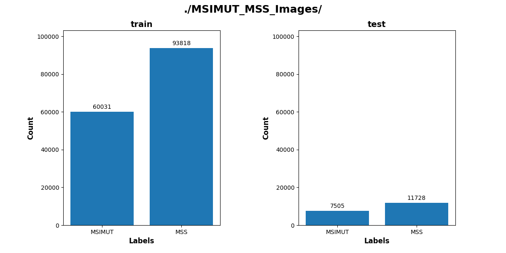
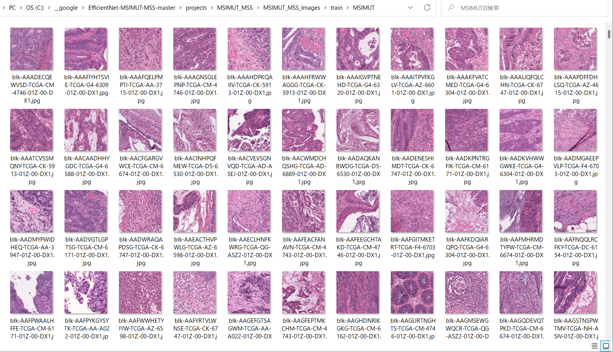
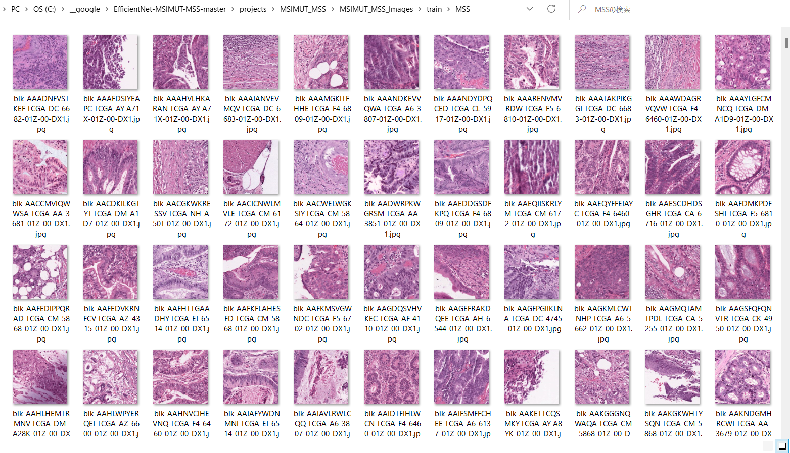
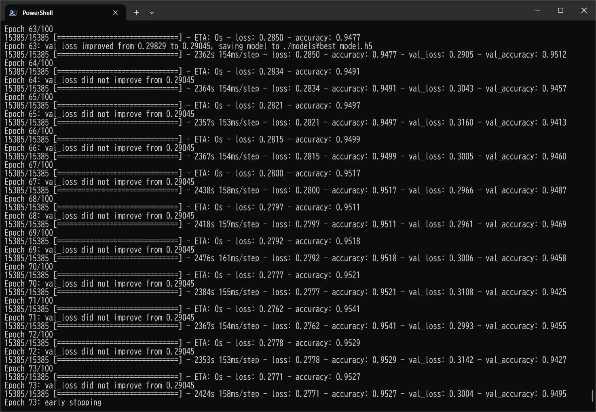
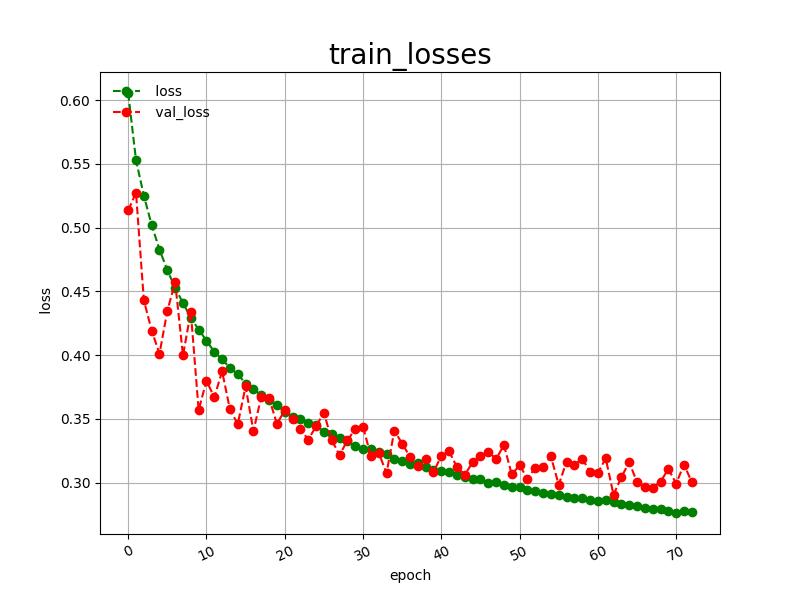
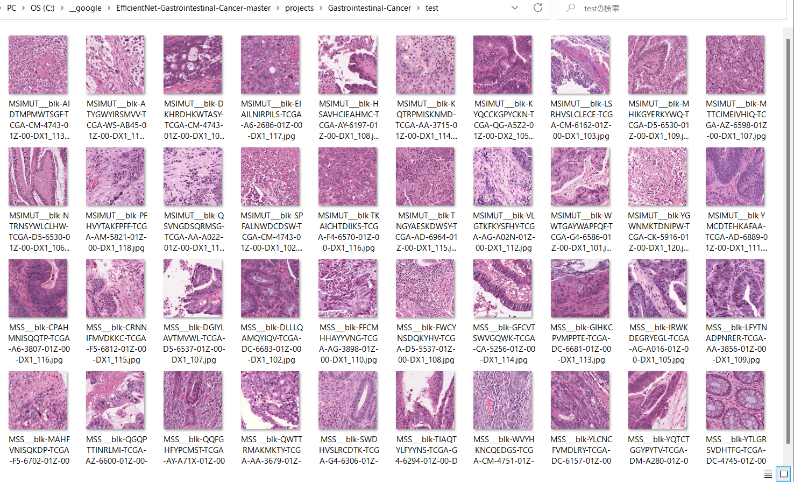
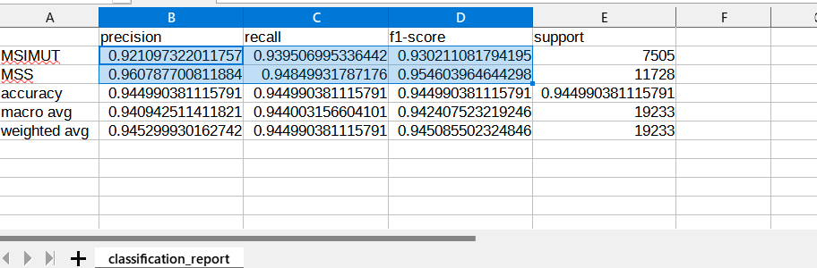
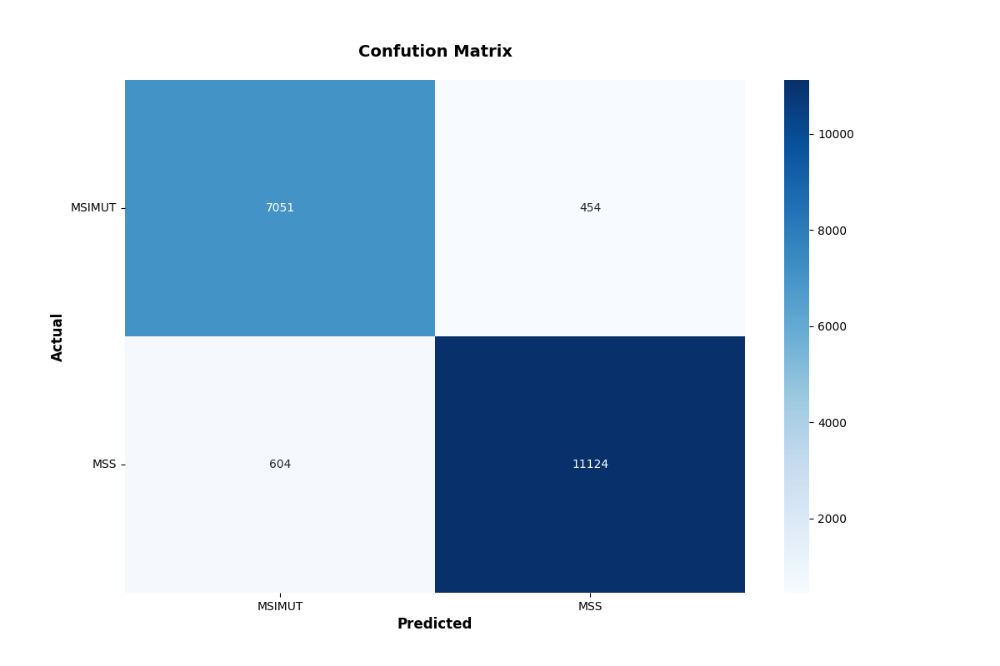

<h2>Tensorflow-EfficientNetV2-Finetuning-Model (2024/01/15)</h2>
This is a Tensorflow2 EfficientNetV2 Finetuning Model for Image Classification based on
<a href="https://github.com/google/automl/tree/master/efficientnetv2">EfficientNetV2</a>.
 
<h3>
1. Development Environment
</h3>
<h3>1.1 OS and Python</h3>
We use the following OS, Python, Tensorflow
<li>
Windows11
</li>
<li>
Python 3.10.11
</li>

<li>
tensorflow 2.9.1
</li>
<h3>1.2 Create a python virtualenv </h3>
Please run the following command to create a python virtualenv of name <b>py38-efficientdet</b>.
<pre>
>cd c:\
>python -m venv py310-efficientnet
>cd c:\py310-efficientnet
>./scripts/activate
</pre>
 
<h3>
2. Install Tensorflow-EfficientNetV2-Finetuning-Model
</h3>
<h3>2.1 Create a working folder </h3>
Please create a working folder "c:\efficientnet_finetuning" for your repository, and install the python packages. 
<pre>
>mkdir c:\efficientnet_finetuning
>cd    c:\efficientnet_finetuning
</pre>
<h3>2.2 Clone the repository</h3>
Please clone Tensorflow-EfficientDet-Finetuning-Model.git in the working folder <b>c:\efficientdet_finetuning</b>. 
<pre>
>git clone https://github.com/atlan-antillia/Tensorflow-EfficientNetV2-Finetuning-Model.git 
</pre>
You can see the following two top folder <b>efficientdet</b> and <b>projects</b> in  
Tensorflow-EfficientNetV2-Finetuning-Model 
of your working folder. 

<pre>
Tensorflow-EfficientNetV2-Finetuning-Model
├─efficientnetv2
└─projects
    └─medical_diagnosis
        ├─Acute-Lymphoblastic-Leukemia
        ├─Acute-Myeloid-Leukemia
        ├─Alzheimer's-Disease
        ├─Brain-Tumor
        ├─Breast-Cancer
        ├─Cervical-Cancer
        ├─Gastrointestinal-Cancer
        ├─Malaria
        ├─Malignant-Lymphoma
        ├─Mammography
        ├─Oral-Cancer
        ├─Osteosarcoma
        └─Skin-Cancer
</pre>

<h3>2.3 effficientnetv2 folder</h3>

The original python scripts in this folder have been taken from the github 
repository <a href="https://github.com/google/automl/tree/master/efficientnetv2">
google/automl/efficientnetv2</a> 
We have added the following python scripts to use Tensorflow-EfficientNetV2-Finetuning-Model. 

<li>
<a href="./efficientnetv2/ClassificationReportWriter.py">ClassificationReportWriter.py</a>
</li>
<li>
<a href="./efficientnetv2/ConfigParser.py">ConfigParser.py</a>
</li>

<li>
<a href="./efficientnetv2/ConfusionMatrix.py">ConfusionMatrix.py</a>
</li>
<li>
<a href="./efficientnetv2/CustomDataset.py">CustomDataset.py</a>
</li>
<li>
<a href="./efficientnetv2/EpochChangeCallback.py">EpochChangeCallback.py</a>
</li>
<li>
<a href="./efficientnetv2/FineTuningModel.py">FineTuningModel.py</a>
</li>
<li>
<a href="./efficientnetv2/EfficientNetV2Evaluator.py">EfficientNetV2Evaluator.py</a>
</li>
<li>
<a href="./efficientnetv2/EfficientNetV2ModelTrainer.py">EfficientNetV2ModelTrainer.py</a>
</li>
<li>
<a href="./efficientnetv2/EfficientNetV2Inferencer.py">EfficientNetV2Inferencer.py</a>
</li>

<h3>2.3 projects folder</h3>
This contains a lot of experimental projects to apply Tensorflow-EfficientNetV2-Finetuning-Model
to the real medical image-datasets in <b>medical_diagnosis</b>, 

<a href="./projects/medical_diagnosis/Acute-Lymphoblastic-Leukemia">Acute-Lymphoblastic-Leukemia</a> 
<a href="./projects/medical_diagnosis/Acute-Myeloid-Leukemia">Acute-Myeloid-Leukemia</a> 
<a href="./projects/medical_diagnosis/Alzheimer's-Disease">Alzheimer's-Disease</a> 
<a href="./projects/medical_diagnosis/Brain-Tumor">Brain-Tumor</a> 
<a href="./projects/medical_diagnosis/Breast-Cancer">Breast-Cancer</a> 
<a href="./projects/medical_diagnosis/Cervical-Cancer">Cervical-Cancer</a> 
<a href="./projects/medical_diagnosis/Gastrointestinal-Cancer">Gastrointestinal-Cancer</a> 
<a href="./projects/medical_diagnosis/Malaria">Malaria</a> 
<a href="./projects/medical_diagnosis/Malignant-Lymphoma">Malignant-Lymphoma</a> 
<a href="./projects/medical_diagnosis/Mammography">Mammography</a> 
<a href="./projects/medical_diagnosis/Oral-Cancer">Oral-Cancer</a> 
<a href="./projects/medical_diagnosis/Osteosarcoma">Osteosarcoma</a> 
<a href="./projects/medical_diagnosis/Skin-Cancer">Skin-Cancer</a> 

 
<h3>3. Install python packages</h3>

Please run the following command to install python packages for this project. 
<pre>
>cd ./Tensorflow-EfficientNetV2-Finetuning-Model
>pip install -r requirments.txt
</pre>

<h3>
4. Download pretrained checkpoints
</h3>
On details of Pretrained efficientNetV2 Checkpoints, 
please refer to <a href="https://github.com/google/automl/tree/master/efficientnetv2">EfficientNetV2</a>

 We use the following two types of pretrained models 
<li>
<a href="https://storage.googleapis.com/cloud-tpu-checkpoints/efficientnet/v2/efficientnetv2-b0.tgz">
efficientnetv2-b0.tgz
</a>
</li>

<li>
<a href="https://storage.googleapis.com/cloud-tpu-checkpoints/efficientnet/v2/efficientnetv2-m.tgz">
efficientnetv2-m.tgz
</a>
</li>

Please download those pretrained checkpoint files and expand them under <b>efficientnetv2</b> folder.  
<pre>
efficientnetv2
├─efficientnetv2-b0
└─efficientnetv2-m
</pre>

 
<h3>
5. Gastrointestinal-Cancer Classification
</h3>
As an image classification example, we show you how to train, evaluate and infer 
our Tensorflow-Finetuning-Model by Gastrointestinal-Cancer dataset. 

Please refer to the previous experiment <a href="https://github.com/atlan-antillia/EfficientNet-Gastrointestinal-Cancer">
EfficientNet-Gastrointestinal-Cancer</a>.   
    
<h3>5.1 Download dataset</h3>
 Please download the dataset MSI MSS (tcga_coad_msi_mss.zip) from the following <b>kaggle</b> web site:
 <a href="https://www.kaggle.com/datasets/linjustin/train-val-test-tcga-coad-msi-mss">Gastrointestinal Cancer MSI MSS Prediction(6 GB)</a>
 
The dataset <b>tcga_coad_msi_mss</b> has the following three directories:
<pre>
tcga_coad_msi_mss
├─test
├─train
└─val
</pre>

<h3>5.2 Dataset Citation</h3>

<b>Context</b>

The original dataset can be found . 
<a href="https://www.kaggle.com/datasets/joangibert/tcga_coad_msi_mss_jpg">TCGA COAD MSI vs MSS Prediction (JPG)</a>

 
<b>Content</b>

The dataset contains histological images for MSI vs MSS classification in gastrointestinal cancer. 
There are 192312 unique images split into train, val, and test sets.

<b>Acknowledgements</b>

Thank you Joan Gibert and Jakob Nikolas Kather for this data set. 

 
For simplicity, we use test and train sets. 
Please copy those directories under <b>./projects/medical_diagnosis/Gastrointestinal-Cancer/MSIMUT_MSS_Images</b>

<pre>
MSIMUT_MSS_Images
  ├─test
  │  ├─MSIMUT
  │  └─MSS
  └─train
      ├─MSIMUT
      └─MSS
</pre>

The train and test dataset contain a lot of images as shown below. 
 
 
 
Sample images of MSIMUT_MSS_Images/train/MSIMUT: 

  
 
Sample images of MSIMUT_MSS_Images/train/MSS: 

  
 

<h3>
6. Train Gastrointestinal Cancer Model
</h3>
<h3>
6.1 Training script
</h3>
Please move to <b>./projects/medical_diagnosis/Gastrointestinal-Cancer/</b> directory,
and run the following bat file to train our Gastrointestinal-Cancer Model by using
<b>MSIMUT_MSS_Images/train</b>.

<pre>
./1_train.bat
</pre>
<pre>
rem 1_train.bat
rem 2024/01/01 
python ../../../efficientnetv2/EfficientNetV2ModelTrainer.py ^
  --model_dir=./models ^
  --eval_dir=./eval ^
  --model_name=efficientnetv2-b0 ^
  --data_generator_config=./data_generator.config ^
  --ckpt_dir=../../../efficientnetv2/efficientnetv2-b0/model ^
  --optimizer=rmsprop ^
  --image_size=224 ^
  --eval_image_size=224 ^
  --data_dir=./MSIMUT_MSS_Images/train ^
  --data_augmentation=True ^
  --fine_tuning=True ^
  --monitor=val_loss ^
  --learning_rate=0.0001 ^
  --trainable_layers_ratio=0.4 ^
  --dropout_rate=0.4 ^
  --num_epochs=100 ^
  --batch_size=8 ^
  --patience=10 ^
  --debug=True  
</pre>
, where data_generator.config is the following: 
<pre>
; data_generation.config
; 2024/01/10
[training]
validation_split   = 0.2
featurewise_center = True
samplewise_center  = False
featurewise_std_normalization=True
samplewise_std_normalization =False
zca_whitening                =False
rotation_range     = 30
horizontal_flip    = True
vertical_flip      = True
width_shift_range  = 0.2
height_shift_range = 0.2
shear_range        = 0.01
zoom_range         = [0.5, 2.0]

;channel_shift_range= 10
;brightness_range   = None #[0.8,1.0]
data_format        = "channels_last"
</pre>

<h3>
6.2 Training result
</h3>

This will generate a <b>best_model.h5</b> in the models folder specified by --model_dir parameter. 
Furthermore, it will generate a <a href="./eval/train_accuracies.csv">train_accuracies</a>
and <a href="./projects/medical_diagnosis/Gastrointestinal-Cancer/eval/train_losses.csv">train_losses</a> files
 
Training console output: 
 
 
Train_accuracies: 
 

 
Train_losses: 
 

 
<h3>
7.. Inference
</h3>
<h3>
7.1 Inference script
</h3>
Please run the following bat file to infer the  in test images by the model generated by the above train command. 
<pre>
./2_inference.bat
</pre>
<pre>
rem 2_inference.bat
rem 2024/01/01
python ../../../efficientnetv2/EfficientNetV2Inferencer.py ^
  --model_name=efficientnetv2-b0  ^
  --model_dir=./models ^
  --fine_tuning=True ^
  --trainable_layers_ratio=0.4 ^
  --dropout_rate=0.4 ^
  --image_path=./test/*.jpg ^
  --eval_image_size=224 ^
  --label_map=./label_map.txt ^
  --mixed_precision=True ^
  --infer_dir=./inference ^
  --debug=False 
</pre>
 
label_map.txt:
<pre>
Benign
Early
Pre
Pro
</pre>
 
<h3>
7.2 Sample test images
</h3>
Sample test images generated by <a href="./projects/medical_diagnosis/Gastrointestinal-Cancer/create_test_dataset.py">create_test_dataset.py</a> 
from <a href="./projects/medical_diagnosis/Gastrointestinal-Cancer/MSIMUT_MSS_Images/test">MSIMUT_MSS_Images/test</a>.
 
 

 
<h3>
7.3 Inference result
</h3>
This inference command will generate <a href="./projects/medical_diagnosis/Gastrointestinal-Cancer/inference/inference.csv">inference result file</a>.
 
 
Inference console output: 
 
 

Inference result (inference.csv): 
 
 
<h3>
8. Evaluation
</h3>
<h3>
8.1 Evaluation script
</h3>
Please run the following bat file to evaluate <a href="./projects/medical_diagnosis/Gastrointestinal-Cancer/MSIMUT_MSS_Images/test">
MSIMUT_MSS_Images/test</a> by the trained model. 
<pre>
./3_evaluate.bat
</pre>
<pre>
rem 3_evaluate.bat
rem 2024/01/01
python ../../../efficientnetv2/EfficientNetV2Evaluator.py ^
  --model_name=efficientnetv2-b0  ^
  --model_dir=./models ^
  --data_dir=./MSIMUT_MSS_Images/test ^
  --evaluation_dir=./evaluation ^
  --fine_tuning=True ^
  --trainable_layers_ratio=0.4 ^
  --dropout_rate=0.4 ^
  --eval_image_size=224 ^
  --mixed_precision=True ^
  --debug=False 
</pre>
 

<h3>
8.2 Evaluation result
</h3>

This evaluation command will generate <a href="./projects/medical_diagnosis/Gastrointestinal-Cancer/evaluation/classification_report.csv">a classification report</a>
 and <a href="./projects/medical_diagnosis/Gastrointestinal-Cancer/evaluation/confusion_matrix.png">a confusion_matrix</a>.
 
 
Evaluation console output: 
 
 

 
Classification report: 
 
 
Confusion matrix: 
 

 
<h3>
References
</h3>
<b>1. Gastrointestinal cancer classification and prognostication from histology using deep learning: Systematic review</b> 
<pre>
Kuntz S, Krieghoff-Henning E, Kather JN, Jutzi T, Höhn J, Kiehl L, Hekler A, Alwers E, von Kalle C, Fröhling S, Utikal JS,
 Brenner H, Hoffmeister M, Brinker TJ. Gastrointestinal cancer classification and prognostication from histology 
 using deep learning: Systematic review. Eur J Cancer. 
 2021 Sep;155:200-215. 
 doi: 10.1016/j.ejca.2021.07.012. 
 Epub 2021 Aug 11. PMID: 34391053.
</pre>
<pre>
https://www.ncbi.nlm.nih.gov/pmc/articles/PMC10280208/

</pre>
