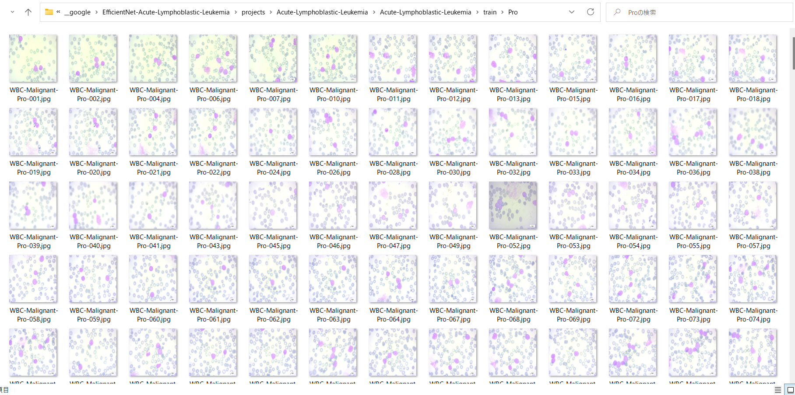
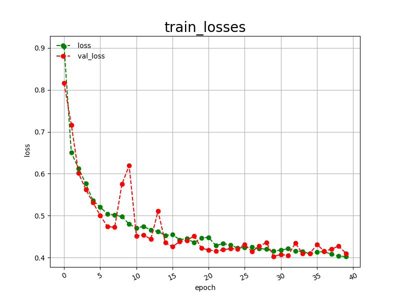

<h2>EfficientNetV2-Acute-Lymphoblastic-Leukemia</h2>

 This is an experimental Acute-Lymphoblastic-Leukemia Classification project based on <b>efficientnetv2</b> in <a href="https://github.com/google/automl">Brain AutoML</a>.
 

Please see also our first experiment <a href="https://github.com/EfficientNet-Acute-Lymphoblastic-Leukemia">EfficientNet-Acute-Lymphoblastic-Leukemia</a> 

<h3>1. Dataset Citation</h3>
 The original Acute-Lymphoblastic-Leukemia dataset has been taken from the following web site: 
<a href="https://www.kaggle.com/datasets/mehradaria/leukemia">
Acute Lymphoblastic Leukemia (ALL) image dataset
</a>
<b>Data Citation:</b> 
<pre>
Mehrad Aria, Mustafa Ghaderzadeh, Davood Bashash, Hassan Abolghasemi, Farkhondeh Asadi, 
and Azamossadat Hosseini, “Acute Lymphoblastic Leukemia (ALL) image dataset.” Kaggle, (2021). 
DOI: 10.34740/KAGGLE/DSV/2175623.
</pre>
<b>Publication Citation:</b> 
<pre>
Ghaderzadeh M, Aria M, Hosseini A, Asadi F, Bashash D, Abolghasemi H. 
"A Fast and Efficient CNN Model for B-ALL Diagnosis and its Subtypes Classification 
using Peripheral Blood Smear Images" XXX 2021;23(4):e27468 URL: https://www.---.org DOI: - PMID: -
</pre>
 

<h3>2. Download dataset </h3>
If you would like to train EffcientNetV2-Acute-Lymphoblastic-Leukemia Model by yourself, 
please download the dataset from the google drive
<a href="https://drive.google.com/file/d/1CzAeP7UQMLDhgRny0AHyv9nod_M4d1fT/view?usp=sharing">Acute-Lymphoblastic-Leukemia.zip</a>
 
 
It containts the following test and train datasets. 
<pre>
Acute-Lymphoblastic-Leukemia
  ├─test
  │  ├─Benign 
  │  ├─Early
  │  ├─Pre
  │  └─Pro
  └─train
      ├─Benign
      ├─Early
      ├─Pre
      └─Pro
</pre>

 
The number of images in train and test dataset: 

 

Sample images of Acute-Lymphoblastic-Leukemia/train/Benign: 

  

Sample images of Acute-Lymphoblastic-Leukemia/train/Early: 

  

Sample images of Acute-Lymphoblastic-Leukemia/train/Pre: 

  

Sample images of Acute-Lymphoblastic-Leukemia/train/Pro: 

  
 

<h3>
3 Train
</h3>
<h3>
3.1 Training script
</h3>
Please run the following bat file to train our Acute-Lymphoblastic-Leukemia efficientnetv2 model by using
<b>Acute-Lymphoblastic-Leukemia/train</b>.
<pre>
./1_train.bat
</pre>
<pre>
rem 1_train.bat
rem 2024/01/01
python ../../../efficientnetv2/EfficientNetV2ModelTrainer.py ^
  --model_dir=./models ^
  --eval_dir=./eval ^
  --model_name=efficientnetv2-b0 ^
  --data_generator_config=./data_generator.config ^
  --ckpt_dir=../../../efficientnetv2/efficientnetv2-b0/model ^
  --optimizer=rmsprop ^
  --image_size=224 ^
  --eval_image_size=224 ^
  --data_dir=./Acute-Lymphoblastic-Leukemia/train ^
  --data_augmentation=True ^
  --fine_tuning=True ^
  --monitor=val_loss ^
  --learning_rate=0.0001 ^
  --trainable_layers_ratio=0.4 ^
  --dropout_rate=0.5 ^
  --num_epochs=100 ^
  --batch_size=8 ^
  --patience=10 ^
  --debug=True  
</pre>
, where data_generator.config is the following: 
<pre>
; data_generation.config
; 2024/01/01
[training]
validation_split   = 0.2
featurewise_center = False
samplewise_center  = False
featurewise_std_normalization=False
samplewise_std_normalization =False
zca_whitening                =False
rotation_range     = 20
horizontal_flip    = True
vertical_flip      = True
width_shift_range  = 0.1
height_shift_range = 0.1
shear_range        = 0.01
zoom_range         = [0.2, 2.0]
;channel_shift_range= 10
;brightness_range   = None;[0.8,1.0]
data_format        = "channels_last"
</pre>

<h3>
3.2 Training result
</h3>

This traing command will generate a <b>best_model.h5</b> in the models folder specified by --model_dir parameter. 
Furthermore, it will generate a <a href="./eval/train_accuracies.csv">train_accuracies</a>
and <a href="./eval/train_losses.csv">train_losses</a> files
 
Training console output: 
 
 
Train_accuracies: 
 

 
Train_losses: 
 

 
<h2>
4. Inference
</h2>
<h3>
4.1 Inference script
</h3>
Please run the following bat file to infer the ALL lesions in test images by the model generated by the above train command. 
<pre>
./2_inference.bat
</pre>
<pre>
rem 2_inference.bat
rem 2024/01/01
python ../../../efficientnetv2/EfficientNetV2Inferencer.py ^
  --model_name=efficientnetv2-b0  ^
  --model_dir=./models ^
  --fine_tuning=True ^
  --trainable_layers_ratio=0.4 ^
  --dropout_rate=0.5 ^
  --image_path=./test/*.jpg ^
  --eval_image_size=224 ^
  --label_map=./label_map.txt ^
  --mixed_precision=True ^
  --infer_dir=./inference ^
  --debug=False 
</pre>
 
label_map.txt:
<pre>
Benign
Early
Pre
Pro
</pre>
 
<h3>
4.2 Sample test images
</h3>

 

 
<h3>
4.3 Inference result
</h3>
This inference command will generate <a href="./inference/inference.csv">inference result file</a>.
 
Inference console output: 
 
 

Inference result (inference.csv): 
 
 
<h3>
5 Evaluation
</h3>
<h3>
5.1 Evaluation script
</h3>
Please run the following bat file to evaluate <a href="./Acute-Lymphoblastic-Leukemia/test">
Acute-Lymphoblastic-Leukemia/test</a> by the trained model. 
<pre>
./3_evaluate.bat
</pre>
<pre>
rem 3_evaluate.bat
rem 2024/01/01
python ../../../efficientnetv2/EfficientNetV2Evaluator.py ^
  --model_name=efficientnetv2-b0  ^
  --model_dir=./models ^
  --data_dir=./Acute-Lymphoblastic-Leukemia/test ^
  --evaluation_dir=./evaluation ^
  --fine_tuning=True ^
  --trainable_layers_ratio=0.4 ^
  --dropout_rate=0.5 ^
  --eval_image_size=224 ^
  --mixed_precision=True ^
  --debug=False 
</pre>
 

<h3>
5.2 Evaluation result
</h3>

This evaluation command will generate <a href="./evaluation/classification_report.csv">a classification report</a>
 and <a href="./evaluation/confusion_matrix.png">a confusion_matrix</a>.
 
 
Evaluation console output: 
 
 

 
Classification report: 
 
 
Confusion matrix: 
 

