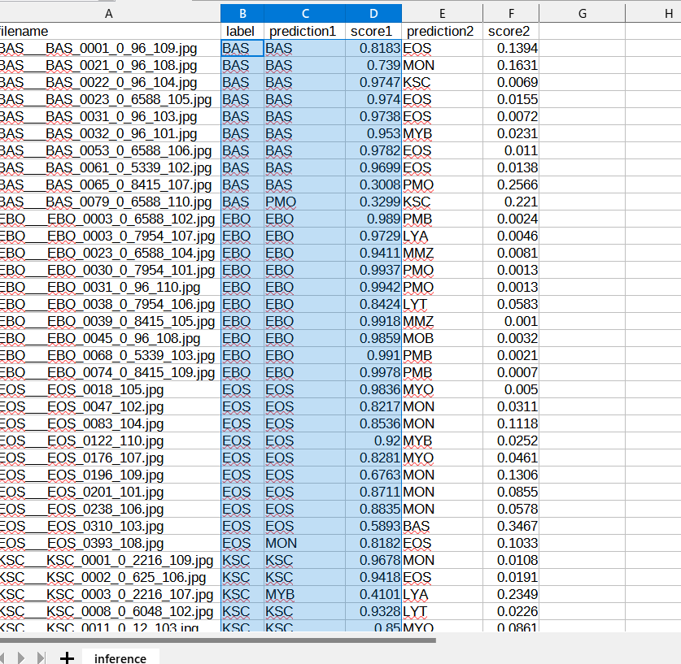

<h2>EfficientNetV2-Acute-Myeloid-Leukemia</h2>
 This is an experimental Acute-Myeloid-Leukemia Classification project based on <b>efficientnetv2</b> 
 in <a href="https://github.com/google/automl">Brain AutoML</a> 

Please see also our first expreiment <a href="https://github.com/sarah-antillia/EfficientNet-Acute-Myeloid-Leukemia">
EfficientNet-Acute-Myeloid-Leukemia </a>

<h3>1. Dataset Citation</h3>
The AML image dataset used here has been taken from the following web site; 
<pre>
CANCER IMAGING ARCHIVE

https://faspex.cancerimagingarchive.net/aspera/faspex/external_deliveries/77?passcode=a6be8bf0a97ddb34fc0913f37b8180d8f7d616a7

Package - AML-Cytomorphology
From:
Natasha Honomichl
To:
help@cancerimagingarchive.net 
CC (on download):
Natasha Honomichl
Date Sent:
17 Feb 2021 01:11 PM
</pre>

<h3>2. Download dataset</h3>

Please download Resampled_AMLImages dataset from google drive: 
<a href="https://drive.google.com/file/d/15W31ddTljTo4rZ8HCohvyg6XFggdEoH2/view?usp=sharing">Resampled_AML_Images.zip</a>
 
It contains the following test and train datasets. 
<pre>
Resampled_AML_Images
  ├─test
  │  ├─BAS
  │  ├─EBO
  │  ├─EOS
  │  ├─KSC
  │  ├─LYA
  │  ├─LYT
  │  ├─MMZ
  │  ├─MOB
  │  ├─MON
  │  ├─MYB
  │  ├─MYO
  │  ├─NGB
  │  ├─NGS
  │  ├─PMB
  │  └─PMO
  └─train
      ├─BAS
      ├─EBO
      ├─EOS
      ├─KSC
      ├─LYA
      ├─LYT
      ├─MMZ
      ├─MOB
      ├─MON
      ├─MYB
      ├─MYO
      ├─NGB
      ├─NGS
      ├─PMB
      └─PMO
</pre>

 

1 Sample images of Resampled_AML_Images/train/BAS: 

  

2 Sample images of Resampled_AML_Images/train/EBO: 

  

3 Sample images of Resampled_AML_Images/train/EOS: 

  

4 Sample images of Resampled_AML_Images/train/KSC: 

  

5 Sample images of Resampled_AML_Images/train/LYA: 

  

6 Sample images of Resampled_AML_Images/train/LYT: 

 

7 Sample images of Resampled_AML_Images/train/MMZ: 

  

8 Sample images of Resampled_AML_Images/train/MOB: 

  

9 Sample images of Resampled_AML_Images/train/MON: 

  

10 Sample images of Resampled_AML_Images/train/MYB: 

  

11 Sample images of Resampled_AML_Images/train/MYO: 

  

12 Sample images of Resampled_AML_Images/train/NGB: 

  

13 Sample images of Resampled_AML_Images/train/NGS: 

  

14 Sample images of Resampled_AML_Images/train/PMB: 

  

15 Sample images of Resampled_AML_Images/train/PMO: 

  

  

<h2>
3. Train
</h2>
<h3>
3.1 Training script
</h3>
Please run the following bat file to train our AML efficientnetv2 model by using
<b>Resampled_AML_images/train</b>.
<pre>
./1_train.bat
</pre>
<pre>
rem 1_train.bat
rem 2024/01/12
python ../../../efficientnetv2/EfficientNetV2ModelTrainer.py ^
  --model_dir=./models ^
  --eval_dir=./eval ^
  --model_name=efficientnetv2-m ^
  --data_generator_config=./data_generator.config ^
  --ckpt_dir=../../../efficientnetv2/efficientnetv2-m/model ^
  --optimizer=adam ^
  --image_size=360 ^
  --eval_image_size=360 ^
  --data_dir=./Resampled_AML_images/train ^
  --data_augmentation=True ^
  --fine_tuning=True ^
  --monitor=val_loss ^
  --learning_rate=0.0001 ^
  --trainable_layers_ratio=0.4 ^
  --dropout_rate=0.4 ^
  --num_epochs=100 ^
  --batch_size=4 ^
  --patience=10 ^
  --debug=True  
</pre>
, where data_generator.config is the following: 
<pre>
; data_generation.config
; 2024/01/12
[training]
validation_split   = 0.2
featurewise_center = True
samplewise_center  = False
featurewise_std_normalization=True
samplewise_std_normalization =False
zca_whitening                =False
rotation_range     = 90
;rotation_range     = 10
horizontal_flip    = True
vertical_flip      = True
width_shift_range  = 0.2
height_shift_range = 0.2
shear_range        = 0.01
zoom_range         = [0.8, 1.0]
data_format        = "channels_last"
brightness_range   = [0.8, 1.0]
fill_mode          =  "nearest"
</pre>

<h3>
3.2 Training result
</h3>

This will generate a <b>best_model.h5</b> in the models folder specified by --model_dir parameter. 
Furthermore, it will generate a <a href="./eval/train_accuracies.csv">train_accuracies</a>
and <a href="./eval/train_losses.csv">train_losses</a> files
 
Training console output: 
 
 
Train_accuracies: 
 

 
Train_losses: 
 

 
<h3>
4. Inference
</h3>
<h3>
4.1 Inference script
</h3>
Please run the following bat file to infer the Acute-Myeloid-Leukemia images in test images by the model generated by the above train command. 
<pre>
./2_inference.bat
</pre>
<pre>
rem 2_inference.bat
rem 2024/01/01
python ../../../efficientnetv2/EfficientNetV2Inferencer.py ^
  --model_name=efficientnetv2-m  ^
  --model_dir=./models ^
  --fine_tuning=True ^
  --trainable_layers_ratio=0.4 ^
  --dropout_rate=0.4 ^
  --image_path=./test/*.jpg ^
  --eval_image_size=360 ^
  --label_map=./label_map.txt ^
  --mixed_precision=True ^
  --infer_dir=./inference ^
  --debug=False 
</pre>
 
label_map.txt:
<pre>
BAS
EBO
EOS
KSC
LYA
LYT
MMZ
MOB
MON
MYB
MYO
NGB
NGS
PMB
PMO
</pre>
 
<h3>
4.2 Sample test images
</h3>

Sample test images generated by <a href="./create_test_dataset.py">create_test_dataset.py</a> 
from <a href="./Resampled_AML_Images/test">Lymphoma/test</a>.
 
 

 
<h3>
4.3 Inference result
</h3>
This inference command will generate <a href="./inference/inference.csv">inference result file</a>.
 
Inference console output: 
 
 

Inference result (<a href="./inference/inference.csv">inference.csv</a>): 
 
 
<h2>
5. Evaluation
</h2>
<h3>
5.1 Evaluation script
</h3>
Please run the following bat file to evaluate <a href="./Resampled_AML_Images/test">
Resampled_AML_Images/test</a> by the trained model. 
<pre>
./3_evaluate.bat
</pre>
<pre>
rem 3_evaluate.bat
rem 2024/01/01
python ../../../efficientnetv2/EfficientNetV2Evaluator.py ^
  --model_name=efficientnetv2-m  ^
  --model_dir=./models ^
  --data_dir=./Resampled_AML_Images/test ^
  --evaluation_dir=./evaluation ^
  --fine_tuning=True ^
  --trainable_layers_ratio=0.4 ^
  --dropout_rate=0.4 ^
  --eval_image_size=360 ^
  --mixed_precision=True ^
  --debug=False 
</pre>
 

<h3>
5.2 Evaluation result
</h3>

This evaluation command will generate <a href="./evaluation/classification_report.csv">a classification report</a>
 and <a href="./evaluation/confusion_matrix.png">a confusion_matrix</a>.
 
 
Evaluation console output: 
 
 

 
Classification report: 
 
 
Confusion matrix: 
 

 
<h3>
References
</h3>
<b>1. AML-Cytomorphology</b> 
<pre>
The AML image dataset used here has been taken from the following web site;
CANCER IMAGING ARCHIVE
https://faspex.cancerimagingarchive.net/aspera/faspex/external_deliveries/77?passcode=a6be8bf0a97ddb34fc0913f37b8180d8f7d616a7
</pre>

<b>2. Acute Myeloid Leukemia classification using a federated Convolutional Neural Network</b> 
scaleoutsystems 
<pre>
https://github.com/scaleoutsystems/AML-tutorial
</pre>

<b>3. Deep learning detects acute myeloid leukemia and predicts NPM1 mutation status from bone marrow smears</b> 
Jan-Niklas Eckardt, Jan Moritz Middeke, Sebastian Riechert, Tim Schmittmann, Anas Shekh Sulaiman,  
Michael Kramer, Katja Sockel, Frank Kroschinsky, Ulrich Schuler, Johannes Schetelig, Christoph Röllig,  
Christian Thiede, Karsten Wendt & Martin Bornhäuser  

<pre>
https://www.nature.com/articles/s41375-021-01408-w
</pre>

<b>4. AMLnet, A deep-learning pipeline for the differential diagnosis of acute myeloid leukemia from bone marrow smears</b> 
Zebin Yu, Jianhu Li, Xiang Wen, Yingli Han, Penglei Jiang, Meng Zhu, Minmin Wang, Xiangli Gao,  
Dan Shen, Ting Zhang, Shuqi Zhao, Yijing Zhu, Jixiang Tong, Shuchong Yuan, HongHu Zhu, He Huang & Pengxu Qian  
<pre>
https://jhoonline.biomedcentral.com/articles/10.1186/s13045-023-01419-3
</pre>
