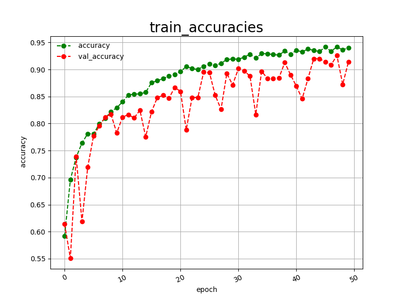
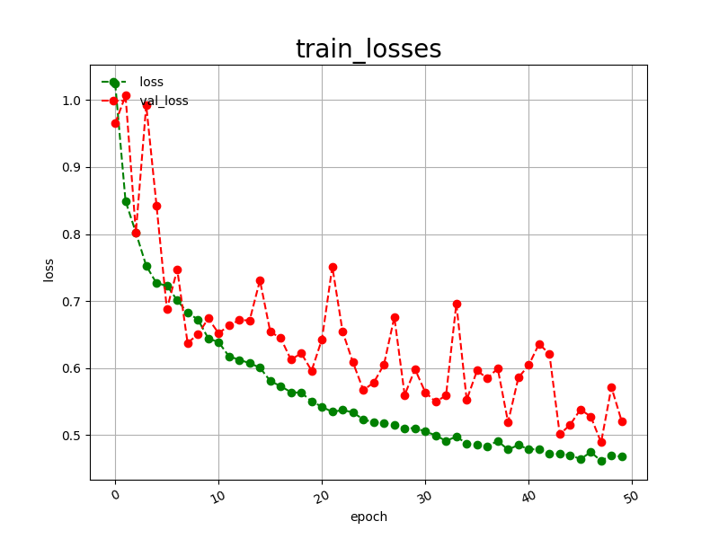
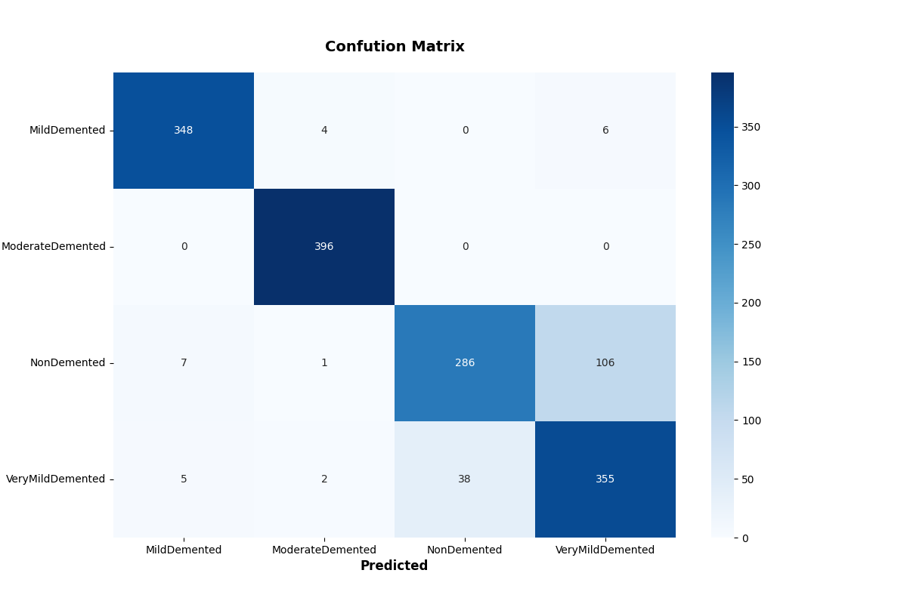

<h2>EfficientNetV2-Alzheimer's-Disease</h2>
 This is an experimental Alzheimer's-Disease Classification project based on <b>efficientnetv2</b> 
 in <a href="https://github.com/google/automl">Brain AutoML</a> 
Please see also our first experiment <a href="https://github.com/atlan-antillia/EfficientNet-Alzheimer-s-Disease">EfficientNet-Alzheimer-s-Disease</a>
 

<h3>1. Dataset Citation</h3>

This image dataset used here has been taken from the following kaggle website: 
<a href="https://www.kaggle.com/datasets/tourist55/alzheimers-dataset-4-class-of-images">
Alzheimer's Dataset ( 4 class of Images)</a>
  
<b>License</b> 
Open Data Commons Open Database License (ODbL) v1.0
 

<h3>
3. Download Dataset
</h3>
If you would like to train EfficientNet Alzheimer's_Disease Model by yourself, 
please download Resampled Alzheimer's_Disease_Images from the google drive: 
<a href="https://drive.google.com/file/d/1rVWwGPap7pL2GkC7WHZIxphuw-_P3hfp/view?usp=sharing">Resampled_Alzheimer's_Images.zip</a>
 

It contains the following test and train datasets. 
<pre>
Resampled_Alzheimer's_Images
├─test
│  ├─MildDemented
│  ├─ModerateDemented
│  ├─NonDemented
│  └─VeryMildDemented
└─train
    ├─MildDemented
    ├─ModerateDemented
    ├─NonDemented
    └─VeryMildDemented   
</pre>

The number of images in this new dataset is the following: 
 
 

Resampled_Alzheimger's_Images/train/MildDemented: 

 
 
Resampled_Alzheimger's_Images/train/ModerateDemented: 

 
 
Resampled_Alzheimger's_Images/train/NonDemented: 

 
 
Resampled_Alzheimger's_Images/train/VeryMildDemented: 

 

<h2>
3 Train

</h2>
<h3>
3.1 Training script
</h3>
Please run the following bat file to train our Alzheimer's Disease Classification efficientnetv2 model by using
<a href="./Resampled_Alzheimer's_Disease_Simpler_Images/train">Resampled_Alzheimger's_Disease_Images/train</a>.
<pre>
./1_train.bat
</pre>
<pre>
rem 1_train.bat
python ../../../efficientnetv2/EfficientNetV2ModelTrainer.py ^
  --model_dir=./models ^
  --eval_dir=./eval ^
  --model_name=efficientnetv2-m  ^
  --data_generator_config=./data_generator.config ^
  --ckpt_dir=../../../efficientnetv2/efficientnetv2-m/model ^
  --optimizer=rmsprop ^
  --image_size=384 ^
  --eval_image_size=480 ^
  --data_dir=./Resampled_Alzheimer's_Images/train ^
  --data_augmentation=True ^
  --valid_data_augmentation=True ^
  --fine_tuning=True ^
  --monitor=val_loss ^
  --learning_rate=0.0001 ^
  --trainable_layers_ratio=0.4 ^
  --dropout_rate=0.2 ^
  --num_epochs=50 ^
  --batch_size=4 ^
  --patience=10 ^
  --debug=True  
</pre>
<pre>
; data_generation.config

[training]
validation_split   = 0.2
featurewise_center = Fale
samplewise_center  = False
featurewise_std_normalization=True
samplewise_std_normalization =False
zca_whitening                =False
rotation_range     = 5
horizontal_flip    = False
vertical_flip      = False
width_shift_range  = 0.2
height_shift_range = 0.2
shear_range        = 0.01
zoom_range         = [0.2, 2.0]
data_format        = "channels_last"

[validation]
validation_split   = 0.2
featurewise_center = False
samplewise_center  = False
featurewise_std_normalization=True
samplewise_std_normalization =False
zca_whitening                =False
rotation_range     = 5
horizontal_flip    = False
vertical_flip      = False
width_shift_range  = 0.2
height_shift_range = 0.2
shear_range        = 0.01
zoom_range         = [0.2, 2.0]
data_format        = "channels_last"
</pre>

<h3>
<a id="4.2">3.2 Training result</a>
</h3>

This will generate a <b>best_model.h5</b> in the models folder specified by --model_dir parameter. 
Furthermore, it will generate a <a href="./eval/train_accuracies.csv">train_accuracies</a>
and <a href="./eval/train_losses.csv">train_losses</a> files
 
Training console output: 
 
 
Train_accuracies: 
 

 
Train_losses: 
 

 
<h2>
<a id="5">4 Inference</a>
</h2>
<h3>
<a id="5.1">4.1 Inference script</a>
</h3>
Please run the following bat file to infer the Altzheimers_Disease in test images by the model generated by the above train command. 
<pre>
./2_inference.bat
</pre>
<pre>
rem 2_inference.bat
python ../../../efficientnetv2/EfficientNetV2Inferencer.py ^
  --model_name=efficientnetv2-m  ^
  --model_dir=./models ^
  --fine_tuning=True ^
  --trainable_layers_ratio=0.4 ^
  --dropout_rate=0.4 ^
  --image_path=./test/*.jpg ^
  --eval_image_size=480 ^
  --label_map=./label_map.txt ^
  --mixed_precision=True ^
  --infer_dir=./inference ^
  --debug=False 
</pre>
 
label_map.txt:
<pre>
Cyst
Normal
Stone
Tumor
</pre>
 
<h3>
4.2 Sample test images
</h3>

Sample test images generated by <a href="./create_test_dataset.py">create_test_dataset.py</a> 
from <a href="./Resampled_Alzheimer's_Disease_Simpler_Images/test">Resampled_Alzheimer's_Disease_Simpler_Imagess/test</a>.
 
 

<h3>
<a id="5.3">4.3 Inference result</a>
</h3>
This inference command will generate <a href="./inference/inference.csv">inference result file</a>.
 
 
Inference console output: 
 
 

Inference result (inference.csv): 
 
 
<h2>
<a id="6">5 Evaluation</a>
</h2>
<h3>
<a id="6.1">5.1 Evaluation script</a>
</h3>
Please run the following bat file to evaluate <a href="./Resampled_Alzheimer's_Disease_Images/test">
Resampled_Alzheimer's_Disease_Image/test</a> by the trained model. 
<pre>
./3_evaluate.bat
</pre>
<pre>
rem 3_evaluate.bat
python ../../../efficientnetv2/EfficientNetV2Evaluator.py ^
  --model_name=efficientnetv2-m  ^
  --model_dir=./models ^
  --data_dir=./Resampled_Alzheimer's_Disease_Images/test ^
  --evaluation_dir=./evaluation ^
  --fine_tuning=True ^
  --trainable_layers_ratio=0.4 ^
  --dropout_rate=0.2 ^
  --eval_image_size=480 ^
  --mixed_precision=True ^
  --debug=False 
</pre>
 

<h3>
<a id="6.2">5.2 Evaluation result</a>
</h3>

This evaluation command will generate <a href="./evaluation/classification_report.csv">a classification report</a>
 and <a href="./evaluation/confusion_matrix.png">a confusion_matrix</a>.
 
 
Evaluation console output: 
 
 

 
Classification report: 
 

 
Confusion matrix: 
 

 
<h3>
References
</h3>
<b>1. Alzheimer’s disease diagnosis and classification using deep learning techniques</b> 
Waleed Al Shehri
<pre>
https://www.ncbi.nlm.nih.gov/pmc/articles/PMC10280208/

</pre>

