<h2>EfficientNet2-BUV-Cancer</h2>
This is an experimental BUV (Breast Cancer in Ultrasound Videos) Classification project based on <b>efficientnetv2</b> in <a href="https://github.com/google/automl">Brain AutoML</a>.
  

Please see also our first experiment <a href="https://github.com/sarah-antillia/EfficientNet-BUV-Cancer">
EfficientNet-BUV-Cancer</a>
 

<h3>1. Dataset Citation</h3>
The dataset used here has been taken from the following Google Drive

Miccai 2022 BUV Dataset 
https://drive.google.com/file/d/1LVXK34OJhC2LkqqyMmVFnXsXQavvZdeF/view?usp=sharing 

https://github.com/jhl-Det/CVA-Net 
This repository is an official implementation of the paper A New Dataset and 
A Baseline Model for Breast Lesion Detection in Ultrasound Videos. (MICCAI-2022)

 
<pre>
Citation:
@InProceedings{10.1007/978-3-031-16437-8_59,
author="Lin, Zhi
and Lin, Junhao
and Zhu, Lei
and Fu, Huazhu
and Qin, Jing
and Wang, Liansheng",
editor="Wang, Linwei
and Dou, Qi
and Fletcher, P. Thomas
and Speidel, Stefanie
and Li, Shuo",
title="A New Dataset and a Baseline Model for Breast Lesion Detection in Ultrasound Videos",
booktitle="Medical Image Computing and Computer Assisted Intervention -- MICCAI 2022",
year="2022",
publisher="Springer Nature Switzerland",
address="Cham",
pages="614--623",
</pre>

<h3>2. Download dataset</h3>
If you would like to train BUB-Breat-Cancer effinentnetv2 model, please download the BUB_Images dataset from
the google drive <a href="https://drive.google.com/file/d/1aHSjNpews-hgqPN2bDKR6IZSmOkvaNEZ/view?usp=sharing">BUV_Images.zip</a>

<pre>

BUV_Images
  ├─test
  │  ├─benign
  │  └─malignant
  └─train
      ├─benign
      └─malignant
</pre>

 
  
Sample images of BUV_Images/train/benign: 
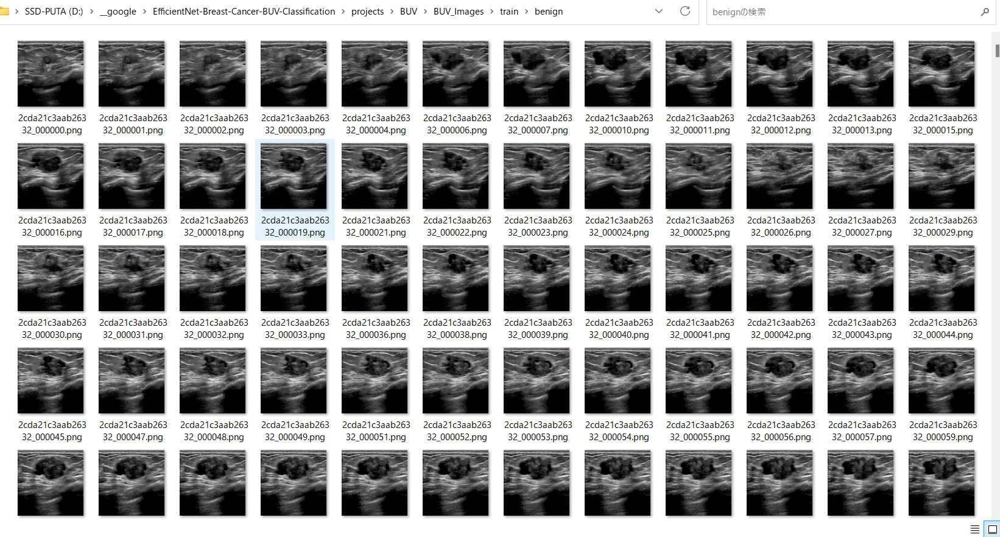
  
 
Sample images of BUV_Images/train/malignant: 
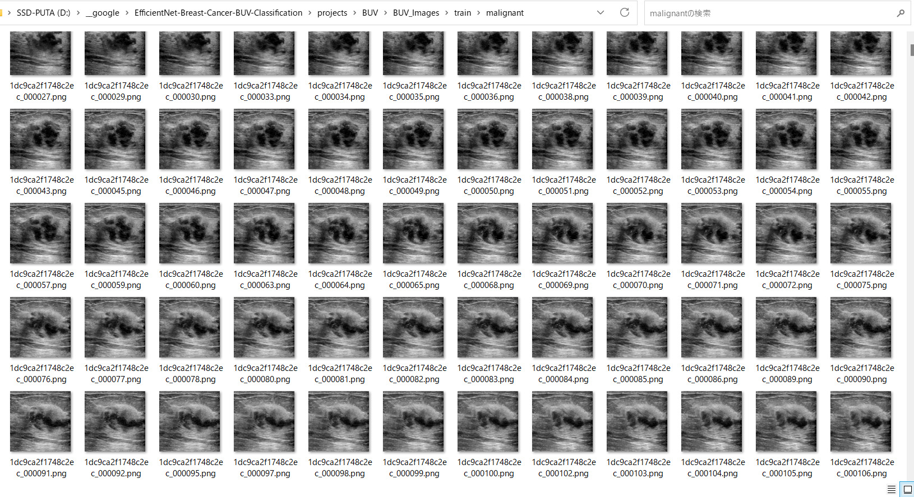
  
 

The number of images in train and test dataset: 
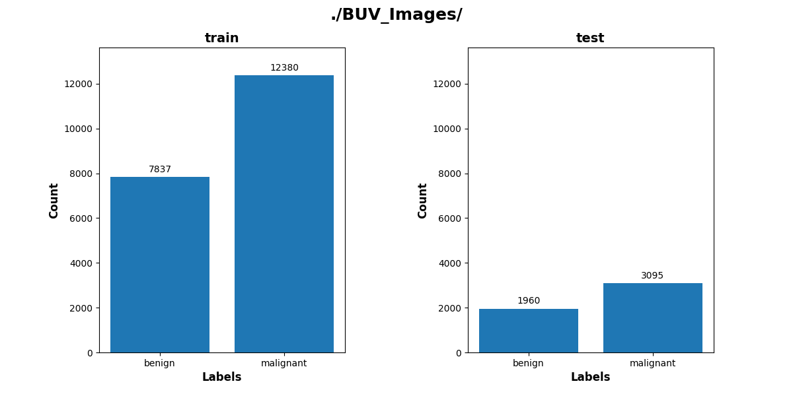

 
 

<h3>
3. Train
</h3>

<h3>
3.1 Training script
</h3>
Please run the following bat file to train our Breast Cancer efficientnetv2 model by using
<b>BUV_Images/train</b>.
<pre>
./1_train.bat
</pre>
<pre>
rem 1_train.bat
rem 2024/01/16
python ../../../efficientnetv2/EfficientNetV2ModelTrainer.py ^
  --model_dir=./models ^
  --eval_dir=./eval ^
  --model_name=efficientnetv2-m  ^
  --data_generator_config=./data_generator.config ^
  --ckpt_dir=../../../efficientnetv2/efficientnetv2-m/model ^
  --optimizer=rmsprop ^
  --image_size=360 ^
  --eval_image_size=360 ^
  --data_dir=./BUV_Images/train ^
  --data_augmentation=True ^
  --valid_data_augmentation=False ^
  --fine_tuning=True ^
  --monitor=val_loss ^
  --learning_rate=0.001 ^
  --trainable_layers_ratio=0.4 ^
  --dropout_rate=0.4 ^
  --num_epochs=50 ^
  --batch_size=4 ^
  --patience=10 ^
  --debug=True  
</pre>
, where data_generator.config is the following: 
<pre>
; data_generation.config
; 2024/01/15
[training]
validation_split   = 0.2
featurewise_center = True
samplewise_center  = False
featurewise_std_normalization=True
samplewise_std_normalization =False
zca_whitening                =False
rotation_range     = 90
horizontal_flip    = True
vertical_flip      = True
width_shift_range  = 0.2
height_shift_range = 0.2
shear_range        = 0.01
zoom_range         = [0.5, 1.0]
data_format        = "channels_last"
brightness_range   = [0.8, 1.0]
fill_mode          =  "nearest"
</pre>

<h3>
3.2 Training result
</h3>

This will generate a <b>best_model.h5</b> in the models folder specified by --model_dir parameter. 
Furthermore, it will generate a <a href="./eval/train_accuracies.csv">train_accuracies</a>
and <a href="./eval/train_losses.csv">train_losses</a> files
 
Training console output: 
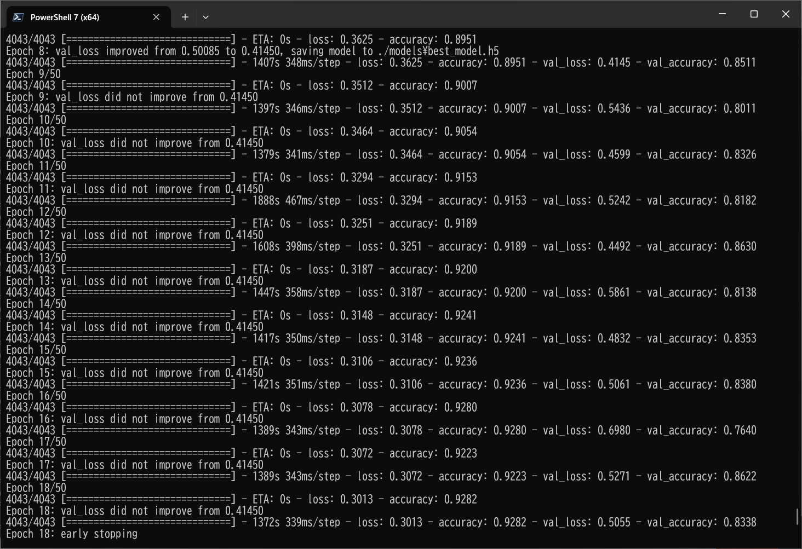 
 
Train_accuracies: 
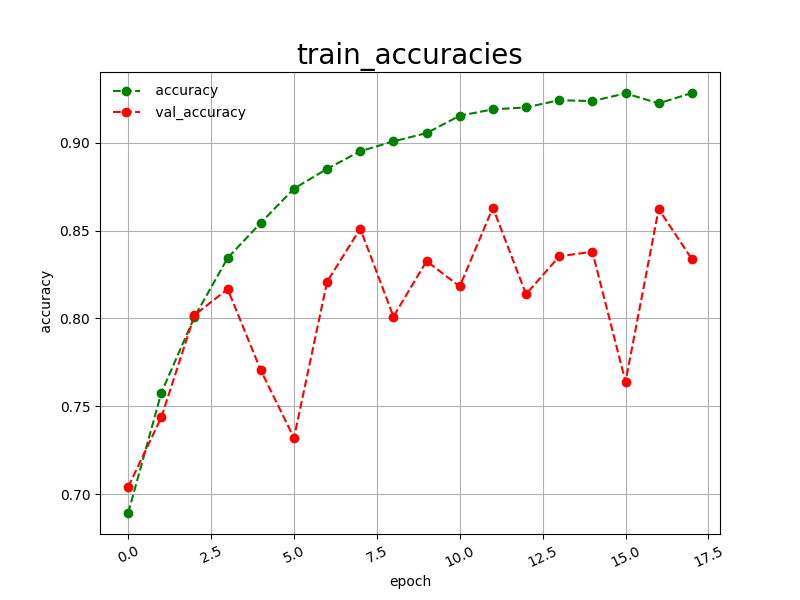 

 
Train_losses: 
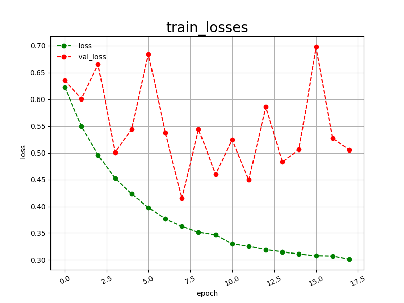 

 
<h3>
4, Inference
</h3>
<h3>
4.1 Inference script
</h3>
Please run the following bat file to infer the breast cancer in test images by the model generated by the above train command. 
<pre>
./2_inference.bat
</pre>
<pre>
rem 2_inference.bat
rem 2024/01/16
python ../../../efficientnetv2/EfficientNetV2Inferencer.py ^
  --model_name=efficientnetv2-m  ^
  --model_dir=./models ^
  --fine_tuning=True ^
  --trainable_layers_ratio=0.4 ^
  --dropout_rate=0.4 ^
  --image_path=./test/*.png ^
  --eval_image_size=360 ^
  --label_map=./label_map.txt ^
  --mixed_precision=True ^
  --infer_dir=./inference ^
  --debug=False 
</pre>
 
label_map.txt:
<pre>
benign
malignant
</pre>
 
<h3>
4.2 Sample test images
</h3>

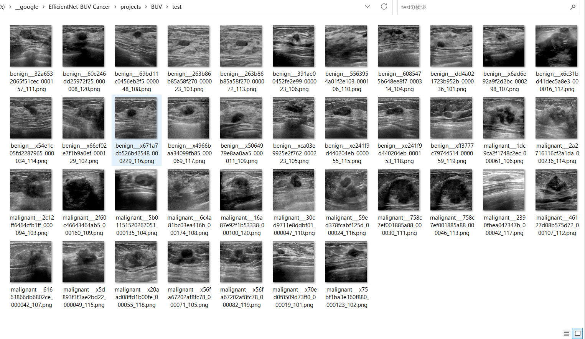 

 
<h3>
4.3 Inference result
</h3>
This inference command will generate <a href="./inference/inference.csv">inference result file</a>.
 At this time, you can see the inference accuracy for the test dataset by our trained model is very low.
More experiments will be needed to improve accuracy. 

 
Inference console output: 
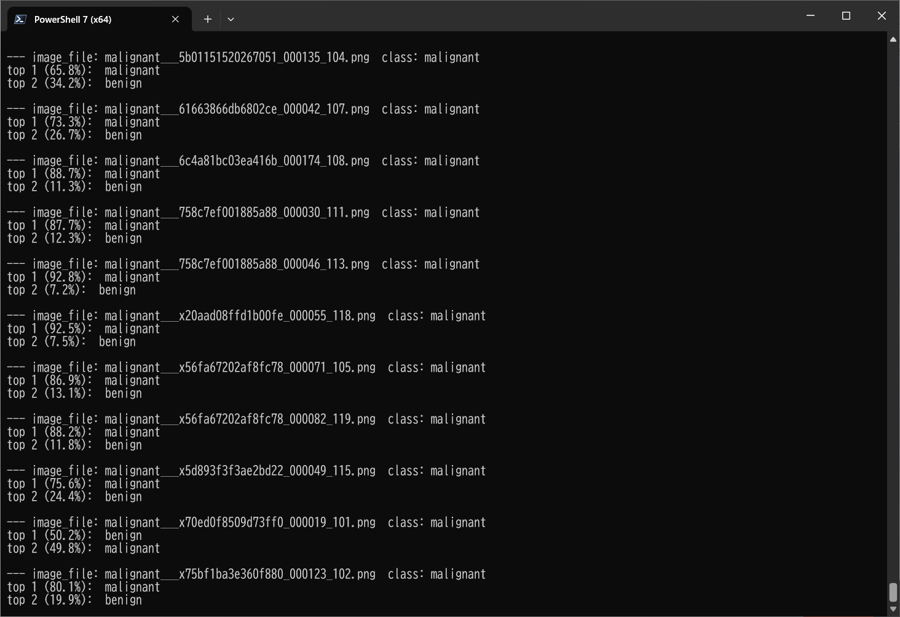 
 

Inference result (inference.csv): 
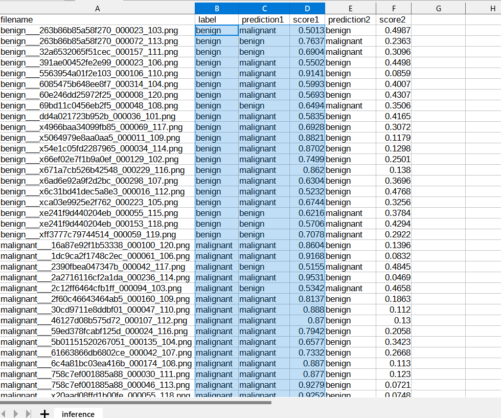 
 
<h3>
5. Evaluation
</h3>
<h3>
5.1 Evaluation script
</h3>
Please run the following bat file to evaluate <a href="./BUV_Images/test">
BUV_Images/test</a> by the trained model. 
<pre>
./3_evaluate.bat
</pre>
<pre>
rem 3_evaluate.bat
rem 2024/01/16
python ../../../efficientnetv2/EfficientNetV2Evaluator.py ^
  --model_name=efficientnetv2-m  ^
  --model_dir=./models ^
  --data_dir=./BUV_Images/test ^
  --evaluation_dir=./evaluation ^
  --fine_tuning=True ^
  --trainable_layers_ratio=0.4 ^
  --dropout_rate=0.4 ^
  --eval_image_size=360 ^
  --mixed_precision=True ^
  --debug=False 
</pre>
 

<h3>
5.2 Evaluation result
</h3>

This evaluation command will generate <a href="./evaluation/classification_report.csv">a classification report</a>
 and <a href="./evaluation/confusion_matrix.png">a confusion_matrix</a>.
 
 
Evaluation console output: 
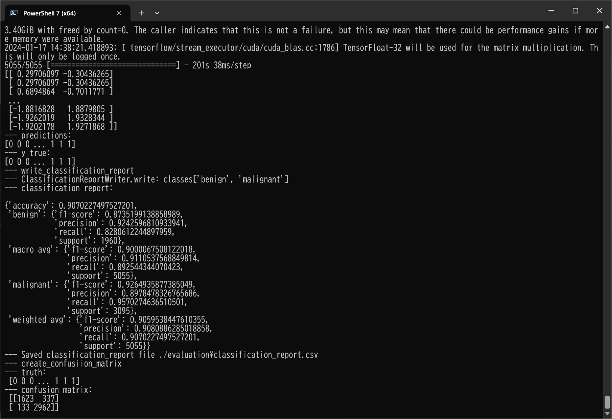 
 

 
Classification report: 
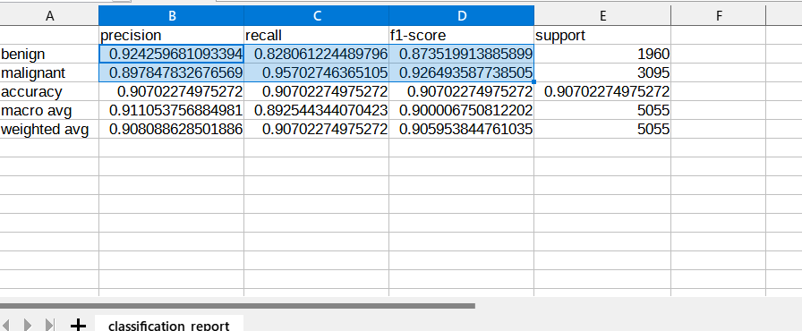 
 
Confusion matrix: 
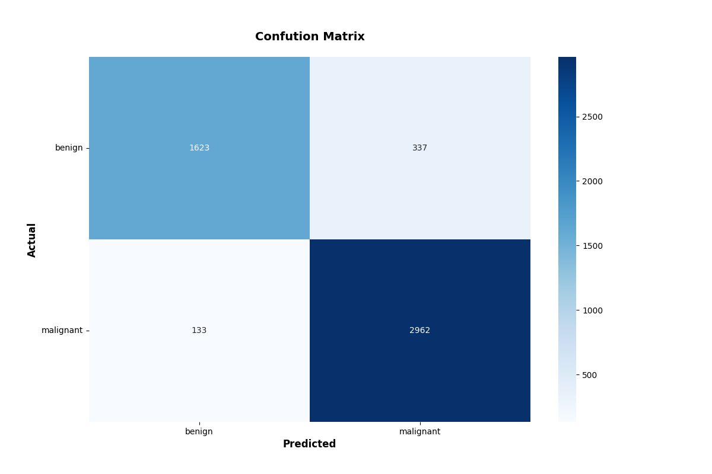 

<h3>References:</h3>
<b>1. Breast lesion detection using an anchor-free network from ultrasound images with segmentation-based enhancement</b> 
Yu Wang & Yudong Yao 
<pre>
https://www.nature.com/articles/s41598-022-18747-y
</pre>

<b>2. Classification of Breast Cancer Ultrasound Images with Deep Learning-Based Models </b> 
Fatih Uysa,and Mehmet Murat Köse 
<pre>
https://www.mdpi.com/2673-4591/31/1/8/html
</pre>

<b>3. A CNN Deep Learning Technique for Prediction of Breast Cancer using Ultrasound Image
</b> 
Atisham Khan and Silky Pareyani 
<pre>
https://www.jetir.org/papers/JETIR2303813.pdf
</pre>
