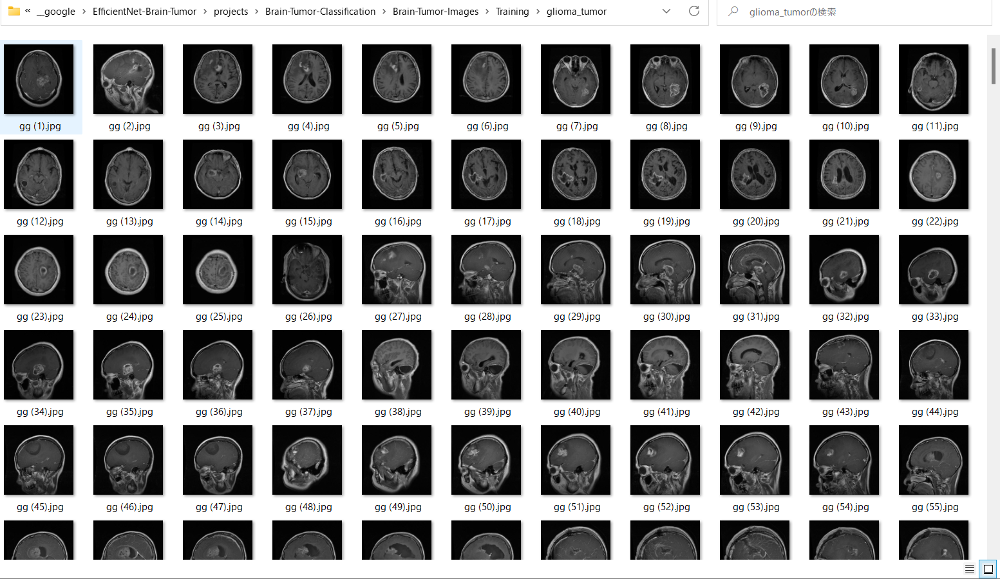
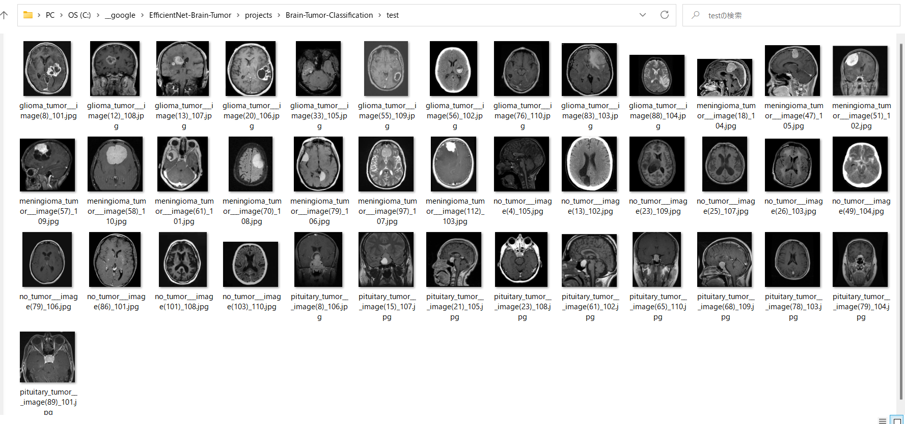

<h2>EfficientNetV2-Brain-Tumor</h2>

 This is a simple Brain Tumor Classification project based on <b>efficientnetv2</b> in <a href="https://github.com/google/automl">Brain AutoML</a>.
  
Please see also our first experiment <a href="https://github.com/atlan-antillia/EfficientNet-Brain-Tumor">
EfficientNet-Brain-Tumor
</a>

<h3>1. Dataset Citation</h3>

 The Brain Tumor dataset used here has been taken from the following web site: 
 <a href="https://github.com/sartajbhuvaji/brain-tumor-classification-dataset">brain-tumor-classificaiton-dataset</a>
  

<h3>2. Download dataset</h3>
 
If you would like to train Brain Tumor Model by yourself, please download the dataset from the github repository

 
It contains the following Testing and Training datasets. 

<pre>
Brain-Tumor-Images
  ├─Testing
  │  ├─glioma_tumor
  │  ├─meningioma_tumor
  │  ├─no_tumor
  │  └─pituitary_tumor
  └─Training
      ├─glioma_tumor
      ├─meningioma_tumor
      ├─no_tumor
      └─pituitary_tumor
</pre>
 
The number of images in Brain-Tumor-Images dataset: 

 
Sample images in Brain-Tumor-Classification/Brain-Tumor-Images/Training/glioma_tumor: 

 
 

Sample images in Brain-Tumor-Classification/Brain-Tumor-Images/Training/meningioma_tumor: 

 
 

Sample images in Brain-Tumor-Classification/Brain-Tumor-Images/Training/no_tumor: 

 
 

Sample images in Brain-Tumor-Classification/Brain-Tumor-Images/Training/pituitary_tumor: 

 
 

<h3>
3. Train
</h3>
<h3>
3.1 Training script
</h3>
Please run the following bat file to train Brain-Rumor EfficientNetV2 model 
by using <a href="./Brain-Tumor-Images/Training">Brain-Tumor-Classification/Brain-Tumor-Images/Training dataset</a>. 
<pre>
./1_train.bat
</pre>
<pre>
rem 1_train.bat
rem 2024/01/01 
python ../../../efficientnetv2/EfficientNetV2ModelTrainer.py ^
  --model_dir=./models ^
  --model_name=efficientnetv2-m  ^
  --data_generator_config=./data_generator.config ^
  --ckpt_dir=../../../efficientnetv2/efficientnetv2-m/model ^
  --optimizer=rmsprop ^
  --num_classes=4 ^
  --image_size=384 ^
  --eval_image_size=480 ^
  --data_dir=./Brain-Tumor-Images/Training ^
  --model_dir=./models ^
  --data_augmentation=True ^
  --valid_data_augmentation=False ^
  --fine_tuning=True ^
  --monitor=val_loss ^
  --learning_rate=0.0001 ^
  --trainable_layers_ratio=0.4 ^
  --dropout_rate=0.4 ^
  --num_epochs=50 ^
  --batch_size=4 ^
  --patience=10 ^
  --debug=True  
</pre>
, and data_generator.config is the following: 
<pre>
 data_generation.config
; 2024/01/10
[training]
validation_split   = 0.2
featurewise_center = False
samplewise_center  = True
featurewise_std_normalization=False
samplewise_std_normalization  =True
zca_whitening                =False
rotation_range     = 10
horizontal_flip    = True
width_shift_range  = 0.2
height_shift_range = 0.2
shear_range        = 0.2
zoom_range         = [0.2, 2.0]
data_format        = "channels_last"
brightness_range   = [0.8, 1.0]
fill_mode          =  "nearest"
</pre>

<h3>
3.2 Training result
</h3>

This will generate a <b>best_model.h5</b> in the models folder specified by --model_dir parameter. 
Furthermore, it will generate a <a href="./eval/train_accuracies.csv">train_accuracies</a>
and <a href="./eval/train_losses.csv">train_losses</a> files
 
Training console output: 
 
 
Train_accuracies: 
 

 
Train_losses: 
 

 
<h2>
4. Inference
</h2>
<h3>
4.1 Inference script
</h3>
Please run the following bat file to infer the brain tumors in test images by the model generated by the above train command. 
<pre>
./2_inference.bat
</pre>
<pre>
rem 2_inference.bat
rem 2024/01/01
python ../../../efficientnetv2/EfficientNetV2Inferencer.py ^
  --model_name=efficientnetv2-m  ^
  --model_dir=./models ^
  --fine_tuning=True ^
  --trainable_layers_ratio=0.4 ^
  --dropout_rate=0.4 ^
  --image_path=./test/*.jpg ^
  --eval_image_size=480 ^
  --num_classes=4 ^
  --label_map=./label_map.txt ^
  --mixed_precision=True ^
  --infer_dir=./inference ^
  --debug=False 
</pre>
 
label_map.txt:
<pre>
glioma_tumor
meningioma_tumor
no_tumor
pituitary_tumor
</pre>
 
<h3>
4.2 Sample test images
</h3>

Sample test images generated by <a href="./create_test_dataset.py">create_test_dataset.py</a> 
from <a href="./Brain-Tumor-Images/Testing">Brain-Tumor-Images/Testing</a> taken from
 <a href="https://github.com/sartajbhuvaji/brain-tumor-classification-dataset">brain-tumor-classificaiton-dataset</a>. 
  
Brain-Tumor-Classification/test: 
 
 
 
Sample images in Brain-Tumoer-Classification/test: 

glioma_tumor 
  
meningioma_tumor 
  
no_tumor 
  
pituitary_tumor 
  

<h3>
4.3 Inference result
</h3>
This inference command will generate <a href="./inference/inference.csv">inference result file</a>.
 
Inference console output: 
 
 

Inference result (inference.csv): 
 
 
<h2>
5. Evaluation
</h2>
<h3>
5.1 Evaluation script
</h3>
Please run the following bat file to evaluate <a href="./Brain-Tumor-Images/Testing">
Brain-Tumor-Images/Testing dataset</a> by the trained model. 
<pre>
./3_evaluate.bat
</pre>
<pre>
rem 3_evaluate.bat
rem 2024/01/01
python ../../../efficientnetv2/EfficientNetV2Evaluator.py ^
  --model_name=efficientnetv2-m  ^
  --model_dir=./models ^
  --data_dir=./Brain-Tumor-Images/Testing ^
  --evaluation_dir=./evaluation ^
  --fine_tuning=True ^
  --trainable_layers_ratio=0.4 ^
  --dropout_rate=0.4 ^
  --eval_image_size=480 ^
  --num_classes=4 ^
  --label_map=./label_map.txt ^
  --mixed_precision=True ^
  --debug=False 
</pre>

<h3>
5.2 Evaluation result
</h3>

This evaluation command will generate <a href="./evaluation/classification_report.csv">a classification report</a>
 and <a href="./evaluation/confusion_matrix.png">a confusion_matrix</a>.
 
 
Evaluation console output: 
 
 

 
Classification report: 
 
 
Confusion matrix: 
 

<h3>References</h3>
<b>1. Brain Tumor Detection Based on Deep Learning Approaches and Magnetic Resonance Imaging </b>
<pre>
Abdusalomov AB, Mukhiddinov M, Whangbo TK. Brain Tumor Detection Based on Deep Learning Approaches 
and Magnetic Resonance Imaging. Cancers (Basel). 
2023 Aug 18;15(16):4172. 
doi: 10.3390/cancers15164172. 
PMID: 37627200; PMCID: PMC10453020.
</pre>
<pre>
https://www.ncbi.nlm.nih.gov/pmc/articles/PMC10453020/
</pre>
