<h2>
EfficientNetV2-Cervical-Cancer
</h2>

This is an experimental project Cervical Cancer Classification based on <b>efficientnetv2</b> in <a href="https://github.com/google/automl">Brain AutoML</a>
 
Please seel also our first experiment
<a href="https://github.com/atlan-antillia/EfficientNet-Pap-Smear">EfficientNet-Pap-Smear</a>
 

<h3>1. Dataset Citation</h3>

The Cervical Cancer dataset used here has been taken from the following web site: 

<a href="https://data.mendeley.com/datasets/zddtpgzv63/4">Liquid based cytology pap smear images for multi-class diagnosis of cervical cancer</a>
  
License: CC BY 4.0 
 

<h3>2. Download dataset</h3>
As mentioned in our first experiment,for simplicity, we have renamed the folder names in the original dataset to be: 
<pre>
original_dataset
├─HSIL   (High squamous intra-epithelial lesion)
├─LSIL   (Low squamous intra-epithelial lesion)
├─NL     (Negative for Intraepithelial malignancy)
└─SCC    (Squamous cell carcinoma)
</pre>
Furthermode,we have created Resampled-pap-smear-images dataset of image-size 512x512 from the original dataset above,
<pre>
Resampled-pap-smear-images
  ├─test
  │  ├─HSIL
  │  ├─LSIL
  │  ├─NL
  │  └─SCC
  └─train
      ├─HSIL
      ├─LSIL
      ├─NL
      └─SCC
</pre>
If you would like to train Cervical-Cancer Model by yourself,
please download the resampled dataset from the google drive
<a href="https://drive.google.com/file/d/1apZj9XBQqpvZ3bmX7VxF5hpkmHFYdJbC/view?usp=sharing">Resampled-pap-smear-images.zip</a>
 

The number of images of train and test image dataset is the following: 
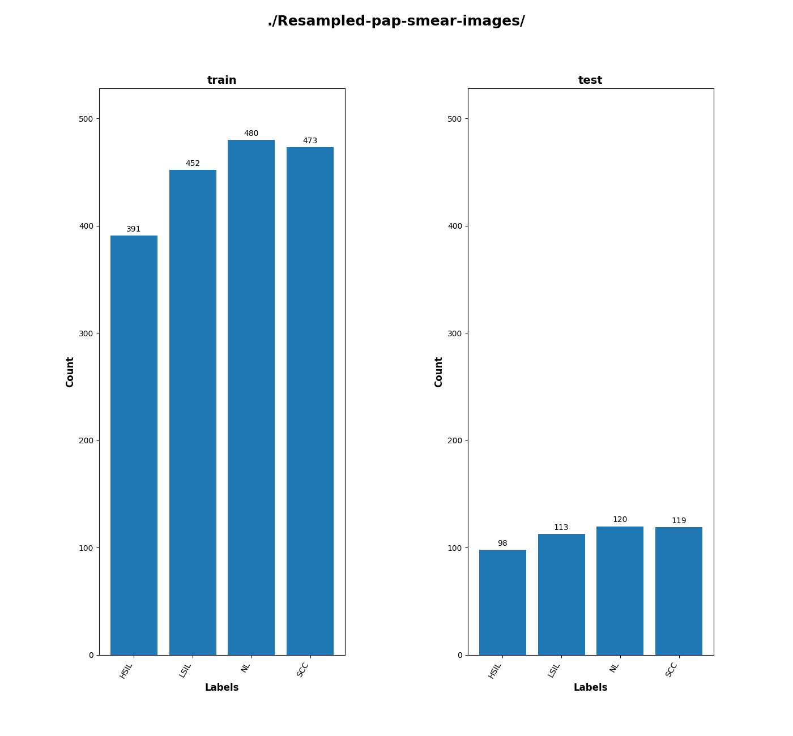
 
 
1 Sample images in Cervical Cancer_Images/train/HSIL: 
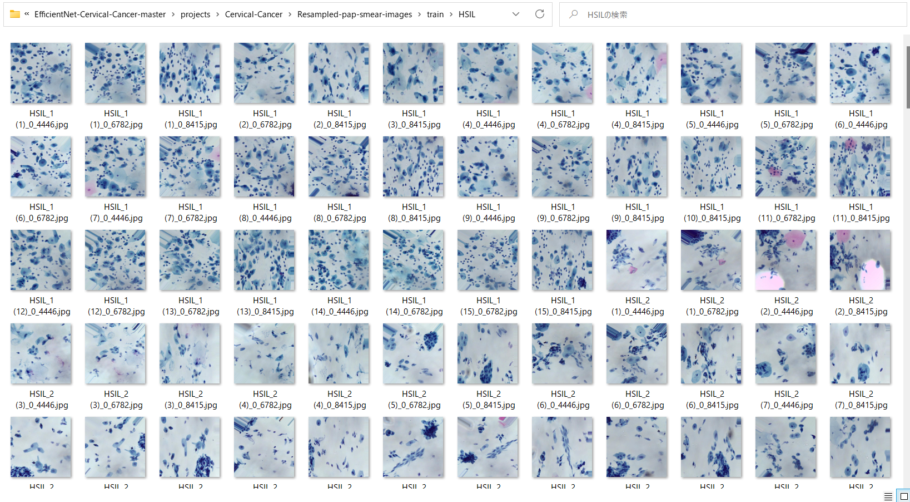  

2 Sample images in Cervical Cancer_Images/train/LSIL: 
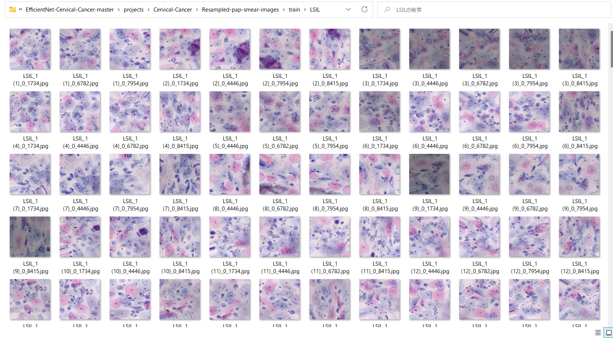  

3 Sample images in Cervical Cancer_Images/train/NL: 
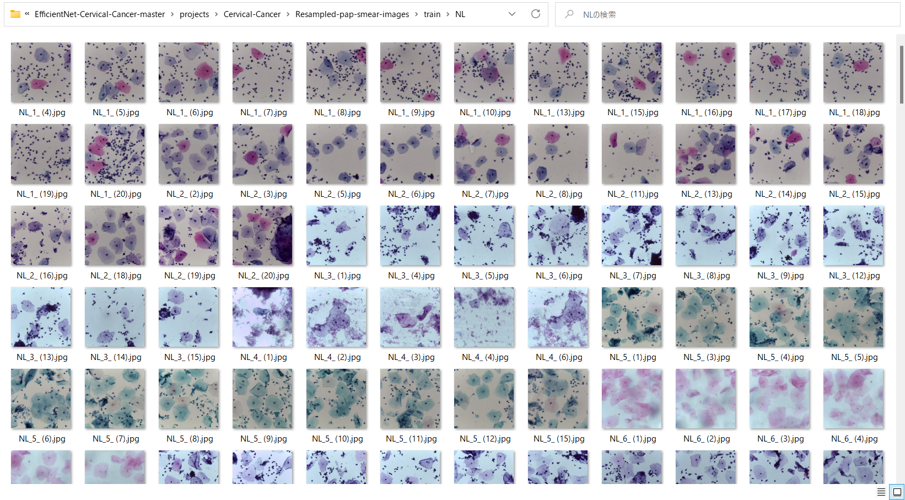  

4 Sample images in Cervical Cancer_Images/train/SCC: 
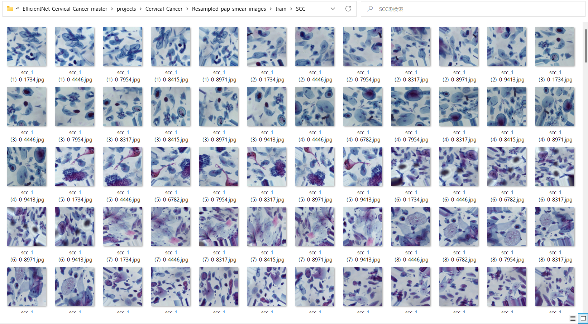  

<h3>
3. Train
</h3>
<h3>
3.1 Training script
</h3>
Please run the following bat file to train our Cervical Cancer efficientnetv2-b0 model by 
using the dataset <b>./Resampled-pap-smear-images/train</b>. 
 
<pre>
./1_train.bat
</pre>
<pre>
rem 1_train.bat
rem 2024/01/01
python ../../../efficientnetv2/EfficientNetV2ModelTrainer.py ^
  --model_dir=./models ^
  --eval_dir=./eval ^
  --model_name=efficientnetv2-m  ^
  --data_generator_config=./data_generator.config ^
  --ckpt_dir=../../../efficientnetv2/efficientnetv2-m/model ^
  --optimizer=adam ^
  --image_size=512 ^
  --eval_image_size=512 ^
  --data_dir=./Resampled-pap-smear-images/train ^
  --data_augmentation=True ^
  --valid_data_augmentation=False ^
  --fine_tuning=True ^
  --monitor=val_loss ^
  --learning_rate=0.0001 ^
  --trainable_layers_ratio=0.4 ^
  --dropout_rate=0.4 ^
  --num_epochs=100 ^
  --batch_size=2 ^
  --patience=10 ^
  --debug=True  
</pre>
,where data_generator.config is the following 
<pre>
; data_generation.config
; 2024/01/11
[training]
validation_split   = 0.2
featurewise_center = False
samplewise_center  = False
featurewise_std_normalization=False
samplewise_std_normalization =False
zca_whitening                =False
rotation_range     = 90
horizontal_flip    = True
vertical_flip      = True
width_shift_range  = 0.2
height_shift_range = 0.2
shear_range        = 0.02
zoom_range         = [0.5, 2.0]
data_format        = "channels_last"

brightness_range   = [0.8,1.0]
fill_mode          =  "nearest"
</pre>

This will generate a <b>best_model.h5</b> in the models folder specified by --model_dir parameter. 
Furthermore, it will generate a <a href="./eval/train_accuracies.csv">train_accuracies</a>
and <a href="./eval/train_losses.csv">train_losses</a> files
 
<h3>
3.2 Training result
</h3>

Training console output: 

 
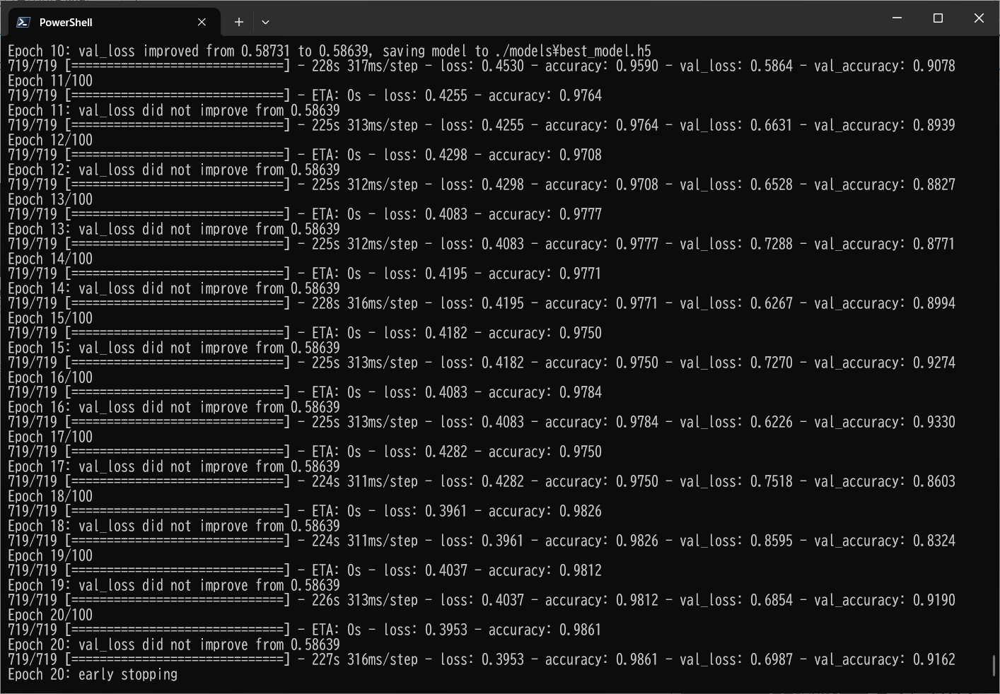 

As shown above, please note that the <b>best_model.h5</b> has been saved at epoch 14.
 
 
Train_accuracies: 
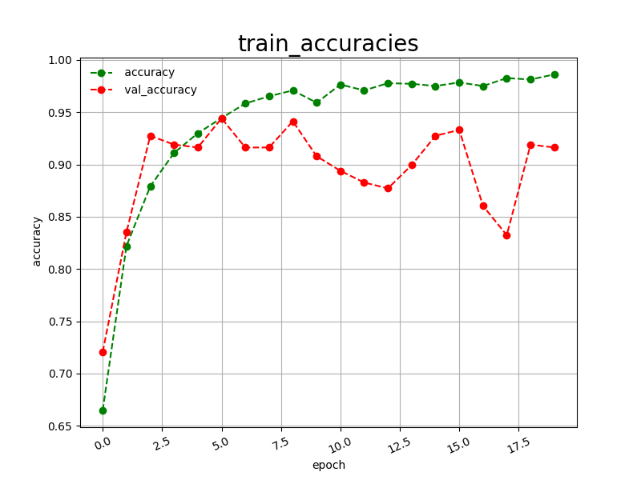 

 
Train_losses: 
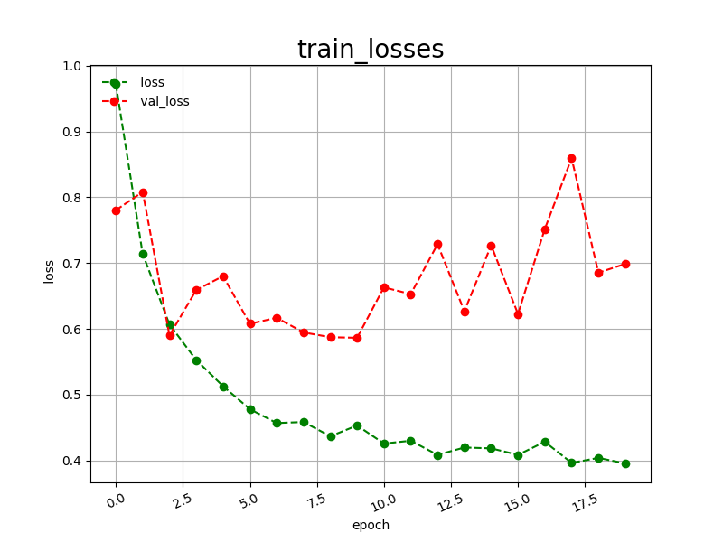 

 

<h3>
4. Inference
</h3>
<h3>
4.1 Inference script
</h3>
Please run the following bat file to infer the Cervical Cancer test images by the model generated by the above train command. 
<pre>
./2_inference.bat
</pre>
<pre>
rem 2_inference.bat
rem 2024/01/10
python ../../../efficientnetv2/EfficientNetV2Inferencer.py ^
  --model_name=efficientnetv2-m  ^
  --model_dir=./models ^
  --fine_tuning=True ^
  --trainable_layers_ratio=0.4 ^
  --dropout_rate=0.4 ^
  --image_path=./test/*.jpg ^
  --eval_image_size=512 ^
  --label_map=./label_map.txt ^
  --mixed_precision=True ^
  --infer_dir=./inference ^
  --debug=False 
</pre>
, where label_map.txt is the following: 
<pre>
HSIL
LSIL
NL
SCC
</pre>
 

<h3>
4.2 Sample test images
</h3>

Sample test images generated by <a href="./create_test_dataset.py">create_test_dataset.py</a> 
from <a href="./Cervical_Cancer_Images/test">Cervical Cancer_Images/test</a>.
Cervical-Cancer/test: 
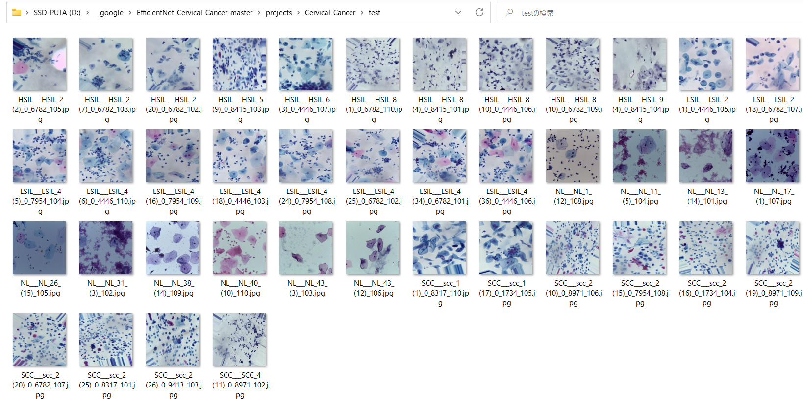
  

<h3>
4.3 Inference result
</h3>

This inference command will generate <a href="./inference/inference.csv">inference result file</a>.
 
Inference console output: 
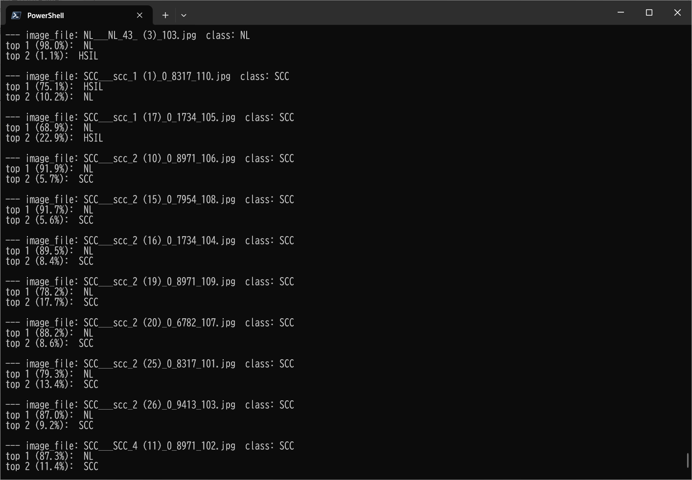 
 
Inference result: 
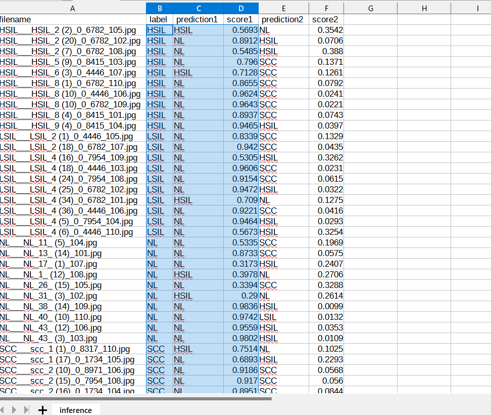 

<h2>
5. Evaluation
</h2>
<h3>
5.1 Evaluation script
</h3>
Please run the following bat file to evaluate <a href="./Cervical_Cancer_Image/test">Cervical-Cancer/Cervical_Cancer_Image/test dataset</a> by the trained model. 
<pre>
./3_evaluate.bat
</pre>
<pre>
rem 3_evaluate.bat
rem 2024/01/01
python ../../../efficientnetv2/EfficientNetV2Evaluator.py ^
  --model_name=efficientnetv2-m  ^
  --model_dir=./models ^
  --data_dir=./Resampled-pap-smear-images/test ^
  --evaluation_dir=./evaluation ^
  --fine_tuning=True ^
  --trainable_layers_ratio=0.4 ^
  --dropout_rate=0.4 ^
  --eval_image_size=512 ^
  --label_map=./label_map.txt ^
  --mixed_precision=True ^
  --debug=False 
</pre>

<h3>
5.2 Evaluation result
</h3>

This evaluation command will generate <a href="./evaluation/classification_report.csv">a classification report</a>
 and <a href="./evaluation/confusion_matrix.png">a confusion_matrix</a>.
 
 
Evaluation console output: 
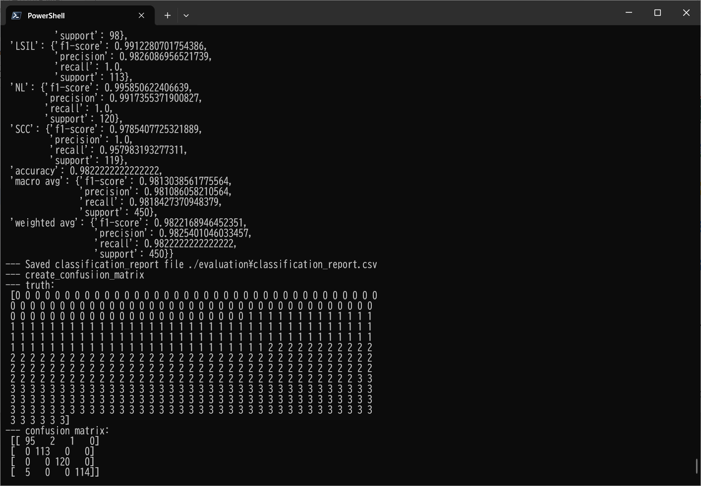 
 

Classification report: 
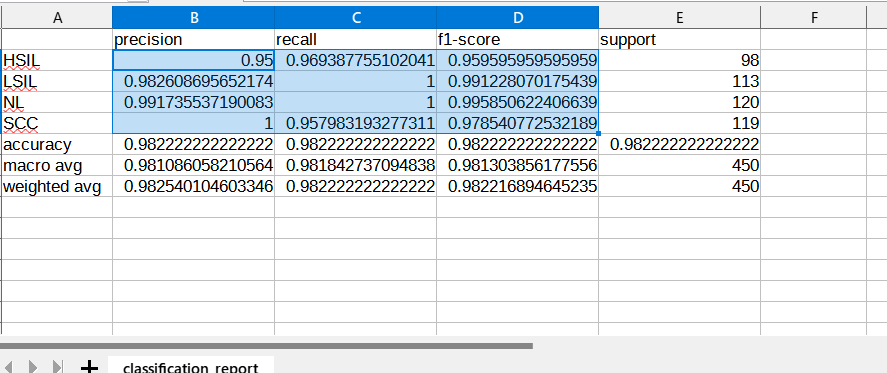 
 
Confusion matrix: 
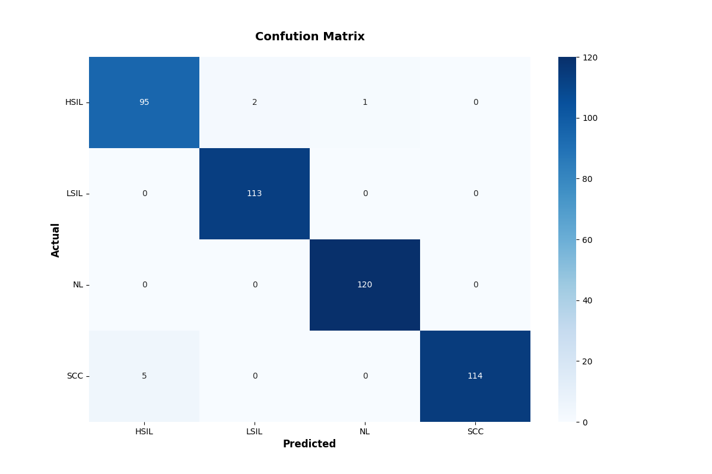 

<h3>References</h3>
<b>1, Liquid based cytology pap smear images for multi-class diagnosis of cervical cancer</b> 
<pre>
https://data.mendeley.com/datasets/zddtpgzv63/4
</pre>

<b>
2. Pap-smear Benchmark Data For Pattern Classification </b>
Jan Jantzen, Jonas Norup , George Dounias , Beth Bjerregaard 

<pre>
https://www.researchgate.net/publication/265873515_Pap-smear_Benchmark_Data_For_Pattern_Classification

</pre>
<b>
3. Deep Convolution Neural Network for Malignancy Detection and Classification in Microscopic Uterine Cervix Cell Images</b> 
Shanthi P B,1 Faraz Faruqi, Hareesha K S, and Ranjini Kudva 
<pre>
https://www.ncbi.nlm.nih.gov/pmc/articles/PMC7062987/
</pre>

<b>
4. DeepCyto: a hybrid framework for cervical cancer classification by using deep feature fusion of cytology images</b> 
Swati Shinde, Madhura Kalbhor, Pankaj Wajire 
<pre>
https://www.aimspress.com/article/doi/10.3934/mbe.2022301?viewType=HTML#b40
</pre>

