<h2>EfficientNetV2-Colorectal-Cancer</h2>

 This is an experimental EfficientNetV2 Colorectal Cancer Classification project based on <b>efficientnetv2</b> in <a href="https://github.com/google/automl">Brain AutoML</a>.
 
Please see also our first experiment <a href="https://github.com/atlan-antillia/EfficientNet-Colorectal-Cancer">
EfficientNet-Colorectal-Cancer
</a>.
 

<h3>1. Dataset Citation</h3>

The image dataset <b>CRC-VAL-HE-7K</b> used here has been taken from the following website: 
Zenodo: 100,000 histological images of human colorectal cancer and healthy tissue 
https://zenodo.org/record/1214456#.Y3sVDHZBy3A
 
Tissue classes included in the dataset are the following: 
<pre>
ADI    : Adipose 
BACK   : Background
DEB    : Debris 
LYM    : Lymphocytes
MUC    : Mucus
MUS    : Smooth muscle
NORM   : Normal colon mucosa 
STR    : Cancer-associated stroma  
TUM    : Colorectal adenocarcinoma epithelium
</pre>
 
 For simplicity, we have removed <b>BACK</b> and <b>DEB</b> folders from the original dataset, and converted the original tif files
 to jpg files by using <a href="./jpg_converter.py">jpg_converter.py</a> script. 

<h3>2. Download dataset</h3>

If you would like to train this EfficientNetV2 Colorectal-Cancer Model by yourself, please download the dataset
from the google drive <a href="https://drive.google.com/file/d/1kYXJsZlbthsrjF9apBQvpbkYW6R_UBGN/view?usp=sharing">
CRC-VAL-HE-7K-Images.zip</a>

It contains the following test and train datasets.  
<pre>
CRC-VAL-HE-7K-images
├─test
│  ├─ADI
│  ├─LYM
│  ├─MUC
│  ├─MUS
│  ├─NORM
│  ├─STR
│  └─TUM
└─train
    ├─ADI
    ├─LYM
    ├─MUC
    ├─MUS
    ├─NORM
    ├─STR
    └─TUM
</pre>
 
 
The distribution of the number of images in the dataset is the following: 
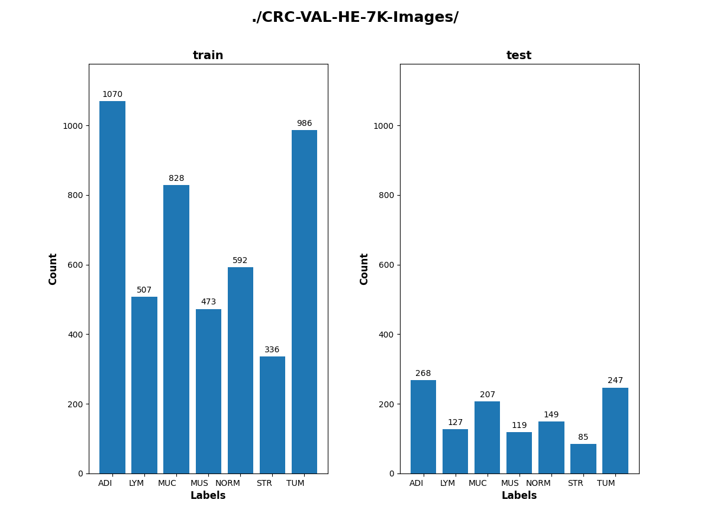 
 

CRC-VAL-HE-7K-images/train/ADI: 
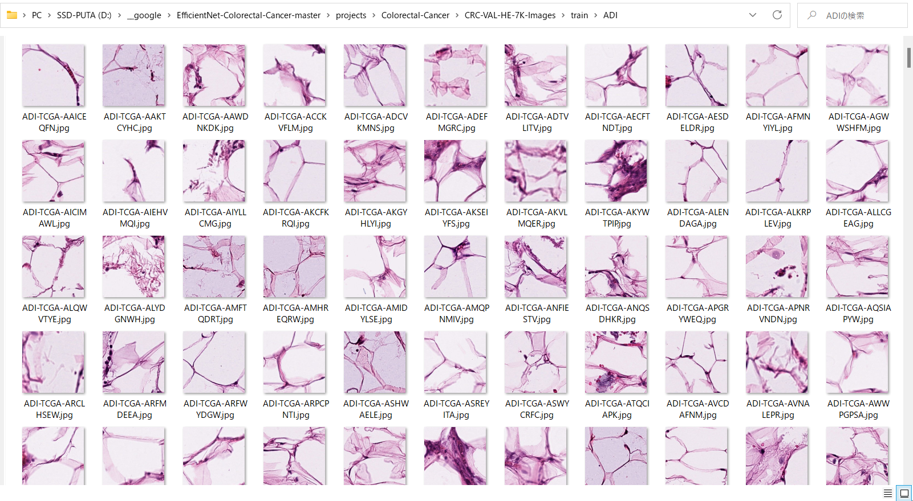
 
 
CRC-VAL-HE-7K-images/train/LYM: 
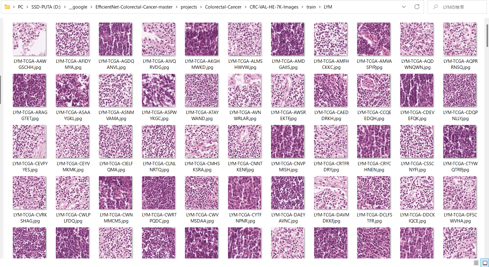
 
 
CRC-VAL-HE-7K-images/train/MUC: 
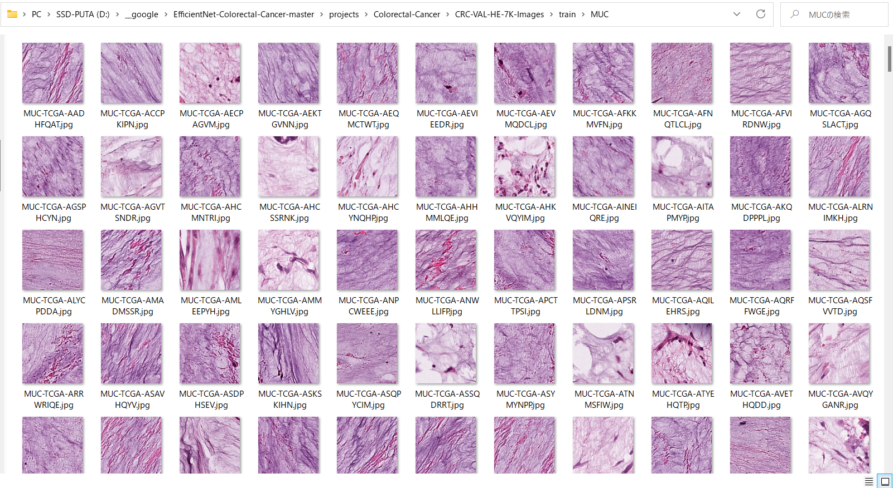
 
 
CRC-VAL-HE-7K-images/train/MUS: 
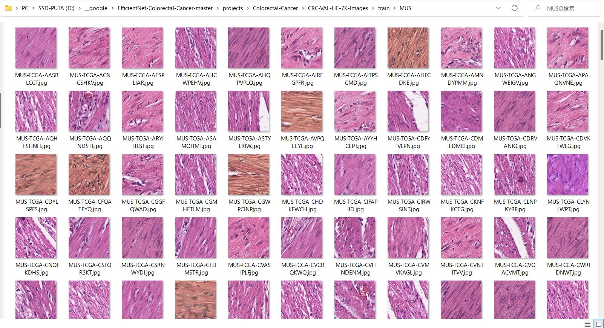
 

 
CRC-VAL-HE-7K-images/train/NORM: 
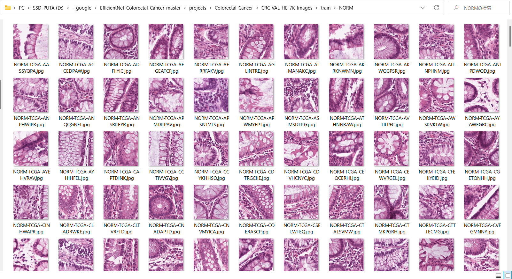
 
 
CRC-VAL-HE-7K-images/train/STR: 
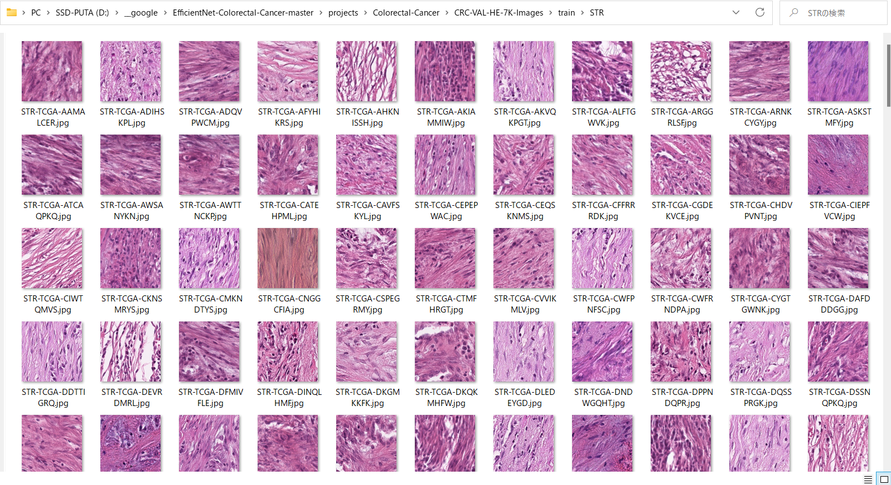
 
 
CRC-VAL-HE-7K-images/train/TUM: 
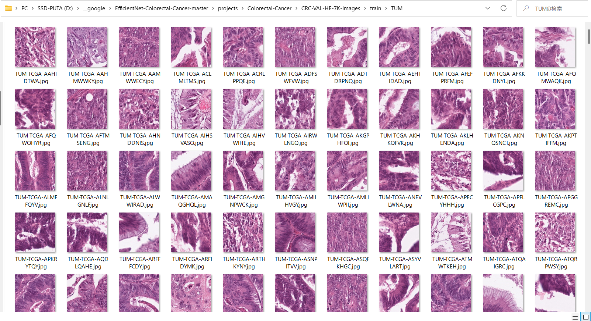
 

<h3>
3. Train
</h3>
<h3>
3.1 Train script
</h3>
Please run the following bat file to train our Colorectal-Cancer Classification Model by using
<a href="./CRC-VAL-HE-7K-Images/train">CRC-VAL-HE-7K-Images/train</a>.
<pre>
./1_train.bat
</pre>
<pre>
rem 1_train.bat
rem 2024/01/17
python ../../../efficientnetv2/EfficientNetV2ModelTrainer.py ^
  --model_dir=./models ^
  --eval_dir=./eval ^
  --model_name=efficientnetv2-b0  ^
  --data_generator_config=./data_generator.config ^
  --ckpt_dir=../../../efficientnetv2/efficientnetv2-b0/model ^
  --optimizer=rmsprop ^
  --image_size=224 ^
  --eval_image_size=224 ^
  --data_dir=./CRC-VAL-HE-7K-Images/train ^
  --data_augmentation=True ^
  --valid_data_augmentation=True ^
  --fine_tuning=True ^
  --monitor=val_loss ^
  --learning_rate=0.0001 ^
  --trainable_layers_ratio=0.4 ^
  --dropout_rate=0.2 ^
  --num_epochs=50 ^
  --batch_size=8 ^
  --patience=10 ^
  --debug=True  
</pre>
, where data_generator.config is the following: 
<pre>
; data_generation.config
[training]
validation_split   = 0.2
featurewise_center = Fale
samplewise_center  = False
featurewise_std_normalization=True
samplewise_std_normalization =False
zca_whitening                =False
rotation_range     = 90
horizontal_flip    = True
vertical_flip      = True
width_shift_range  = 0.1
height_shift_range = 0.1
shear_range        = 0.01
zoom_range         = [0.8, 1.2]
data_format        = "channels_last"

[validation]
validation_split   = 0.2
featurewise_center = False
samplewise_center  = False
featurewise_std_normalization=True
samplewise_std_normalization =False
zca_whitening                =False
rotation_range     = 90
horizontal_flip    = True
vertical_flip      = True
width_shift_range  = 0.1
height_shift_range = 0.1
shear_range        = 0.01
zoom_range         = [0.8, 1.2]
data_format        = "channels_last"
</pre>

<h3>
3.2 Training result
</h3>

This will generate a <b>best_model.h5</b> in the models folder specified by --model_dir parameter. 
Furthermore, it will generate a <a href="./eval/train_accuracies.csv">train_accuracies</a>
and <a href="./eval/train_losses.csv">train_losses</a> files
 
Training console output: 
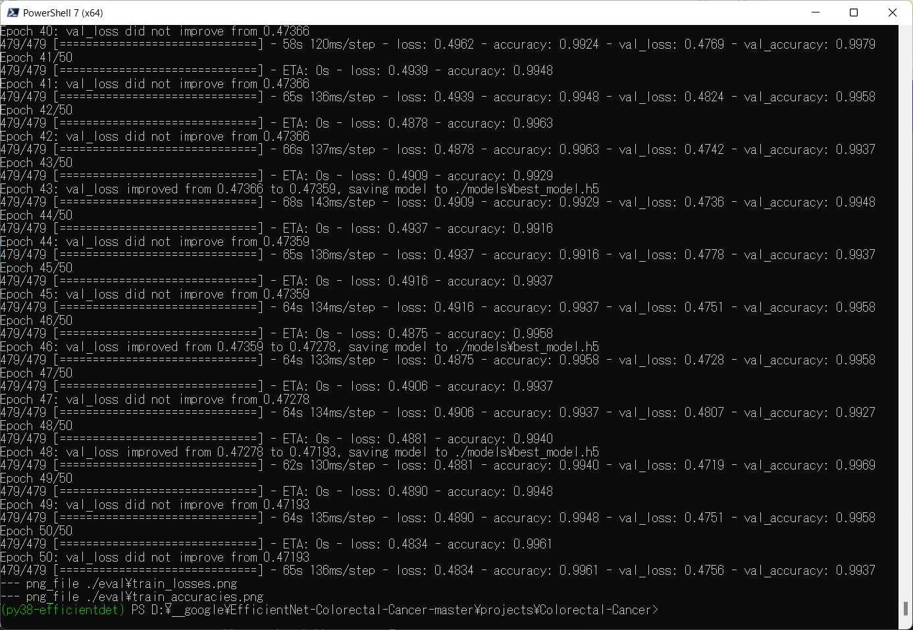 
 
Train_accuracies: 
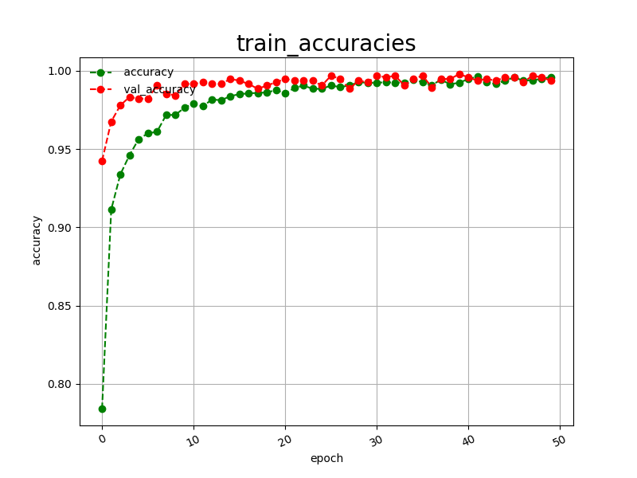 

 
Train_losses: 
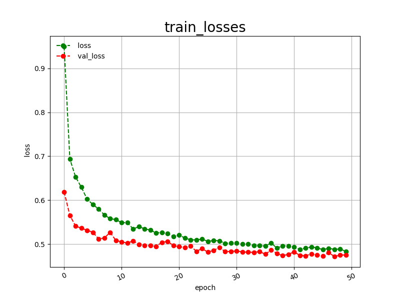 

 
<h3>
4. Inference
</h3>
<h3>
4.1 Inference script
</h3>
Please run the following bat file to infer the Colorectal Cancer in test images by the model generated by the above train command. 
<pre>
./2_inference.bat
</pre>
<pre>
rem 2_inference.bat
rem 2024/01/17
python ../../../efficientnetv2/EfficientNetV2Inferencer.py ^
  --model_name=efficientnetv2-b0  ^
  --model_dir=./models ^
  --fine_tuning=True ^
  --trainable_layers_ratio=0.4 ^
  --dropout_rate=0.2 ^
  --image_path=./test/*.jpeg ^
  --eval_image_size=224 ^
  --label_map=./label_map.txt ^
  --mixed_precision=True ^
  --infer_dir=./inference ^
  --debug=False 
</pre>
 
label_map.txt:
<pre>
ADI
LYM
MUC
MUS
NORM
STR
TUM
</pre>
 
<h3>
4.2 Sample test images
</h3>

Sample test images generated by <a href="./create_test_dataset.py">create_test_dataset.py</a> 
from <a href="./Colorectal_Images/test">Colorectal_Imagess/test</a>.
 
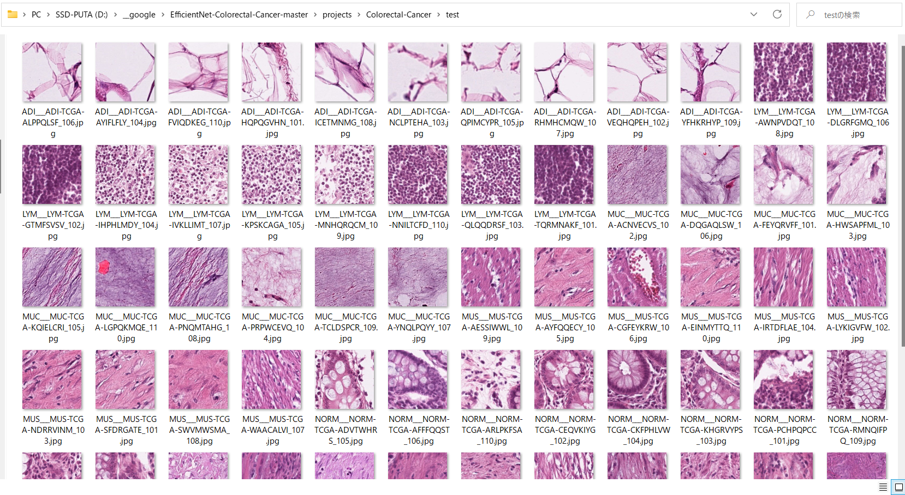 

<h3>
4.3 Inference result
</h3>
This inference command will generate <a href="./inference/inference.csv">inference result file</a>.
 
 
Inference console output: 
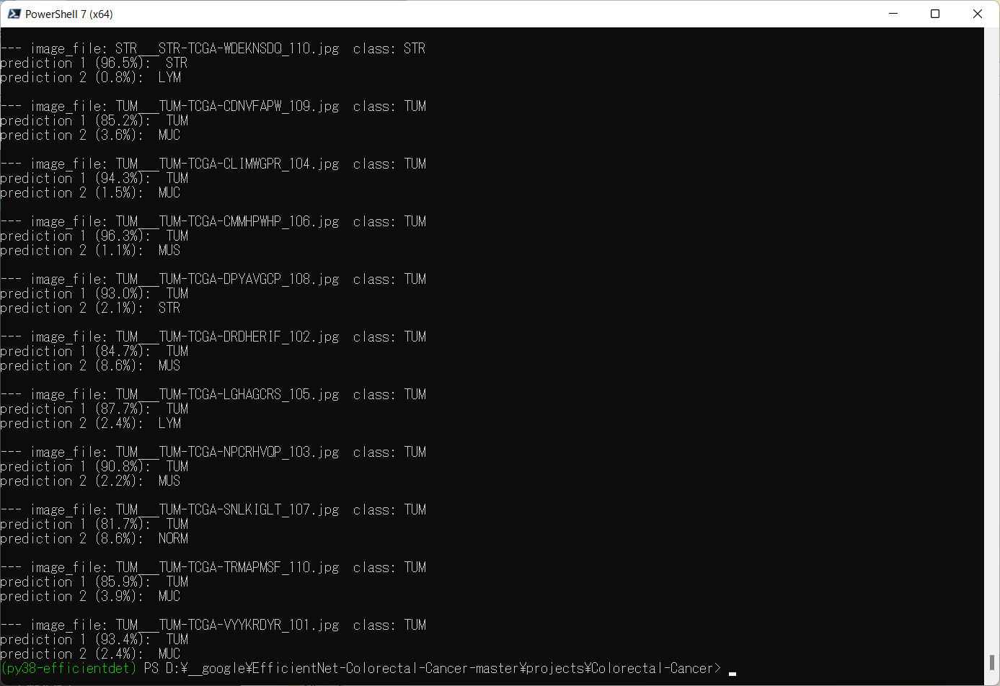 
 

Inference result (inference.csv): 
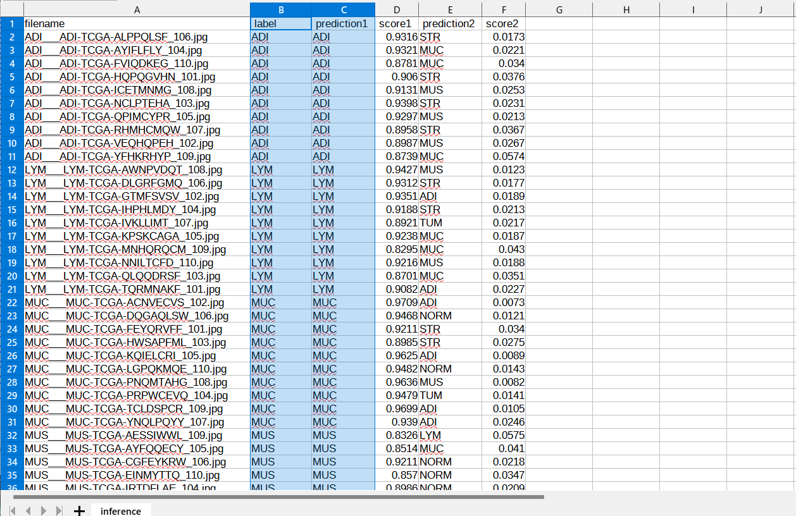 
 
<h3>
5. Evaluation
</h3>
<h3>
5.1 Evaluation script
</h3>
Please run the following bat file to evaluate <a href="./CRC-VAL-HE-7K-Images/test">
CRC-VAL-HE-7K-Images/test</a> by the trained model. 
<pre>
./3_evaluate.bat
</pre>
<pre>
rem 3_evaluate.bat
rem 2024/01/17
python ../../../efficientnetv2/EfficientNetV2Evaluator.py ^
  --model_name=efficientnetv2-b0  ^
  --model_dir=./models ^
  --data_dir=./CRC-VAL-HE-7K-Images/test ^
  --evaluation_dir=./evaluation ^
  --fine_tuning=True ^
  --trainable_layers_ratio=0.4 ^
  --dropout_rate=0.2 ^
  --eval_image_size=224 ^
  --mixed_precision=True ^
  --debug=False 
</pre>
 

<h3>
5.2 Evaluation result
</h3>

This evaluation command will generate <a href="./evaluation/classification_report.csv">a classification report</a>
 and <a href="./evaluation/confusion_matrix.png">a confusion_matrix</a>.
 
 
Evaluation console output: 
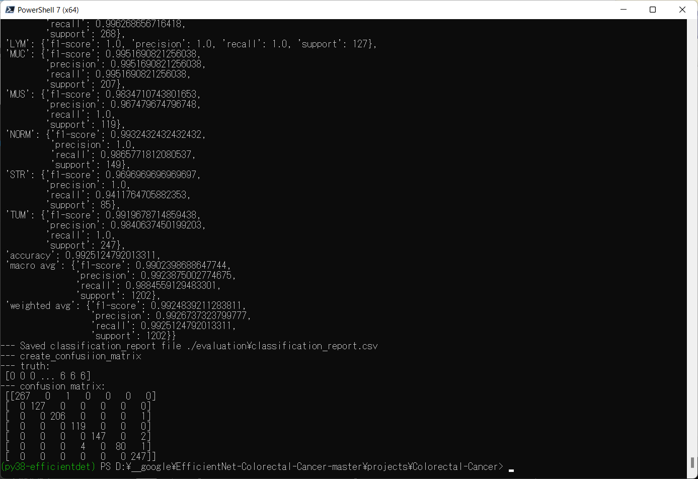 
 

 
Classification report: 
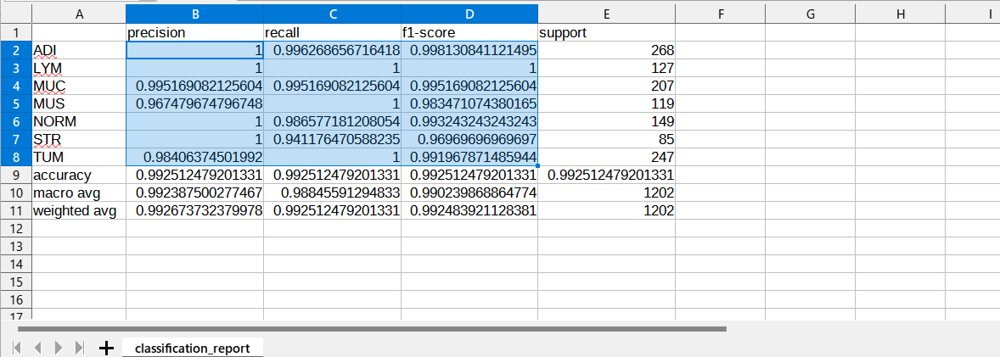 

 
Confusion matrix: 
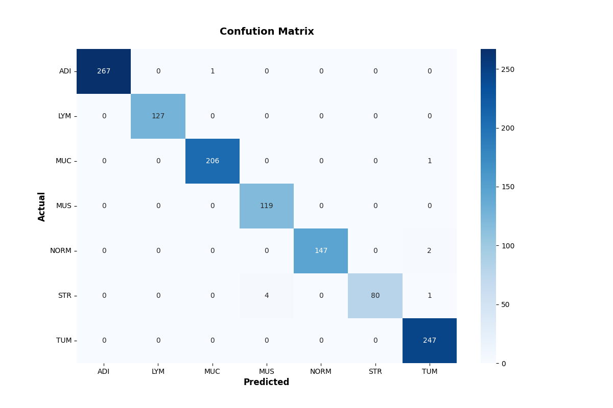 

<h3>
References
</h3>

<b>1. Deep Learning Techniques for the Classification of Colorectal Cancer Tissue
</b> 
Min-Jen Tsai and Yu-Han Tao 
<pre>
https://www.mdpi.com/2079-9292/10/14/1662/htm
</pre>

<b>2. Enhancing Histopathological Colorectal Cancer Image Classification by using Convolutional Neural Network
</b> 
Radwan Al.Shawesh, Yi Xiang Chen 
<pre>
https://www.medrxiv.org/content/10.1101/2021.03.17.21253390v1.full
</pre>

<b>3. Predicting survival from colorectal cancer histology slides using deep learning: A retrospective multicenter study
</b> 
Jakob Nikolas Kather et al. 
<pre>
https://www.ncbi.nlm.nih.gov/pmc/articles/PMC6345440/
</pre>
