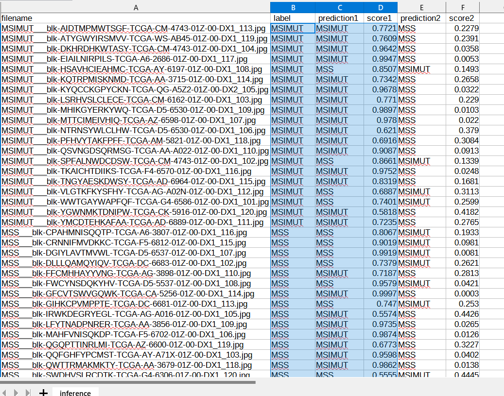

<h2>EfficientNetV2-Gastrointestinal-Cancer</h2>

 This is an experimental Gastrointestinal-Cancer Classification project based on <b>efficientnetv2</b> in 
 <a href="https://github.com/google/automl">Brain AutoML</a> 

 Please see also our first exeperiment <a href="https://github.com/atlan-antillia/EfficientNet-Gastrointestinal-Cancer">
EfficientNet-Gastrointestinal-Cancer</a>
 
<h3>1. Dataset Citation</h3>
The original MSI MSS Images dataset has been taken from the following web site: 
 
<b>
<a href="https://zenodo.org/record/2530835#.YxRox3ZBy3A">
Histological images for MSI vs. MSS classification in gastrointestinal cancer, FFPE samples
 
 Kather, Jakob Nikol 
</b>
</a>
<b>Rights</b>: 
<pre>
cc-by-4.0 icon
Creative Commons Attribution 4.0 International
</pre>

 
<a href="https://www.kaggle.com/code/linjustin/cnn-keras/data">
<b>CNN Keras Python · Gastrointestinal Cancer MSI MSS Prediction</b>
</a>

<h3>
2. Download dataset
</h3>

Please download the dataset <b>MSI MSS (tcga_coad_msi_mss.zip) </b> from the following web site:
 
<a href="https://www.kaggle.com/code/linjustin/cnn-keras/data">
<b>CNN Keras Python · Gastrointestinal Cancer MSI MSS Prediction</b>
</a>
 
The dataset <b>tcga_coad_msi_mss</b> has the following three directories: 
<pre>
.
├─test
├─train
└─val
</pre>
    
For simplicity, we use test and train sets. Please copy those directories under
<pre>
MSIMUT_MSS_Images
  ├─test
  │  ├─MSIMUT
  │  └─MSS
  └─train
      ├─MSIMUT
      └─MSS
</pre>

The number of images in train and test dataset: 
 
 
 
Sample images of MSIMUT_MSS_Images/train/MSIMUT: 

  
 
Sample images of MSIMUT_MSS_Images/train/MSS: 

  
 

<h3>
3. Train
</h3>
<h3>
3.1 Training script
</h3>
Please run the following bat file to train our Gastrointestinal-Cancer Model by using
<b>MSIMUT_MSS_Images/train</b>.
<pre>
./1_train.bat
</pre>
<pre>
rem 1_train.bat
rem 2024/01/01 
python ../../../efficientnetv2/EfficientNetV2ModelTrainer.py ^
  --model_dir=./models ^
  --eval_dir=./eval ^
  --model_name=efficientnetv2-b0 ^
  --data_generator_config=./data_generator.config ^
  --ckpt_dir=../../../efficientnetv2/efficientnetv2-b0/model ^
  --optimizer=rmsprop ^
  --image_size=224 ^
  --eval_image_size=224 ^
  --data_dir=./MSIMUT_MSS_Images/train ^
  --data_augmentation=True ^
  --fine_tuning=True ^
  --monitor=val_loss ^
  --learning_rate=0.0001 ^
  --trainable_layers_ratio=0.4 ^
  --dropout_rate=0.4 ^
  --num_epochs=100 ^
  --batch_size=8 ^
  --patience=10 ^
  --debug=True  
</pre>
, where data_generator.config is the following: 
<pre>
; data_generation.config
; 2024/01/10
[training]
validation_split   = 0.2
featurewise_center = True
samplewise_center  = False
featurewise_std_normalization=True
samplewise_std_normalization =False
zca_whitening                =False
rotation_range     = 30
horizontal_flip    = True
vertical_flip      = True
width_shift_range  = 0.2
height_shift_range = 0.2
shear_range        = 0.01
zoom_range         = [0.5, 2.0]

;channel_shift_range= 10
;brightness_range   = None #[0.8,1.0]
data_format        = "channels_last"
</pre>

<h3>
3.2 Training result
</h3>

This will generate a <b>best_model.h5</b> in the models folder specified by --model_dir parameter. 
Furthermore, it will generate a <a href="./eval/train_accuracies.csv">train_accuracies</a>
and <a href="./eval/train_losses.csv">train_losses</a> files
 
Training console output: 
 
 
Train_accuracies: 
 

 
Train_losses: 
 

 
<h3>
4. Inference
</h3>
<h3>
4.1 Inference script
</h3>
Please run the following bat file to infer the  in test images by the model generated by the above train command. 
<pre>
./2_inference.bat
</pre>
<pre>
rem 2_inference.bat
rem 2024/01/01
python ../../../efficientnetv2/EfficientNetV2Inferencer.py ^
  --model_name=efficientnetv2-b0  ^
  --model_dir=./models ^
  --fine_tuning=True ^
  --trainable_layers_ratio=0.4 ^
  --dropout_rate=0.4 ^
  --image_path=./test/*.jpg ^
  --eval_image_size=224 ^
  --label_map=./label_map.txt ^
  --mixed_precision=True ^
  --infer_dir=./inference ^
  --debug=False 
</pre>
 
label_map.txt:
<pre>
Benign
Early
Pre
Pro
</pre>
 
<h3>
4.2 Sample test images
</h3>
Sample test images generated by <a href="./create_test_dataset.py">create_test_dataset.py</a> 
from <a href="./MSIMUT_MSS_Images/test">MSIMUT_MSS_Images/test</a>.
 
 

 
<h3>
4.3 Inference result
</h3>
This inference command will generate <a href="./inference/inference.csv">inference result file</a>.
 
 
Inference console output: 
 
 

Inference result (inference.csv): 
 
 
<h3>
5. Evaluation
</h3>
<h3>
5.1 Evaluation script
</h3>
Please run the following bat file to evaluate <a href="./MSIMUT_MSS_Images/test">
MSIMUT_MSS_Images/test</a> by the trained model. 
<pre>
./3_evaluate.bat
</pre>
<pre>
rem 3_evaluate.bat
rem 2024/01/01
python ../../../efficientnetv2/EfficientNetV2Evaluator.py ^
  --model_name=efficientnetv2-b0  ^
  --model_dir=./models ^
  --data_dir=./MSIMUT_MSS_Images/test ^
  --evaluation_dir=./evaluation ^
  --fine_tuning=True ^
  --trainable_layers_ratio=0.4 ^
  --dropout_rate=0.4 ^
  --eval_image_size=224 ^
  --mixed_precision=True ^
  --debug=False 
</pre>
 

<h3>
<a id="6.2">6.2 Evaluation result</a>
</h3>

This evaluation command will generate <a href="./evaluation/classification_report.csv">a classification report</a>
 and <a href="./evaluation/confusion_matrix.png">a confusion_matrix</a>.
 
 
Evaluation console output: 
 
 

 
Classification report: 
 
 
Confusion matrix: 
 

<h3>
References
</h3>
<b>1. Gastrointestinal cancer classification and prognostication from histology using deep learning: Systematic review</b> 
<pre>
Kuntz S, Krieghoff-Henning E, Kather JN, Jutzi T, Höhn J, Kiehl L, Hekler A, Alwers E, 
von Kalle C, Fröhling S, Utikal JS, Brenner H, Hoffmeister M, Brinker TJ. 
Gastrointestinal cancer classification and prognostication from histology 
 using deep learning: Systematic review. Eur J Cancer. 
2021 Sep;155:200-215. 
doi: 10.1016/j.ejca.2021.07.012. 
Epub 2021 Aug 11. PMID: 34391053.
</pre>
<pre>
https://www.ncbi.nlm.nih.gov/pmc/articles/PMC10280208/
</pre>

<b>2. Gastric cancer: Classification, histology and application of molecular pathology</b> 
<pre>
Hu B, El Hajj N, Sittler S, Lammert N, Barnes R, Meloni-Ehrig A. Gastric cancer: 
Classification, histology and application of molecular pathology. J Gastrointest Oncol. 
2012 Sep;3(3):251-61. 
doi: 10.3978/j.issn.2078-6891.2012.021. 
PMID: 22943016; PMCID: PMC3418539.
</pre>
<pre>
https://www.ncbi.nlm.nih.gov/pmc/articles/PMC3418539/
</pre>

