<h2>EfficientNetV2-Lung-Colon-Cancer</h2>

 This is an experimental EfficientNetV2 Lung Colon Cancer Classification project based on <b>efficientnetv2</b> in <a href="https://github.com/google/automl">Brain AutoML</a>.
 
Please see also our first experiment <a href="https://github.com/atlan-antillia/EfficientNet-Lung-Colon-Cancer">
EfficientNet-Lung-Colon-Cancer</a>
 
<h3>1. Dataset Citation</h3>
 The original lung_colon_image_set has been taken from the following web site: 
<a href="https://www.kaggle.com/datasets/andrewmvd/lung-and-colon-cancer-histopathological-images">
Lung and Colon Cancer Histopathological Images
</a> 
See also: 
<a href="https://www.kaggle.com/code/tenebris97/lung-colon-all-5-classes-efficientnetb7-98/data">
Lung & Colon ALL 5 Classes | EfficientNetB7 | 98%%
</a>

<b>About This Data:</b> 
<pre>
This dataset contains 25,000 histopathological images with 5 classes. All images are 768 x 768 pixels in size and are in jpeg file format.
The images were generated from an original sample of HIPAA compliant and validated sources, consisting of 750 total images of lung tissue (250 benign lung tissue, 250 lung adenocarcinomas, and 250 lung squamous cell carcinomas) and 500 total images of colon tissue (250 benign colon tissue and 250 colon adenocarcinomas) and augmented to 25,000 using the Augmentor package.
There are five classes in the dataset, each with 5,000 images, being:

Lung benign tissue
Lung adenocarcinoma
Lung squamous cell carcinoma
Colon adenocarcinoma
Colon benign tissue
How to Cite this Dataset
If you use in your research, please credit the author of the dataset:

Original Article
Borkowski AA, Bui MM, Thomas LB, Wilson CP, DeLand LA, Mastorides SM. Lung and Colon Cancer Histopathological Image Dataset (LC25000). arXiv:1912.12142v1 [eess.IV], 2019

Relevant Links
https://arxiv.org/abs/1912.12142v1
https://github.com/tampapath/lung_colon_image_set
Dataset BibTeX
@article{,
title= {LC25000 Lung and colon histopathological image dataset},
keywords= {cancer,histopathology},
author= {Andrew A. Borkowski, Marilyn M. Bui, L. Brannon Thomas, Catherine P. Wilson, Lauren A. DeLand, Stephen M. Mastorides},
url= {https://github.com/tampapath/lung_colon_image_set}
}
</pre>

 
The original <b>lung_colon_image_set</b> has two sub directories, <b>colon_image_sets</b> and <b>lung_image_sets</b>: 
<pre>
lung_colon_image_set
  ├─colon_image_sets
  │  ├─colon_aca
  │  └─colon_n
  └─lung_image_sets
      ├─lung_aca
      ├─lung_n
      └─lung_scc
</pre>
We have created <b>Lung_Colon_Images</b> dataset of 5 classes from the original dataset. 
If you would like to train EfficientNetV2 Lung-Colon-Cancer Model by yourself,
please download the dataset of 5 classes from the google drive 
<a href="https://drive.google.com/file/d/1x5BaihxLYvbHoxNUaPzd86gk-Dw3X2fj/view?usp=sharing">Lung_Colon_Images.zip</a> .
 
It contains the following test and train datasets. 
<pre>
Lung_Colon_Images
  ├─test
  │  ├─colon_aca
  │  ├─colon_n
  │  ├─lung_aca
  │  ├─lung_n
  │  └─lung_scc
  └─train
      ├─colon_aca
      ├─colon_n
      ├─lung_aca
      ├─lung_n
      └─lung_scc
</pre>
 
 
The number of images in classes of train and test sets: 
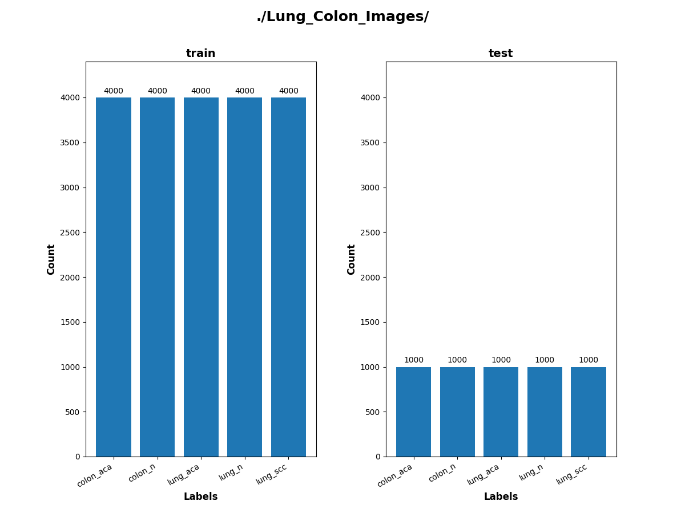 
 
 
Sample images of Lung_Colon_Images/train/colon_aca: 
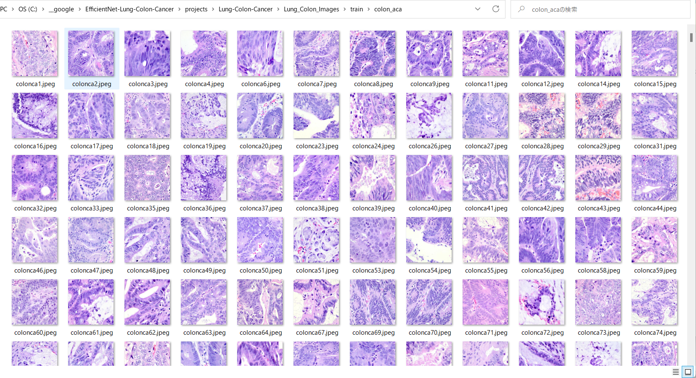
 
 

Sample images of Lung_Colon_Images/train/colon_n: 
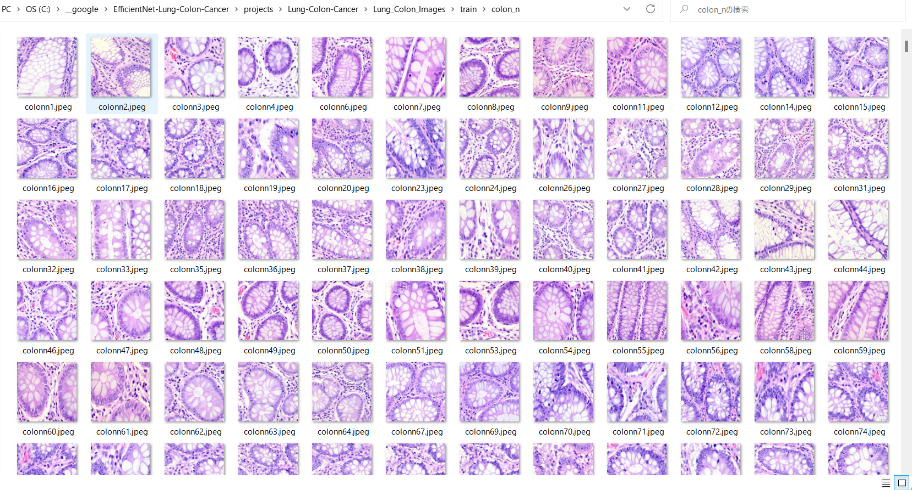
 
 

Sample images of Lung_Colon_Images/train/lung_aca: 
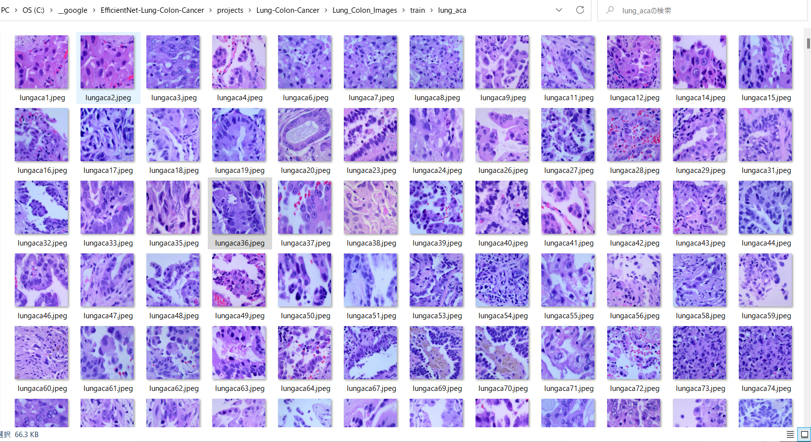
 
 

Sample images of Lung_Colon_Images/train/lung_n: 
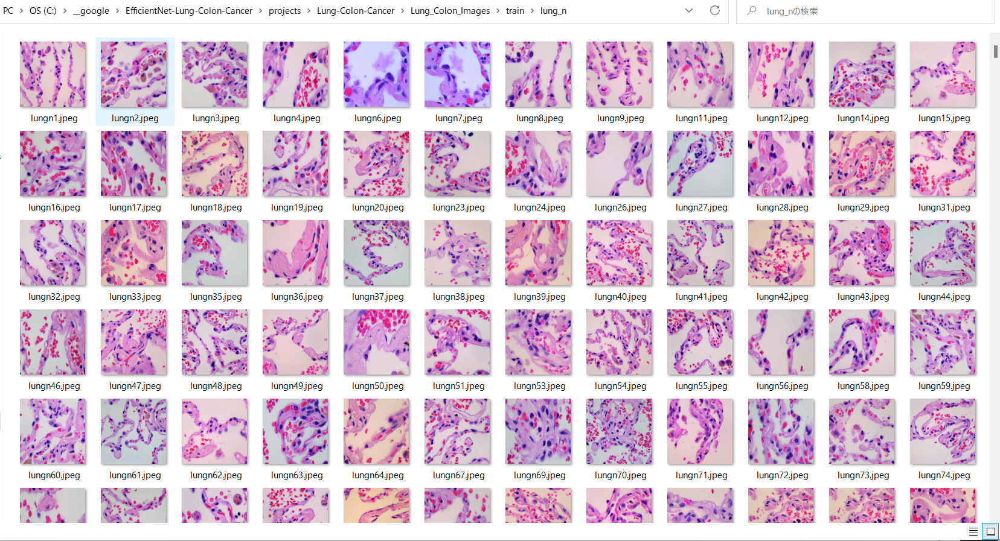
 
 

Sample images of Lung_Colon_Images/train/lung_scc: 
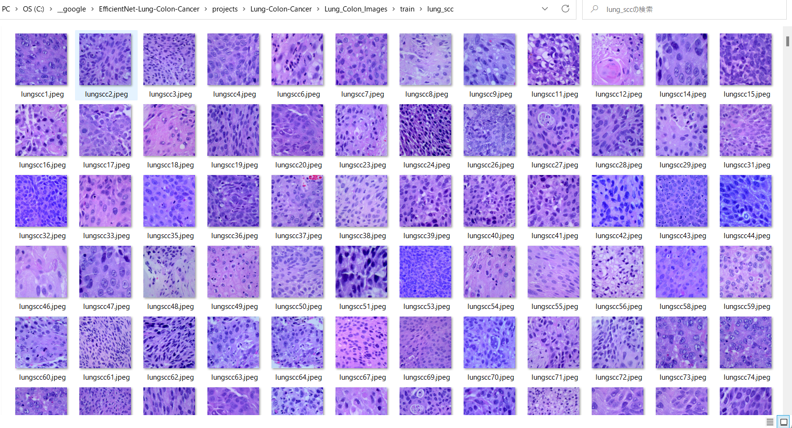
 
 
<h3>
3. Train
</h3>
<h3>
3.1 Training script
</h3>
Please run the following bat file to train our Lung Colon efficientnetv2 model by using
<b>Lung_Colon_Images/train</b>.
<pre>
./1_train.bat
</pre>
<pre>
rem 1_train.bat
rem 2024/01/17
python ../../../efficientnetv2/EfficientNetV2ModelTrainer.py ^
  --model_dir=./models ^
  --eval_dir=./eval ^
  --model_name=efficientnetv2-m  ^
  --data_generator_config=./data_generator.config ^
  --ckpt_dir=../../../efficientnetv2/efficientnetv2-m/model ^
  --optimizer=rmsprop ^
  --image_size=384 ^
  --eval_image_size=480 ^
  --data_dir=./Lung_Colon_Images/train ^
  --data_augmentation=True ^
  --valid_data_augmentation=True ^
  --fine_tuning=True ^
  --monitor=val_loss ^
  --learning_rate=0.0001 ^
  --trainable_layers_ratio=0.4 ^
  --dropout_rate=0.3 ^
  --num_epochs=50 ^
  --batch_size=4 ^
  --patience=10 ^
  --debug=True  
</pre>
, where data_generator.config is the following: 
<pre>
; data_generation.config

[training]
validation_split   = 0.2
featurewise_center = True
samplewise_center  = False
featurewise_std_normalization=True
samplewise_std_normalization =False
zca_whitening                =False
rotation_range     = 60
horizontal_flip    = True
vertical_flip      = True 
width_shift_range  = 0.1
height_shift_range = 0.1
shear_range        = 0.01
zoom_range         = [0.2, 2.0]
data_format        = "channels_last"

[validation]8
validation_split   = 0.2
featurewise_center = True
samplewise_center  = False
featurewise_std_normalization=True
samplewise_std_normalization =False
zca_whitening                =False
rotation_range     = 60
horizontal_flip    = True
vertical_flip      = True
width_shift_range  = 0.1
height_shift_range = 0.1
shear_range        = 0.01
zoom_range         = [0.3, 2.0]
data_format        = "channels_last"
</pre>

<h3>
3.2 Training result
</h3>

This will generate a <b>best_model.h5</b> in the models folder specified by --model_dir parameter. 
Furthermore, it will generate a <a href="./eval/train_accuracies.csv">train_accuracies</a>
and <a href="./eval/train_losses.csv">train_losses</a> files
 
Training console output: 
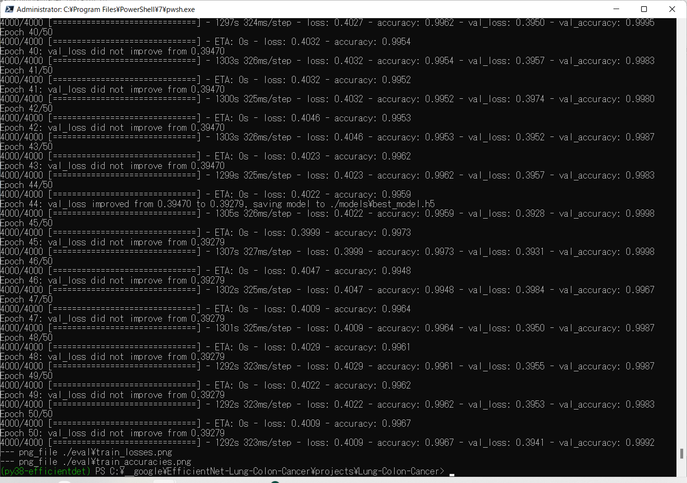 
 
Train_accuracies: 
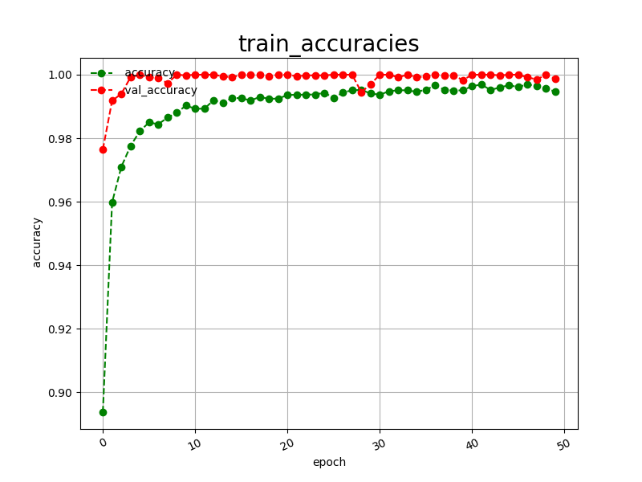 

 
Train_losses: 
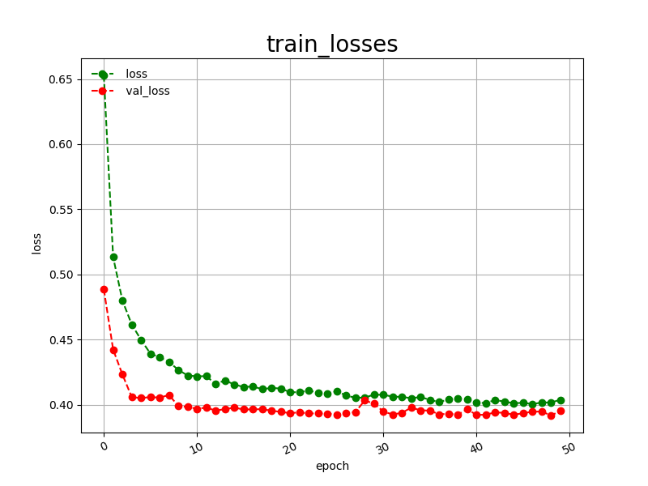 

 
<h3>
4. Inference
</h3>
<h3>
4.1 Inference script
</h3>
Please run the following bat file to infer the Lung Colon Cancer in test images by the model generated by the above train command. 
<pre>
./2_inference.bat
</pre>
<pre>
rem 2_inference.bat
rem 2024/01/17
python ../../../efficientnetv2/EfficientNetV2Inferencer.py ^
  --model_name=efficientnetv2-m  ^
  --model_dir=./models ^
  --fine_tuning=True ^
  --trainable_layers_ratio=0.4 ^
  --dropout_rate=0.3 ^
  --image_path=./test/*.jpeg ^
  --eval_image_size=480 ^
  --label_map=./label_map.txt ^
  --mixed_precision=True ^
  --infer_dir=./inference ^
  --debug=False 
</pre>
 
label_map.txt:
<pre>
colon_aca
colon_n
lung_aca
lung_n
lung_scc
</pre>
 
<h3>
4.2 Sample test images
</h3>

Sample test images generated by <a href="./create_test_dataset.py">create_test_dataset.py</a> 
from <a href="./Lung_Colon_Images/test">Lung_Colon_Images/test</a>.
 
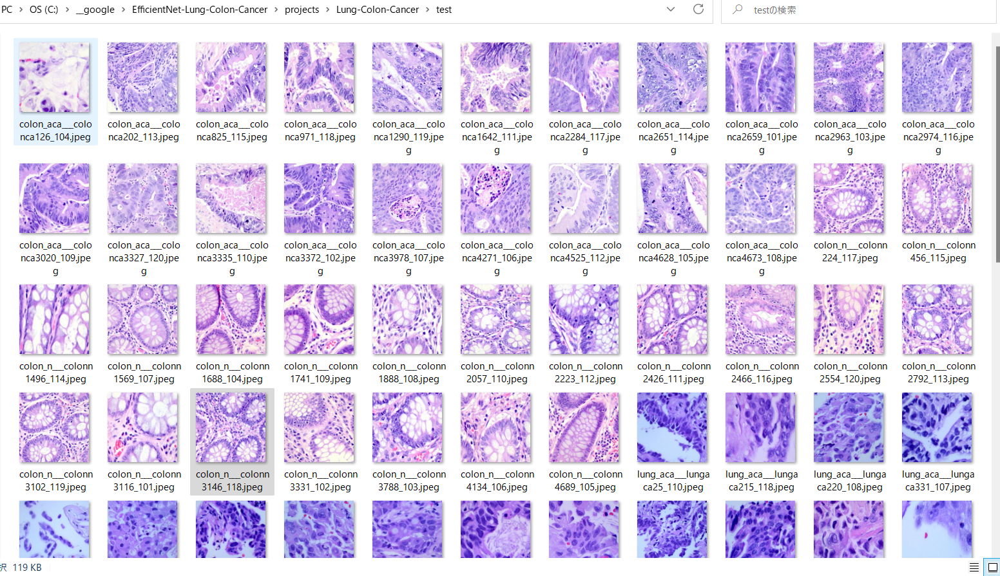 

 
<h3>
4.3 Inference result
</h3>
This inference command will generate <a href="./inference/inference.csv">inference result file</a>.
 
 
Inference console output: 
 
 

Inference result (inference.csv): 
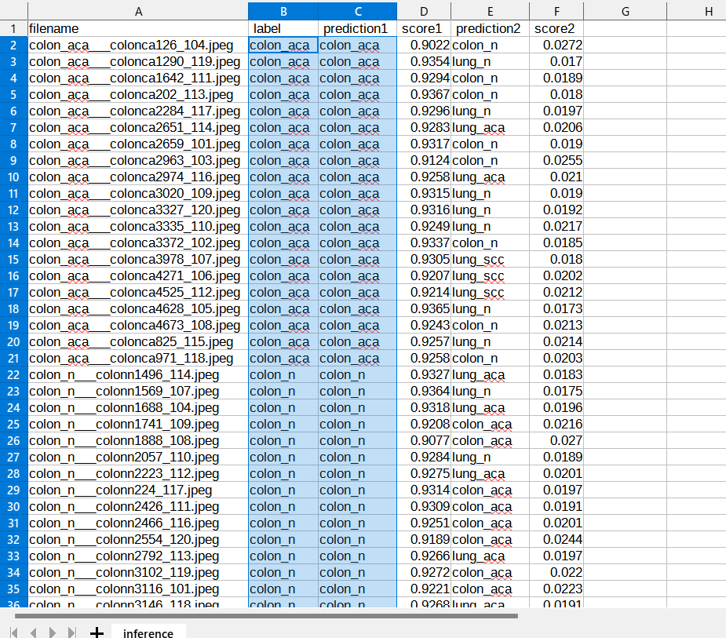 
 
<h3>
5. Evaluation
</h3>
<h3>
5.1 Evaluation script
</h3>
Please run the following bat file to evaluate <a href="./Lung_Colon_Images/test">
Lung_Colon_Images/test</a> by the trained model. 
<pre>
./3_evaluate.bat
</pre>
<pre>
rem 3_evaluate.bat
rem 2024/01/17
python ../../../efficientnetv2/EfficientNetV2Evaluator.py ^
  --model_name=efficientnetv2-m  ^
  --model_dir=./models ^
  --data_dir=./Lung_Colon_Images/test ^
  --evaluation_dir=./evaluation ^
  --fine_tuning=True ^
  --trainable_layers_ratio=0.4 ^
  --dropout_rate=0.3 ^
  --eval_image_size=480 ^
  --mixed_precision=True ^
  --debug=False 
</pre>
 

<h3>
5.2 Evaluation result
</h3>

This evaluation command will generate <a href="./evaluation/classification_report.csv">a classification report</a>
 and <a href="./evaluation/confusion_matrix.png">a confusion_matrix</a>.
 
 
Evaluation console output: 
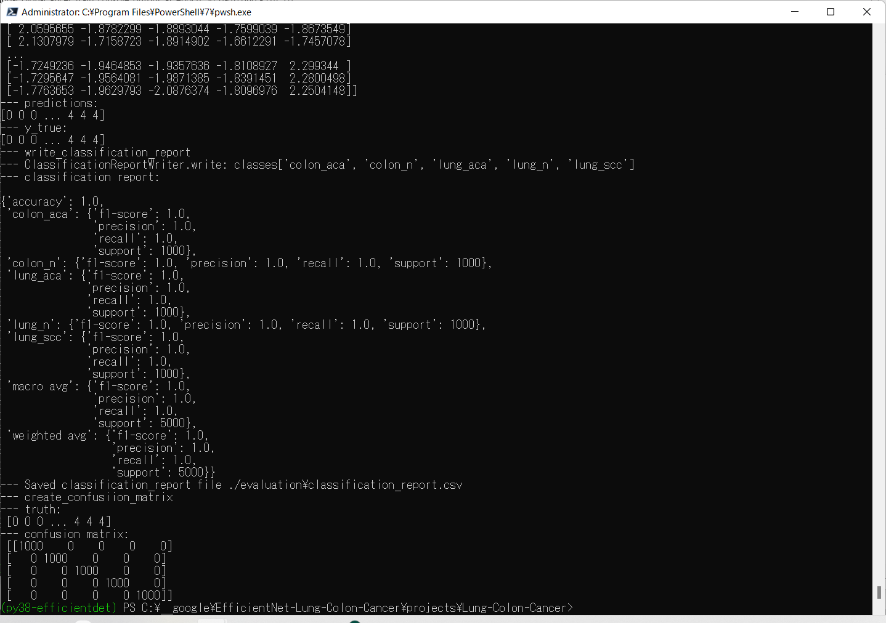 
 

 
Classification report: 
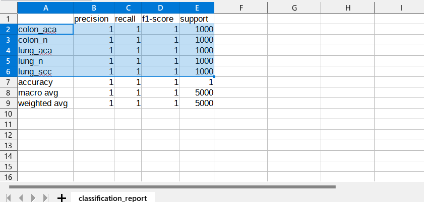 
 
Confusion matrix: 
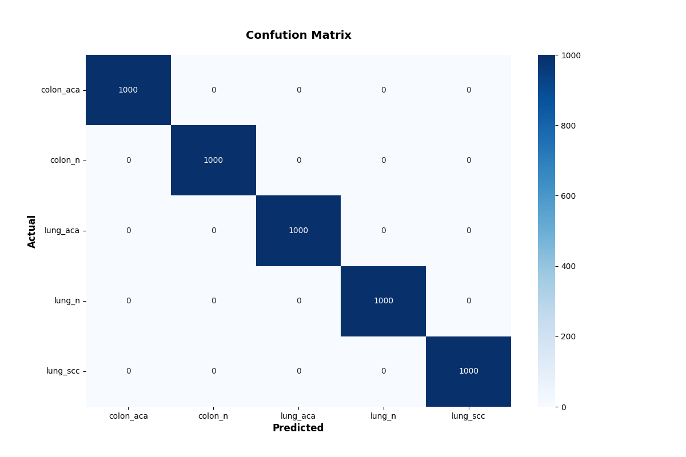 

 
<h3>
References
</h3>
<b>
1. A Machine Learning Approach to Diagnosing Lung and Colon Cancer Using a Deep Learning-Based Classification Framework
</b> 
<pre>
https://www.ncbi.nlm.nih.gov/pmc/articles/PMC7865416/  
</pre>
 
<b>2. Lung and Colon Cancer Histopathological Images</b> 
<pre>
https://www.kaggle.com/datasets/andrewmvd/lung-and-colon-cancer-histopathological-images
</pre>
 
<b>3. Lung & Colon ALL 5 Classes | EfficientNetB7 | 98%</b>  
<pre>
https://www.kaggle.com/code/tenebris97/lung-colon-all-5-classes-efficientnetb7-98/data
</pre>

