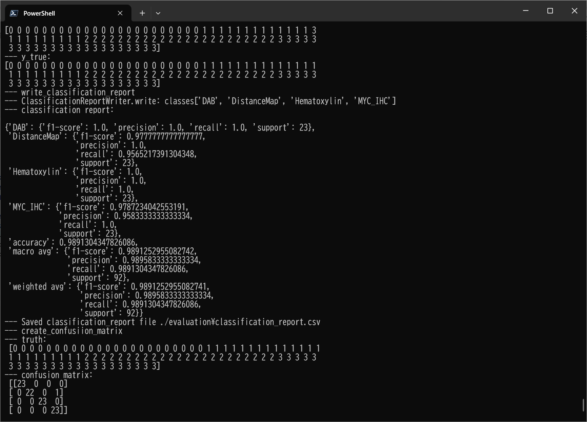

<h2>EfficientNetV2-Lymphoma</h2>
 This is an experimental EfficientNetV2 Lymphoma Classification project based on <b>efficientnetv2</b> 
 in <a href="https://github.com/google/automl">Brain AutoML</a>.
  
Please see also our first experiment <a href="https://github.com/sarah-antillia/EfficientNet-Lymphoma">EfficientNet-Lymphoma
</a> 

<h3>1. Dataset Citation</h3>

The orignal Lymphoma image dataset used here has been taken from the following web site:
<pre>
Dataset: https://bit.ly/2MdWSzp

Citation:
https://www.ncbi.nlm.nih.gov/pubmed/27093450
https://arxiv.org/abs/1409.1556
https://arxiv.org/abs/1905.11946
</pre>

<h3>2. Download dataset</h3>
If you would like to train Lymphoma Model by yourself,
please download from the original image dataset <b>Picture</b> from the following web site:
 
Dataset: https://bit.ly/2MdWSzp 

 
The dataset contains the following 4 types of images: 
<pre>
DAB(MYC signal)
Distance map of positive nuclei
Hematoxylin (blue counterstrain)
MYC IHC
</pre>
However, for simplicity, we use the following short names instead of 4 types name above: 
<pre>
DAB
DistanceMap
Hematoxylin
MYC_IHC
</pre>

  We have created <b>Lymphoma_images_master</b> dataset from
the orignal image dataset <b>Pictures</b> by using 
<a href="./create_master.py">create_master.py</a> script, by which
we have converted the original tif files to jpg files and reduced the size of the image to 1/5.
If you would like to use the jpg image dataset, please down load the dataset from the 
google drive
<a href="https://drive.google.com/file/d/1C_PioX26LXdL5-P0m1XxeGZt-tvrT-cB/view?usp=sharing">Lymphoma_Images.zip</a>
 
<pre>
Lymphoma_Images
  ├─test
  │  ├─DAB
  │  ├─DistanceMap
  │  ├─Hematoxylin
  │  └─MYC_IHC
  └─train
      ├─DAB
      ├─DistanceMap
      ├─Hematoxylin
      └─MYC_IHC
</pre>

 

The numbe of images of this dataset is the following. 

 

Sample images of Lymphoma_images/train/DAB: 

  

Sample images of Lymphoma_images/train/DistanceMap: 

  

Sample images of Lymphoma_images/train/Hematoxylin: 

  

Sample images of Lymphoma_images/train/MYC_IHC: 

  

 

<h2>
3. Train
</h2>
<h3>
3.1 Training script
</h3>
Please run the following bat file to train our Lymphoma efficientnetv2 model by using
<b>Lymphoma_images/train</b>.
<pre>
./1_train.bat
</pre>
<pre>
rem 1_train.bat
rem 2024/01/10
python ../../../efficientnetv2/EfficientNetV2ModelTrainer.py ^
  --model_dir=./models ^
  --eval_dir=./eval ^
  --model_name=efficientnetv2-m ^
  --data_generator_config=./data_generator.config ^
  --ckpt_dir=../../../efficientnetv2/efficientnetv2-m/model ^
  --optimizer=rmsprop ^
  --image_size=380 ^
  --eval_image_size=380 ^
  --data_dir=./Lymphoma_images/train ^
  --data_augmentation=True ^
  --fine_tuning=True ^
  --monitor=val_loss ^
  --learning_rate=0.0001 ^
  --trainable_layers_ratio=0.4 ^
  --dropout_rate=0.4 ^
  --num_epochs=100 ^
  --batch_size=4 ^
  --patience=10 ^
  --debug=True  
</pre>
, where data_generator.config is the following: 
<pre>
; data_generation.config
; 2024/01/14
[training]
validation_split   = 0.2
featurewise_center = False
samplewise_center  = False
featurewise_std_normalization=False
samplewise_std_normalization =False
zca_whitening                =False
rotation_range     = 90
horizontal_flip    = True
vertical_flip      = True
width_shift_range  = 0.2
height_shift_range = 0.2
shear_range        = 0.01
zoom_range         = [0.2, 2.0]
;channel_shift_range= 10
brightness_range   = None # [0.8, 1.0]

data_format        = "channels_last"
fill_mode          =  "nearest"
</pre>

<h3>
3.2 Training result
</h3>

This will generate a <b>best_model.h5</b> in the models folder specified by --model_dir parameter. 
Furthermore, it will generate a <a href="./eval/train_accuracies.csv">train_accuracies</a>
and <a href="./eval/train_losses.csv">train_losses</a> files
 
Training console output: 
 
 
Train_accuracies: 
 

 
Train_losses: 
 

 
<h3>
4. Inference
</h3>
<h3>
4.1 Inference script
</h3>
Please run the following bat file to infer the test images by the model generated by the above train command. 
<pre>
./2_inference.bat
</pre>
<pre>
rem 2_inference.bat
rem 2024/01/10
python ../../../efficientnetv2/EfficientNetV2Inferencer.py ^
  --model_name=efficientnetv2-m  ^
  --model_dir=./models ^
  --fine_tuning=True ^
  --trainable_layers_ratio=0.4 ^
  --dropout_rate=0.4 ^
  --image_path=./test/*.jpg ^
  --eval_image_size=380 ^
  --label_map=./label_map.txt ^
  --mixed_precision=True ^
  --infer_dir=./inference ^
  --debug=False 
</pre>
 
label_map.txt:
<pre>
DAB
DistanceMap
Hematoxylin
MYC_IHC
</pre>
 
<h3>
4.2 Sample test images
</h3>

Sample test images generated by <a href="./create_test_dataset.py">create_test_dataset.py</a> 
from <a href="./test">Lymphoma/test</a>.
 
 

 
<h3>
4.3 Inference result
</h3>
This inference command will generate <a href="./inference/inference.csv">inference result file</a>.
 At this time, you can see the inference accuracy for the test dataset by our trained model is very low.
More experiments will be needed to improve accuracy. 

 
Inference console output: 
 
 

Inference result (<a href="./inference/inference.csv">inference.csv</a>): 
 
 
<h2>
5. Evaluation
</h2>
<h3>
5.1 Evaluation script
</h3>
Please run the following bat file to evaluate <a href="./Lymphoma/test">
Lymphoma_images/test</a> by the trained model. 
<pre>
./3_evaluate.bat
</pre>
<pre>
rem 3_evaluate.bat
rem 2024/01/10
python ../../../efficientnetv2/EfficientNetV2Evaluator.py ^
  --model_name=efficientnetv2-m  ^
  --model_dir=./models ^
  --data_dir=./Lymphoma_images/test ^
  --evaluation_dir=./evaluation ^
  --fine_tuning=True ^
  --trainable_layers_ratio=0.4 ^
  --dropout_rate=0.4 ^
  --eval_image_size=380 ^
  --mixed_precision=True ^
  --debug=False 
</pre>
 

<h3>
5.2 Evaluation result
</h3>

This evaluation command will generate <a href="./evaluation/classification_report.csv">a classification report</a>
 and <a href="./evaluation/confusion_matrix.png">a confusion_matrix</a>.
 
 
Evaluation console output: 
 
 

 
Classification report: 
 
 
Confusion matrix: 
 

 
<h3>
References
</h3>
<b>1.Predicting-Lymphoma-using-CNN-in-Keras</b> 
Sandip Saha Joy 
<pre>
https://github.com/sandipsahajoy/Predicting-Lymphoma-using-CNN-in-Keras
</pre>
<b>2. Deep Learning for Lymphoma Detection on Microscopic Images</b> 
<pre>
https://www.atlantis-press.com/article/125979336.pdf
</pre>

<b>3. Deep Learning for the Classification of Non-Hodgkin Lymphoma on Histopathological Images</b> 
Georg Steinbuss,Mark Kriegsmann,Christiane Zgorzelski, Alexander Brobeil, Benjamin Goeppert, 
Sascha Dietrich, Gunhild Mechtersheimer, and Katharina Kriegsmann1 
<pre>
https://www.ncbi.nlm.nih.gov/pmc/articles/PMC8156071/
</pre>

