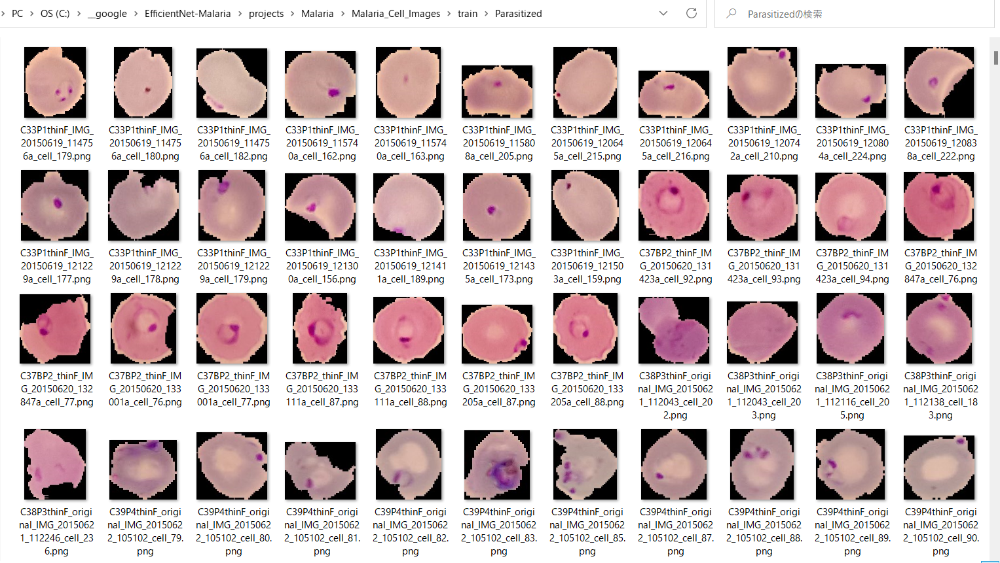

<h2>EfficientNetV2-Malaria</h2>

 This is an experimental EfficientNetV2-Malaria Cell Images Classification project 
 based on <b>efficientnetv2</b> in <a href="https://github.com/google/automl">Brain AutoML</a>.
 

<h3>1. Dataset Citation</h3>

 The original Malaria Cell Images dataset has been taken from the following web site: 
<a href= "https://lhncbc.nlm.nih.gov/">
<b>National Library of Medicine</b> Lister Hill National Center for Biomedical Communications
</a>
 
 
<a href="https://data.lhncbc.nlm.nih.gov/public/Malaria/cell_images.zip">
Malaria/cell_images.zip
</a>
<h3>
2. Download dataset</a>
</h3>
If you would like to train Malaria Model by yourself,
please download the dataset from the google drive 
 
<a href="https://drive.google.com/file/d/15i-6Li8NxyX5OKdSbzUZP6GDOcDdTe1z/view?usp=sharing">Malaria_Cell_Images.zip</a>
 
It contains the follow test and train datasets.
<pre>
Malaria_Cell_Images
  ├─test
  │  ├─Parasitized
  │  └─Uninfected
  └─train
      ├─Parasitized
      └─Uninfected
</pre>
  
Sample images of Malaria_Cell_Images/train/Parasitized: 

  
 
Sample images of Malaria_Cell_Images/train/Uninfected: 

  
 

The number of images in train and test dataset: 

 
 

<h3>
3. Train
</h3>
<h3>
3.1 Training script
</h3>
Please run the following bat file to train the Malaria EfficientnetV2 Model by using
<b>Malaria_Cell_Images/train</b>.
<pre>
./1_train.bat
</pre>
<pre>
rem 1_train.bat
rem 2024/01/01
python ../../../efficientnetv2/EfficientNetV2ModelTrainer.py ^
  --model_dir=./models ^
  --eval_dir=./eval ^
  --model_name=efficientnetv2-b0 ^
  --data_generator_config=./data_generator.config ^
  --ckpt_dir=../../../efficientnetv2/efficientnetv2-b0/model ^
  --optimizer=adam ^
  --image_size=224 ^
  --eval_image_size=224 ^
  --data_dir=./Malaria_Cell_Images/train ^
  --data_augmentation=True ^
  --fine_tuning=True ^
  --monitor=val_loss ^
  --learning_rate=0.0001 ^
  --trainable_layers_ratio=0.4 ^
  --dropout_rate=0.4 ^
  --num_epochs=50 ^
  --batch_size=8 ^
  --patience=10 ^
  --debug=True  
</pre>
, where data_generator.config is the following: 
<pre>
; data_generation.config
; 2024/01/01
[training]
validation_split   = 0.2
featurewise_center = True
samplewise_center  = False
featurewise_std_normalization=True
samplewise_std_normalization =False
zca_whitening                =False
rotation_range     = 90
horizontal_flip    = True
vertical_flip      = True
width_shift_range  = 0.2
height_shift_range = 0.2
shear_range        = 0.01
zoom_range         = [0.4, 2.0]
data_format        = "channels_last"
</pre>

<h3>
3.2 Training result</h3>

This will generate a <b>best_model.h5</b> in the models folder specified by --model_dir parameter. 
Furthermore, it will generate a <a href="./projects/Malaris/eval/train_accuracies.csv">train_accuracies</a>
and <a href="./eval/train_losses.csv">train_losses</a> files
 
Training console output: 
 
 
Train_accuracies: 
 

 
Train_losses: 
 

 
<h2>
4. Inference
</h2>
<h3>
4.1 Inference script
</h3>
Please run the following bat file to infer the skin cancer lesions in test images by the model generated by the above train command. 
<pre>
./2_inference.bat
</pre>
<pre>
rem 2_inference.bat
rem 2024/01/01
python ../../../efficientnetv2/EfficientNetV2Inferencer.py ^
  --model_name=efficientnetv2-b0  ^
  --model_dir=./models ^
  --fine_tuning=True ^
  --trainable_layers_ratio=0.4 ^
  --dropout_rate=0.4 ^
  --image_path=./test/*.png ^
  --eval_image_size=224 ^
  --label_map=./label_map.txt ^
  --mixed_precision=True ^
  --infer_dir=./inference ^
  --debug=False 
</pre>
 
label_map.txt:
<pre>
Parasitized
Uninfected
</pre>
 
<h3>
4.2 Sample test images
</h3>

Sample test images generated by <a href="./create_test_dataset.py">create_test_dataset.py</a> 
from <a href="./Malaria_Cells_Image/test">alaria_Cells_Image/test</a>.
 
 

 
<h3>
4.3 Inference result
</h3>
This inference command will generate <a href="./inference/inference.csv">inference result file</a>.
 At this time, you can see the inference accuracy for the test dataset by our trained model is very low.
More experiments will be needed to improve accuracy. 

 
Inference console output: 
 
 

Inference result (inference.csv): 
 
 
<h3>
5. Evaluation
</h3>
<h3>
5.1 Evaluation script
</h3>
Please run the following bat file to evaluate <a href="./Malaria_Cell_Images/test">
Malaris_Cell_Images/test</a> by the trained model. 
<pre>
./3_evaluate.bat
</pre>
<pre>
rem 3_evaluate.bat
rem 2024/01/01
python ../../../efficientnetv2/EfficientNetV2Evaluator.py ^
  --model_name=efficientnetv2-b0  ^
  --model_dir=./models ^
  --data_dir=./Malaria_Cell_Images/test ^
  --evaluation_dir=./evaluation ^
  --fine_tuning=True ^
  --trainable_layers_ratio=0.4 ^
  --dropout_rate=0.4 ^
  --eval_image_size=224 ^
  --mixed_precision=True ^
  --debug=False 
</pre>
 

<h3>
5.2 Evaluation result
</h3>

This evaluation command will generate <a href="./Malaris/evaluation/classification_report.csv">a classification report</a>
 and <a href="./evaluation/confusion_matrix.png">a confusion_matrix</a>.
 
 
Evaluation console output: 
 
 

 
Classification report: 
 
 
Confusion matrix: 
 

