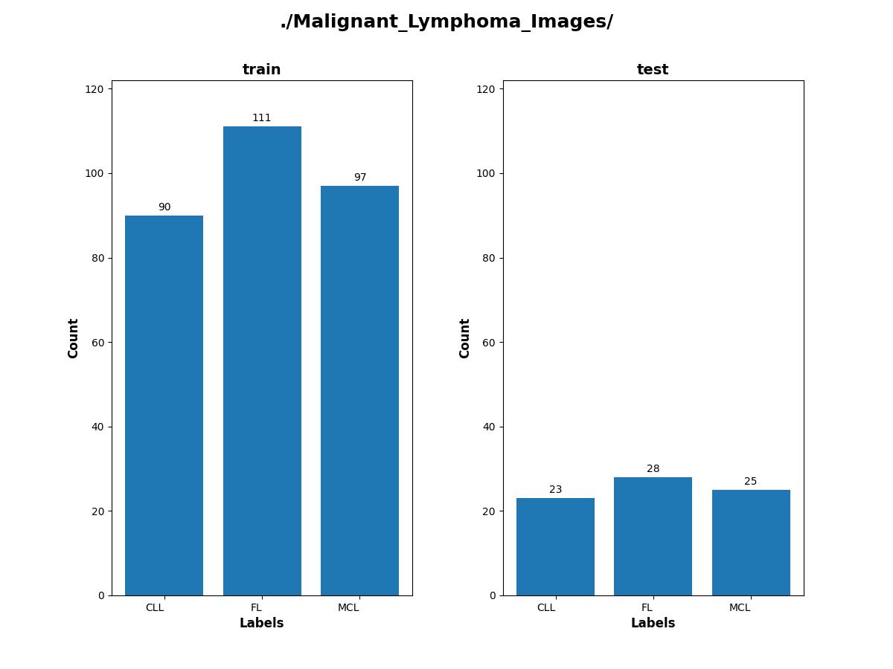
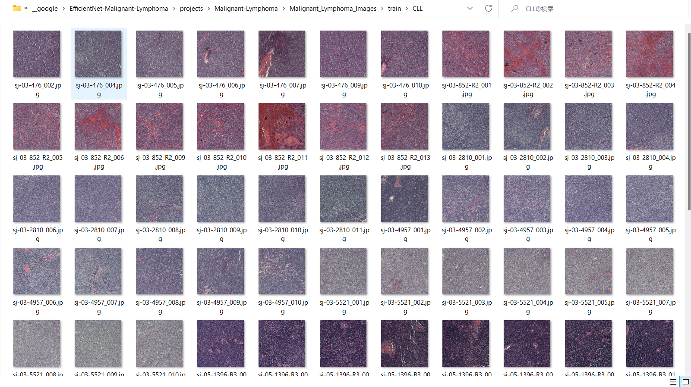
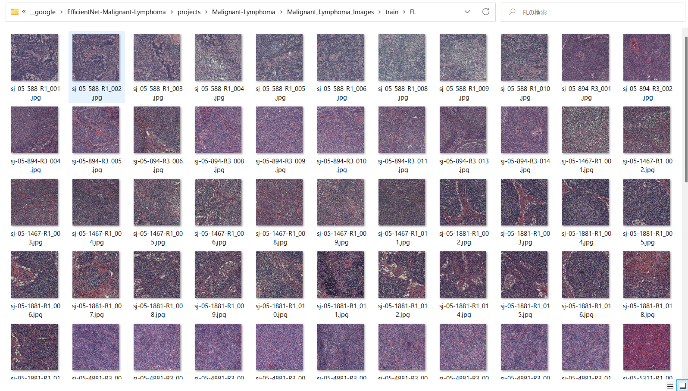
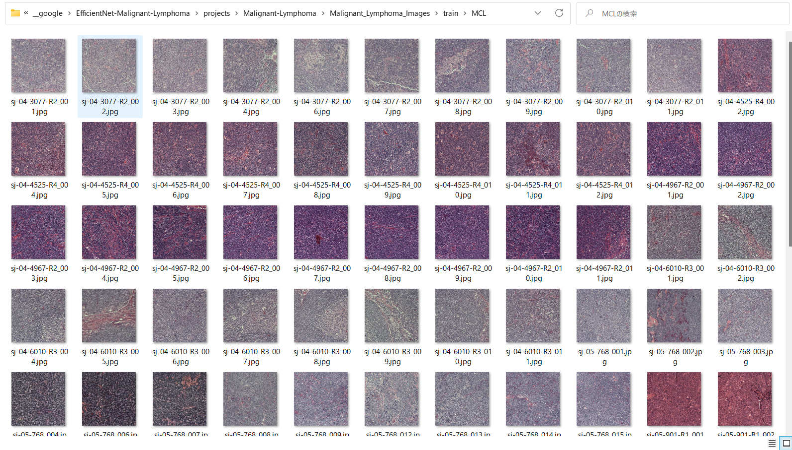
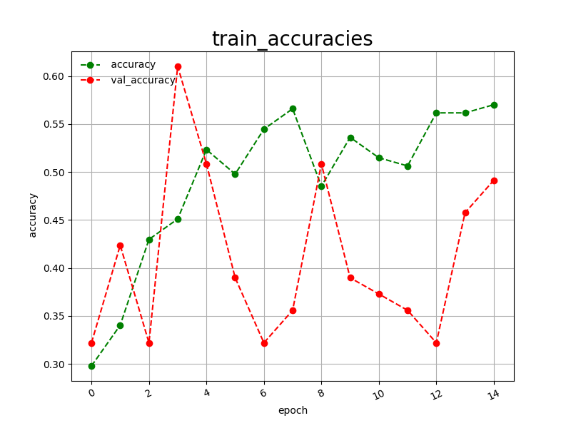
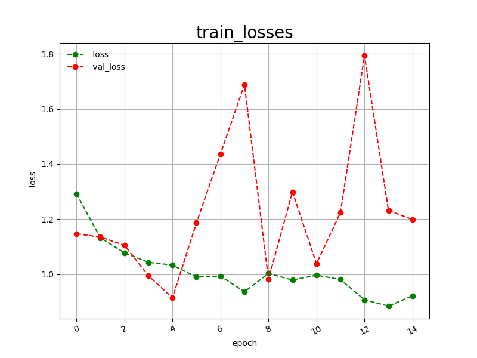
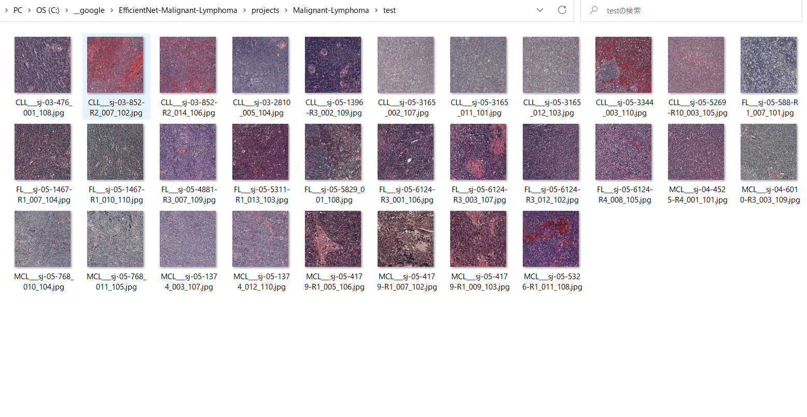
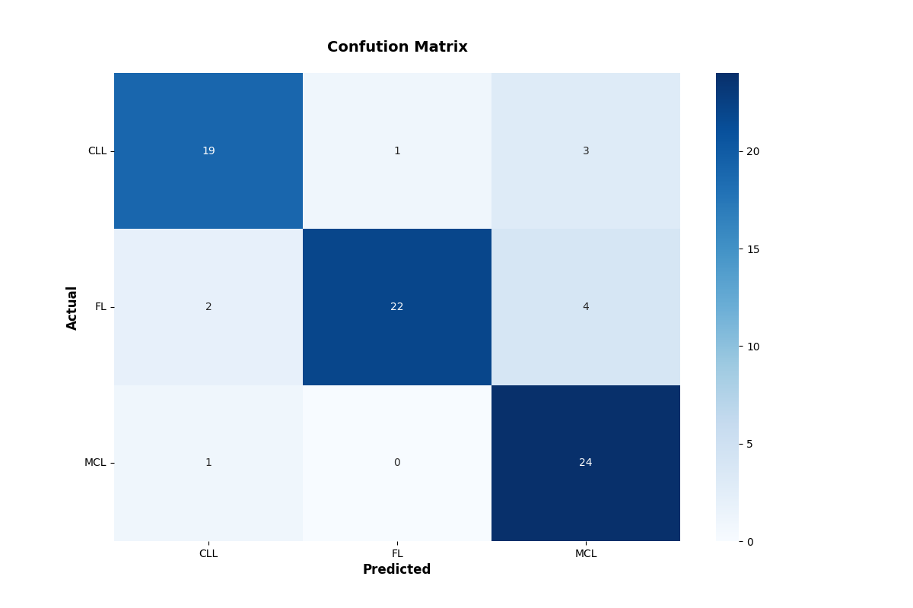

<h2>EfficientNetV2-Malignant-Lymphoma</h2>

 This is an experimental EfficientNetV2 Malignant Lymphoma Classification project based on <b>efficientnetv2</b> in <a href="https://github.com/google/automl">Brain AutoML</a>.
 

Please see also our first experiment <a href="https://github.com/atlan-antillia/EfficientNet-Malignant-Lymphoma">
EfficientNet-Malignant-Lymphoma
</a>

 

<h3>
1. Dataset Citation
</h3>
The original  Malignant Lymphoma dataset has been taken from the following website: 

<a href="https://www.kaggle.com/datasets/andrewmvd/malignant-lymphoma-classification">Malignant Lymphoma Classification</a>

  
<pre>
Original Article
Orlov, Nikita & Chen, Wayne & Eckley, David & Macura, Tomasz & Shamir, Lior & Jaffe, Elaine & Goldberg, Ilya. (2010). Automatic Classification of Lymphoma Images With Transform-Based Global Features. IEEE transactions on information technology in biomedicine : a publication of the IEEE Engineering in Medicine and Biology Society. 14. 1003-13. 10.1109/TITB.2010.2050695.

BibTeX
@article{article,
author = {Orlov, Nikita and Chen, Wayne and Eckley, David and Macura, Tomasz and Shamir, Lior and Jaffe, Elaine and Goldberg, Ilya},
year = {2010},
month = {07},
pages = {1003-13},
title = {Automatic Classification of Lymphoma Images With Transform-Based Global Features},
volume = {14},
journal = {IEEE transactions on information technology in biomedicine : a publication of the IEEE Engineering in Medicine and Biology Society},
doi = {10.1109/TITB.2010.2050695}
}

License was not specified at the source
</pre>

<h3>
2. Download dataset
</h3>
If you would like to train Malignant-Lymphoma Model by yourself,
please download the Malignant-Lymphoma image dataset from the google drive 
<a href="https://drive.google.com/file/d/14Y7BtiBKo__CoPcj_PeI0kK2LREXPz9P/view?usp=sharingz">Malignant_Lymphoma_Images.zip</a>
 
It contains the following test and train datasets. 
<pre>
Malignant_Lymphoma_Images
  ├─test
  │  ├─CLL
  │  ├─FL
  │  └─MCL
  └─train
      ├─CLL
      ├─FL
      └─MCL
</pre>
 
The number of images in classes of train and test sets: 
 
 
 
Sample images of Malignant-Lymphoma/train/CLL: 

 
 
Sample images of Malignant-Lymphoma/train/FL: 

 
 
Sample images of Malignant-Lymphoma/train/MCL: 

 

<h3>
3. Train

</h3>
<h3>
3.1 Training script</a>
</h3>
Please run the following bat file to train our Lung Colon efficientnetv2 model by using
<b>Malignant_Lymphoma_Images/train</b>.
<pre>
./1_train.bat
</pre>
<pre>
rem 1_train.bat
rem 2024/01/01
python ../../../efficientnetv2/EfficientNetV2ModelTrainer.py ^
  --model_dir=./models ^
  --eval_dir=./eval ^
  --model_name=efficientnetv2-m  ^
  --data_generator_config=./data_generator.config ^
  --ckpt_dir=../../../efficientnetv2/efficientnetv2-m/model ^
  --optimizer=adam ^
  --image_size=384 ^
  --eval_image_size=480 ^
  --data_dir=./Malignant_Lymphoma_Images/train ^
  --data_augmentation=True ^
  --valid_data_augmentation=True ^
  --fine_tuning=True ^
  --monitor=val_loss ^
  --learning_rate=0.002 ^
  --trainable_layers_ratio=0.6 ^
  --dropout_rate=0.2 ^
  --num_epochs=50 ^
  --batch_size=4 ^
  --patience=10 ^
  --debug=True  
</pre>
, where data_generator.config is the following: 
<pre>
; data_generation.config
; 2024/01/01
[training]
validation_split   = 0.2
featurewise_center = False
samplewise_center  = True
featurewise_std_normalization=False
samplewise_std_normalization =True
zca_whitening                =False
rotation_range     = 10
horizontal_flip    = True
vertical_flip      = True 
width_shift_range  = 0.2
height_shift_range = 0.2
shear_range        = 0.1

zoom_range         = [0.5, 2.0]
data_format        = "channels_last"

[validation]
validation_split   = 0.2
featurewise_center = False
samplewise_center  = True
featurewise_std_normalization=False
samplewise_std_normalization =True
zca_whitening                =False
rotation_range     = 10
horizontal_flip    = True
vertical_flip      = True
width_shift_range  = 0.2
height_shift_range = 0.2
shear_range        = 0.1
zoom_range         = [0.5, 2.0]
data_format        = "channels_last"
</pre>

<h3>
3.2 Training result
</h3>

This will generate a <b>best_model.h5</b> in the models folder specified by --model_dir parameter. 
Furthermore, it will generate a <a href="./eval/train_accuracies.csv">train_accuracies</a>
and <a href="./eval/train_losses.csv">train_losses</a> files
 
Training console output: 
 
 
Train_accuracies: 
 

 
Train_losses: 
 

 
<h2>
4. Inference
</h2>
<h3>
4.1 Inference script
</h3>
Please run the following bat file to infer the breast cancer in test images by the model generated by the above train command. 
<pre>
./2_inference.bat
</pre>
<pre>
rem 2_inference.bat
rem 2024/01/01
python ../../../efficientnetv2/EfficientNetV2Inferencer.py ^
  --model_name=efficientnetv2-m  ^
  --model_dir=./models ^
  --fine_tuning=True ^
  --trainable_layers_ratio=0.4 ^
  --dropout_rate=0.4 ^
  --image_path=./test/*.jpg ^
  --eval_image_size=480 ^
  --label_map=./label_map.txt ^
  --mixed_precision=True ^
  --infer_dir=./inference ^
  --debug=False 
</pre>
 
label_map.txt:
<pre>
CLL
FL
MCL
</pre>
 
<h3>
4.2 Sample test images</a>
</h3>

Sample test images generated by <a href="./create_test_dataset.py">create_test_dataset.py</a> 
from <a href="./Malignant_Lymphoma_Images/test">Malignant_Lymphoma_Images/test</a>.
 
 

<h3>
4.3 Inference result
</h3>
This inference command will generate <a href="./inference/inference.csv">inference result file</a>.
 
 
Inference console output: 
 
 

Inference result (inference.csv): 
 
 
<h3>
<5. Evaluation
</h3>
<h3>
5.1 Evaluation script
</h3>
Please run the following bat file to evaluate <a href="./Malignant_Lymphoma_Images/test">
Malignant_Lymphoma_Images/test</a> by the trained model. 
<pre>
./3_evaluate.bat
</pre>
<pre>
rem 3_evaluate.bat
rem 2024/01/01
python ../../../efficientnetv2/EfficientNetV2Evaluator.py ^
  --model_name=efficientnetv2-m  ^
  --model_dir=./models ^
  --data_dir=./Malignant_Lymphoma_Images/test ^
  --evaluation_dir=./evaluation ^
  --fine_tuning=True ^
  --trainable_layers_ratio=0.4 ^
  --dropout_rate=0.4 ^
  --eval_image_size=480 ^
  --mixed_precision=True ^
  --debug=False 
</pre>
 

<h3>
5.2 Evaluation result
</h3>

This evaluation command will generate <a href="./evaluation/classification_report.csv">a classification report</a>
 and <a href="./evaluation/confusion_matrix.png">a confusion_matrix</a>.
 
 
Evaluation console output: 
 
 

 
Classification report: 
 
 
Confusion matrix: 
 

 
<h3>
References
</h3>
<b>1. Malignant Lymphoma Classification</b>
<pre>
https://www.kaggle.com/datasets/andrewmvd/malignant-lymphoma-classification
</pre>
<b>2. Malignant lymphoma classification 
Elaine Jaffe (National Cancer Institute) and Nikita Orlov (National Institute on Aging)
</b>
<pre>
https://academictorrents.com/details/3cde17e7e4d9886513630c1005ba20b8d37c333a
</pre>

