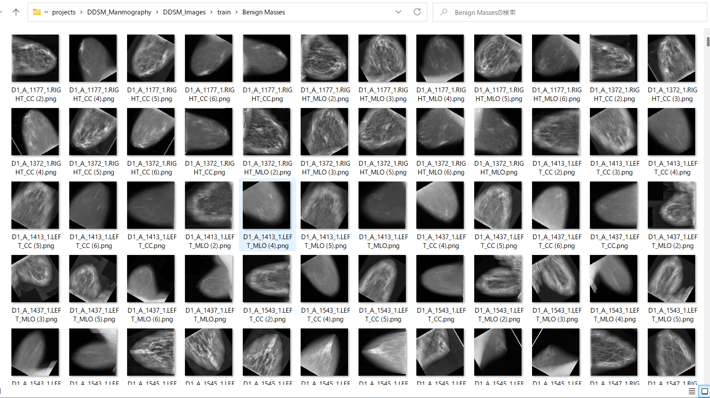
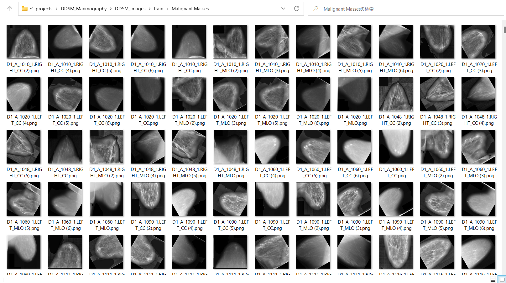
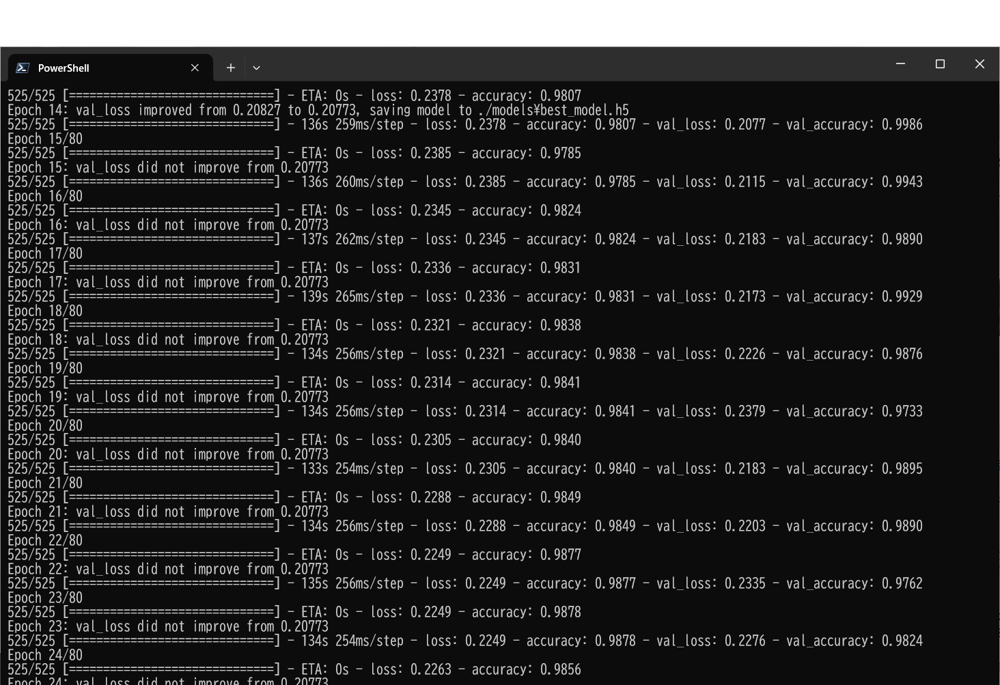
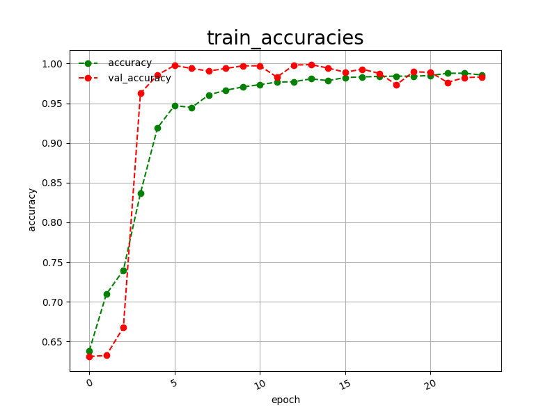
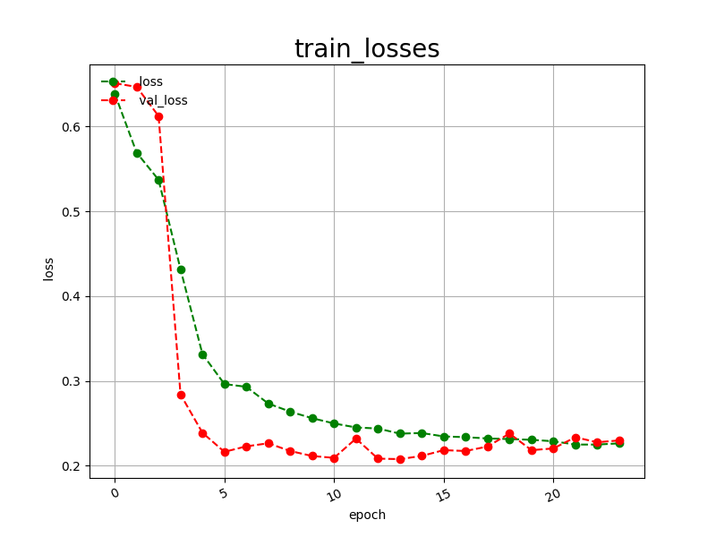
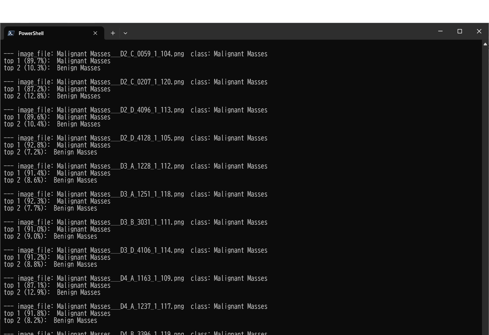
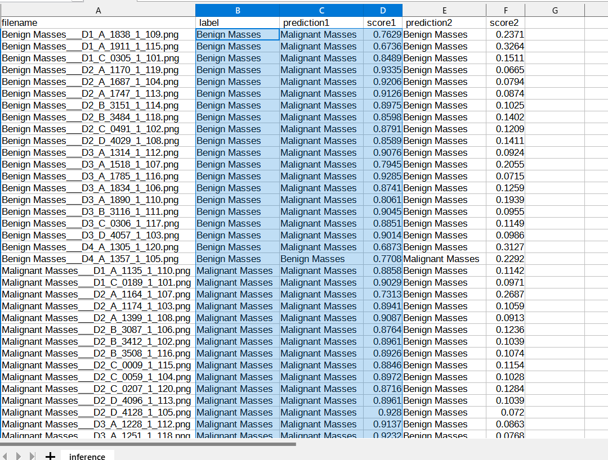
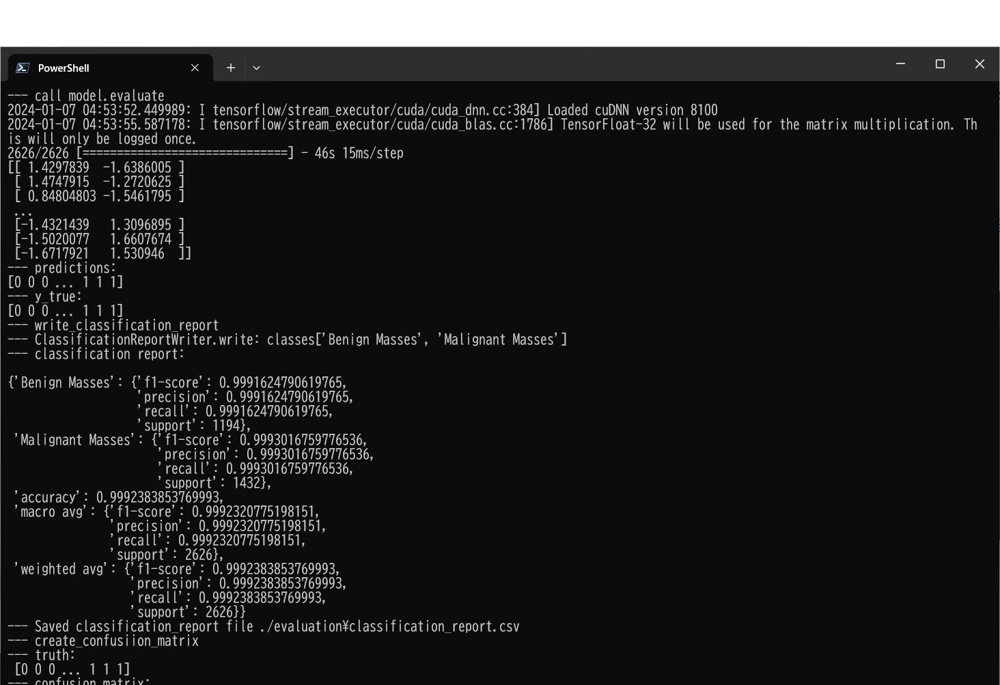
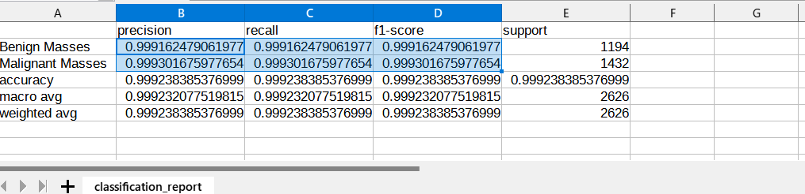
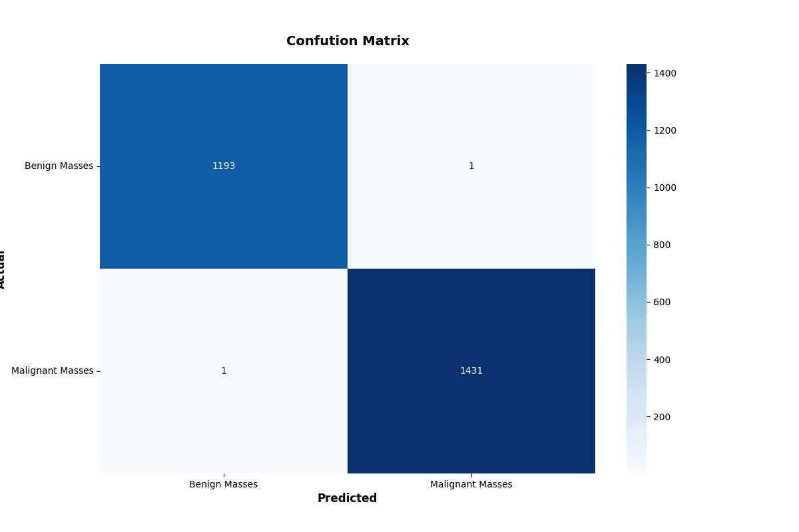

<h2>
EfficientNetV2-Mammography
</h2>
This is an experimental project Breast Mammographic Image Classification based on <b>efficientnetv2</b> in 
<a href="https://github.com/google/automl">Brain AutoML</a>
 
Please see also our first experiment <a href="https://github.com/atlan-antillia/EfficientNet-Mammography">
EfficientNet-Mammography</a>
 

<h3>
1. Dataset Citation
</h3>
The Mammography dataset used here has been taken from the following web site: 
 <a href="https://data.mendeley.com/datasets/ywsbh3ndr8/5">Dataset of Breast mammography images with Masses (License: CC BY 4.0)</a>
 
 

<h3>
2, Download dataset
</h3>
If you would like to train EfficientNetV2 Breast Mammography Model by yourself,
please download the images dataset from the google drive <a href="https://drive.google.com/file/d/1RpH72QPcY-wmuwyIbdSfFCWr6VU5lIDG/view?usp=sharing">
DDSM_Images.zip
</a>.
 
It contains the following test and train datasets. 
<pre>
DDSM_Images
  ├─test
  │  ├─Benign Masses
  │  └─Malignant Masses
  └─train
      ├─Benign Masses
      └─Malignant Masses
</pre>

 
The number of images of train and test image dataset: 

 
 
1 Sample images in DDSM_Images/train/Benign Masses: 
  

2 Sample images in DDSM_Images/train/Malignant Masses: 
  

<h3>
3. Train
</h3>
<h3>
3.1 Training script
</h3>
Please run the following bat file to train our EfficientNetV2 Mammography Model by 
using  the dataset <b>./DDSM_Images/train</b>.
 
<pre>
./1_train.bat
</pre>
<pre>
rem 1_train.bat
rem 2024/01/01
python ../../../efficientnetv2/EfficientNetV2ModelTrainer.py ^
  --model_dir=./models ^
  --model_name=efficientnetv2-b0  ^
  --data_generator_config=./data_generator.config ^
  --ckpt_dir=../../../efficientnetv2/efficientnetv2-b0/model ^
  --optimizer=adam ^
  --image_size=224 ^
  --eval_image_size=224 ^
  --data_dir=./DDSM_Images/train ^
  --model_dir=./models ^
  --data_augmentation=True ^
  --valid_data_augmentation=True ^
  --fine_tuning=True ^
  --monitor=val_loss ^
  --learning_rate=0.0002 ^
  --trainable_layers_ratio=0.4 ^
  --dropout_rate=0.4 ^
  --num_epochs=80 ^
  --batch_size=16 ^
  --patience=10 ^
  --debug=True  
</pre>
,where data_generator.config is the following 
<pre>
; data_generation.config
; 2024/01/10
[training]
validation_split   = 0.2
featurewise_center = True
samplewise_center  = False
featurewise_std_normalization=True
samplewise_std_normalization =False
zca_whitening                =False
rotation_range     = 30
horizontal_flip    = True
vertical_flip      = True
 
width_shift_range  = 0.2
height_shift_range = 0.2
shear_range        = 0.01
zoom_range         = [0.6, 2.0]
data_format        = "channels_last"

[validation]
validation_split   = 0.2
featurewise_center = True
samplewise_center  = False
featurewise_std_normalization=True
samplewise_std_normalization =False
zca_whitening                =False
rotation_range     = 30
horizontal_flip    = True
vertical_flip      = True
width_shift_range  = 0.2
height_shift_range = 0.2
shear_range        = 0.01
zoom_range         = [0.6, 2.0]
data_format        = "channels_last"
</pre>

This will generate a <b>best_model.h5</b> in the models folder specified by --model_dir parameter. 
Furthermore, it will generate a <a href="./eval/train_accuracies.csv">train_accuracies</a>
and <a href="./eval/train_losses.csv">train_losses</a> files
 
<h3>
3.2 Training result
</h3>

Training console output: 
 

As shown above, please note that the <b>best_model.h5</b> has been saved at epoch 17.
 
 
Train_accuracies: 
 

 
Train_losses: 
 

 

<h3>
4. Inference
</h3>
<h3>
4.1 Inference script
</h3>
Please run the following bat file to infer the Mammography test images by the model generated by the above train command. 
<pre>
./2_inference.bat
</pre>
<pre>
rem 2_inference.bat
rem 2024/01/01
python ../../../efficientnetv2/EfficientNetV2Inferencer.py ^
  --model_name=efficientnetv2-b0  ^
  --model_dir=./models ^
  --fine_tuning=True ^
  --trainable_layers_ratio=0.4 ^
  --dropout_rate=0.4 ^
  --image_path=./test/*.png ^
  --eval_image_size=224 ^
  --label_map=./label_map.txt ^
  --mixed_precision=True ^
  --infer_dir=./inference ^
  --debug=False 
</pre>
, where label_map.txt is the following: 
<pre>
Benign Masses
Malignant Masses
</pre>
 

<h3>
4.2 Sample test images
</h3>

Sample test images generated by <a href="./create_test_dataset.py">create_test_dataset.py</a> 
from <a href="./DDSM_Images/test">DDSM_Images/test</a>.
Mammography/test: 

  

<h3>
4.3 Inference result
</h3>

This inference command will generate <a href="./inference.csv">inference result file</a>.
 
Inference console output: 
 
 
Inference result: 
 

 
<h3>
5. Evaluation
</h3>
<h3>
5.1 Evaluation script
</h3>
Please run the following bat file to evaluate <a href="./DDSM_Image/test">DDSM_Image/test</a> by the trained model. 
<pre>
./3_evaluate.bat
</pre>
<pre>
rem 2024/01/01
python ../../../efficientnetv2/EfficientNetV2Evaluator.py ^
  --model_name=efficientnetv2-b0  ^
  --model_dir=./models ^
  --data_dir=./DDSM_Images/test ^
  --evaluation_dir=./evaluation ^
  --fine_tuning=True ^
  --trainable_layers_ratio=0.4 ^
  --dropout_rate=0.4 ^
  --eval_image_size=224 ^
  --label_map=./label_map.txt ^
  --mixed_precision=True ^
  --debug=False 
</pre>

<h3>
5.2 Evaluation result
</h3>

This evaluation command will generate <a href="./evaluation/classification_report.csv">a classification report</a>
 and <a href="./evaluation/confusion_matrix.png">a confusion_matrix</a>.
 
 
Evaluation console output: 
 
 

Classification report: 
 
 
Confusion matrix: 
 
 

<h3>References</h3>
<b>
1. Deep convolutional neural networks for mammography: advances, challenges and applications</b> 
Dina Abdelhafiz, Clifford Yang, Reda Ammar & Sheida Nabavi  
<pre>
https://bmcbioinformatics.biomedcentral.com/articles/10.1186/s12859-019-2823-4
</pre>
<b>
2. Deep learning in mammography images segmentation and classification: Automated CNN approach</b> 
Author links open overlay panelWessam M.SalamaaMoustafa H.Alyb
<pre>
https://www.sciencedirect.com/science/article/pii/S1110016821002027
</pre>
