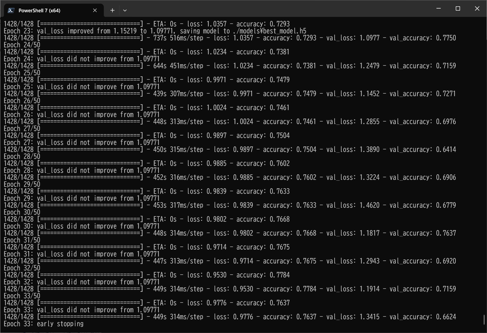
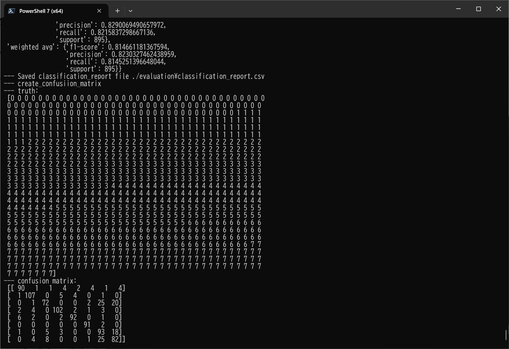

<h2>EfficientNetV2-Ocular-Disease</h2>

 This is an experimental EfficientNetV2 Ocular Disease Classification project based on <b>efficientnetv2</b> in <a href="https://github.com/google/automl">Brain AutoML</a>.
 
Please see also our first experiment <a href="https://github.com/atlan-antillia/EfficientNet-Ocular-Disease">
EfficientNet-Ocular-Disease
</a>
 
<h3>1. Dataset Citation</h3>
The image dataset used here has been taken from the following website: 
 
<b>Ocular Disease Intelligent Recognition ODIR-5K</b> 
https://academictorrents.com/details/cf3b8d5ecdd4284eb9b3a80fcfe9b1d621548f72
 
 
<b>Ocular Disease Recognition</b> 
https://www.kaggle.com/datasets/andrewmvd/ocular-disease-recognition-odir5k
 
 
About this Data 
See also: https://academictorrents.com/details/cf3b8d5ecdd4284eb9b3a80fcfe9b1d621548f72 
<pre>
Ocular Disease Intelligent Recognition (ODIR) is a structured ophthalmic database of 5,000 patients with age, color fundus photographs from left and right eyes and doctors' diagnostic keywords from doctors.

This dataset is meant to represent ‘‘real-life’’ set of patient information collected by Shanggong Medical Technology Co., Ltd. from different hospitals/medical centers in China. In these institutions, fundus images are captured by various cameras in the market, such as Canon, Zeiss and Kowa, resulting into varied image resolutions.
Annotations were labeled by trained human readers with quality control management. They classify patient into eight labels including:

Normal (N),
Diabetes (D),
Glaucoma (G),
Cataract (C),
Age related Macular Degeneration (A),
Hypertension (H),
Pathological Myopia (M),
Other diseases/abnormalities (O)

License
License was not specified on source
</pre>
Splash Image
Image from <a href="https://pixabay.com/pt/users/matryx-15948447/?utm_source=link-attribution&utm_medium=referral&utm_campaign=image&utm_content=5061291">Omni Matryx </a>
by Pixabay 

<h3>2. Download dataset</h3>
If you would like to train EfficientNetV2 Ocular-Disease Model by yourself,
please download the resampled dataset from the google drive 
<a href="https://drive.google.com/file/d/15PqVDySqLfMqAkwXXcVux4GlGfpg01gi/view?usp=sharing">Resampled_Ocular_Disease_Images.zip</a>
 
It contains the following test and train datasets. 
<pre>
Resampled_Ocular_Disease_Images
├─test
│  ├─A
│  ├─C
│  ├─D
│  ├─G
│  ├─H
│  ├─M
│  ├─N
│  └─O
└─train
    ├─A
    ├─C
    ├─D
    ├─G
    ├─H
    ├─M
    ├─N
    └─O
</pre>
The number of images in this Resampled_Ocular_Disease_Images is the following: 
 
 
 
Resampled_Ocular_Disease_Images/train/A (Age related Macular Degeneration) : 

 
 
Resampled_Ocular_Disease_Images/train/C (Cataract): 

 
 
Resampled_Ocular_Disease_Images/train/D (Diabetes): 

 
 
Resampled_Ocular_Disease_Images/train/G (Glaucoma): 

 
 
Resampled_Ocular_Disease_Images/train/H (Hypertension): 

 
 
Resampled_Ocular_Disease_Images/train/M (Pathological Myopia): 

 
 
Resampled_Ocular_Disease_Images/train/N (Normal): 

 
 
Resampled_Ocular_Disease_Images/train/O (Other diseases/abnormalities): 

 
 

<h3>
3. Train
</h3>
<h3>
3.1 Training script
</h3>
Please run the following bat file to train our Ocular Disease Classification efficientnetv2 model by using
<b>Resampled_Ocular_Disease_Images/train</b>.
<pre>
./1_train.bat
</pre>
<pre>
rem 1_train.bat
rem 2024/01/18
python ../../../efficientnetv2/EfficientNetV2ModelTrainer.py ^
  --model_dir=./models ^
  --eval_dir=./eval ^
  --model_name=efficientnetv2-m  ^
  --data_generator_config=./data_generator.config ^
  --ckpt_dir=../../../efficientnetv2/efficientnetv2-m/model ^
  --optimizer=rmsprop ^
  --image_size=512 ^
  --eval_image_size=512 ^
  --data_dir=./Resampled_Ocular_Disease_Images/train ^
  --data_augmentation=True ^
  --valid_data_augmentation=False ^
  --fine_tuning=True ^
  --monitor=val_loss ^
  --learning_rate=0.0001 ^
  --trainable_layers_ratio=0.4 ^
  --dropout_rate=0.4 ^
  --num_epochs=50 ^
  --batch_size=2 ^
  --patience=10 ^
  --debug=True
</pre>
, where data_generator.config is the following: 
<pre>
; data_generation.config
; 2024/01/18
[training]
validation_split   = 0.2
featurewise_center = True
samplewise_center  = False
featurewise_std_normalization=True
samplewise_std_normalization =False
zca_whitening                =False
rotation_range     = 180
horizontal_flip    = True
vertical_flip      = True 
width_shift_range  = 0.2
height_shift_range = 0.2
shear_range        = 0.01
zoom_range         = [0.1, 2.0]
data_format        = "channels_last"
</pre>

<h3>
3.2 Training result
</h3>

This will generate a <b>best_model.h5</b> in the models folder specified by --model_dir parameter. 
Furthermore, it will generate a <a href="./eval/train_accuracies.csv">train_accuracies</a>
and <a href="./eval/train_losses.csv">train_losses</a> files
 
Training console output: 
 
 
Train_accuracies: 
 

 
Train_losses: 
 

 
<h3>
4. Inference
</h3>
<h3>
4.1 Inference script
</h3>
Please run the following bat file to infer the Ocular-Disease in test images by the model generated by the above train command. 
<pre>
./2_inference.bat
</pre>
<pre>
rem 2_inference.bat
rem 2024/01/18
python ../../../efficientnetv2/EfficientNetV2Inferencer.py ^
  --model_name=efficientnetv2-m  ^
  --model_dir=./models ^
  --fine_tuning=True ^
  --trainable_layers_ratio=0.4 ^
  --dropout_rate=0.4 ^
  --image_path=./test/*.jpg ^
  --eval_image_size=512 ^
  --label_map=./label_map.txt ^
  --mixed_precision=True ^
  --infer_dir=./inference ^
  --debug=False 
</pre>
 
label_map.txt:
<pre>
A
C
D
G
H
M
N
O
</pre>
 
<h3>
4.2 Sample test images
</h3>

Sample test images generated by <a href="./create_test_dataset.py">create_test_dataset.py</a> 
from <a href="./Resampled_Ocular_Disease_Images/test">Resampled_Ocular_Disease_Imagess/test</a>.
 
 

<h3>
4.3 Inference result
</h3>
This inference command will generate <a href="./inference/inference.csv">inference result file</a>.
 
 
Inference console output: 
 
 

Inference result (inference.csv): 
 
 
<h3>
5. Evaluation
</h3>
<h3>
<5.1 Evaluation script
</h3>
Please run the following bat file to evaluate <a href="./Resampled_Ocular_Disease_Images/test">
Resampled_Ocular_Disease_Images/test</a> by the trained model. 
<pre>
./3_evaluate.bat
</pre>
<pre>

</pre>
 

<h3>
<a id="6.2">6.2 Evaluation result</a>
</h3>

This evaluation command will generate <a href="./evaluation/classification_report.csv">a classification report</a>
 and <a href="./evaluation/confusion_matrix.png">a confusion_matrix</a>.
 
 
Evaluation console output: 
 
 

 
Classification report: 
 
 
Confusion matrix: 
 

 
<h3>
References
</h3>
<b>1. Ocular Disease Intelligent Recognition ODIR-5K</b> 
<pre>
https://academictorrents.com/details/cf3b8d5ecdd4284eb9b3a80fcfe9b1d621548f72
</pre>

<b>2. Ocular Disease Recognition</b> 
<pre>
https://www.kaggle.com/datasets/andrewmvd/ocular-disease-recognition-odir5k
</pre>
