<h2>EfficientNetV2-Peripheral-Blood-Cell</h2>

 This is an experimental Peripheral-Blood-Cell Classification project based on <b>efficientnetv2</b> in <a href="https://github.com/google/automl">Brain AutoML</a>.
 
Please see also our first experiment <a href="https://github.com/sarah-antillia/EfficientNet-Peripheral-Blood-Cell">EfficientNet-Peripheral-Blood-Cell</a>.
 
<h3>1. Dataset Citation</h3>
The orignal Peripheral Blood Cell image dataset used here has been taken from the following web site:

https://data.mendeley.com/datasets/snkd93bnjr/1

A dataset for microscopic peripheral blood cell images for development 
of automatic recognition systems

<pre>
Acevedo, Andrea; Merino, Anna; Alférez, Santiago; Molina, Ángel; Boldú, Laura; Rodellar, José (2020), 
“A dataset for microscopic peripheral blood cell images for development of automatic recognition 
systems”, 
Mendeley Data, V1, doi: 10.17632/snkd93bnjr.1
</pre>
 

<h3>2. Download dataset</h3>

If you would like to train Peripheral_Blood_Cell Model by yourself,
please download the new Peripheral_Blood_Cell dataset splitted to train and test from 
<a href="https://drive.google.com/file/d/12nJmOmDJHOZ5U7GXQOjRlZpSw1EgNYSS/view?usp=sharing">Peripheral_Blood_Cell.zip</a>,
 
It contains the follwing test and train datasets. 
<pre>
Peripheral_Blood_Cell
  ├─test
  │  ├─basophil
  │  ├─eosinophil
  │  ├─erythroblast
  │  ├─ig
  │  ├─lymphocyte
  │  ├─monocyte
  │  ├─neutrophil        
  │  └─platelet
  └─train
      ├─basophil
      ├─eosinophil
      ├─erythroblast
      ├─ig
      ├─lymphocyte
      ├─monocyte
      ├─neutrophil
      └─platelet
</pre>

 
The number of images in train and test dataset: 
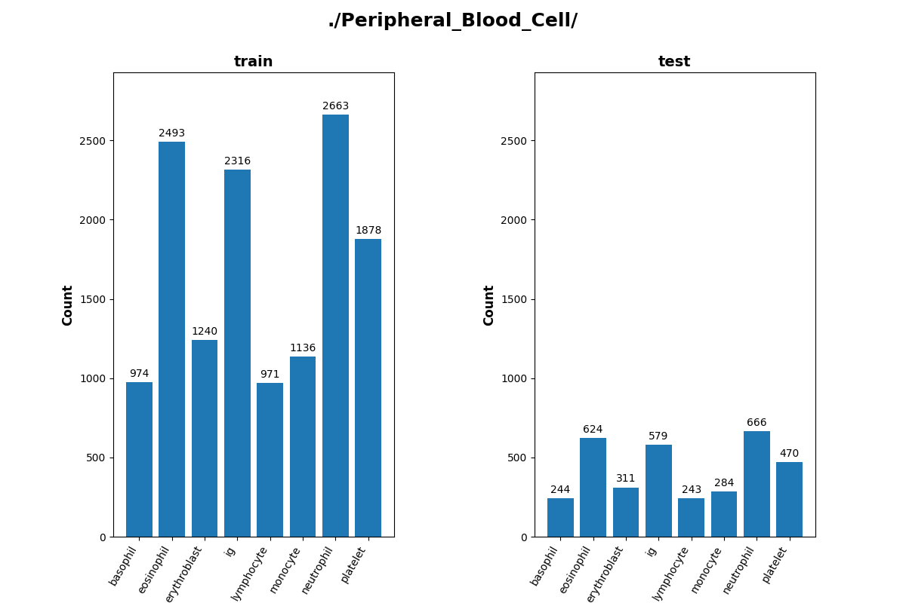
 

Sample images of Peripheral_Blood_Cell/train/basophil: 
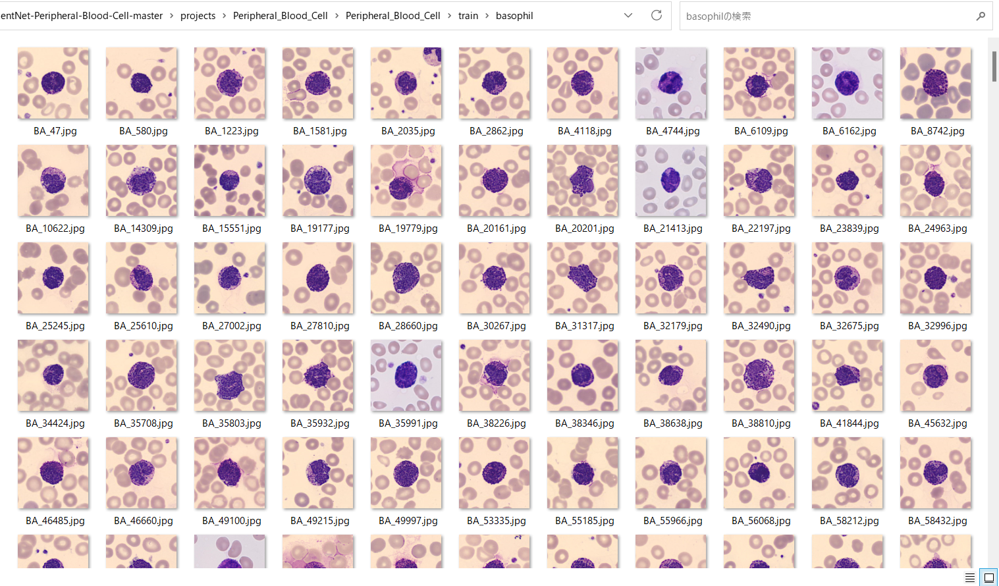
  

Sample images of Peripheral_Blood_Cell/train/eosinophil: 
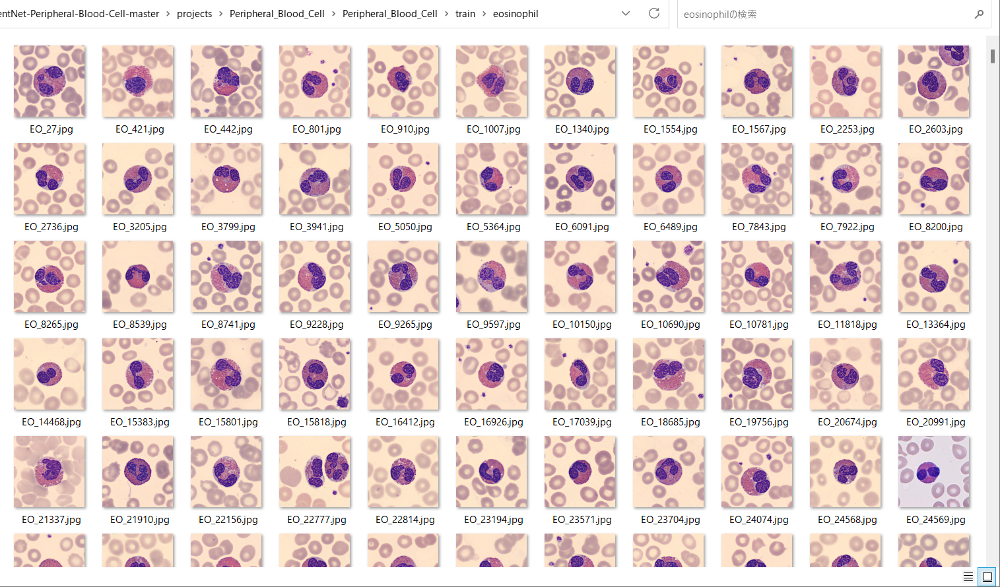
  

Sample images of Peripheral_Blood_Cell/train/erythroblast: 
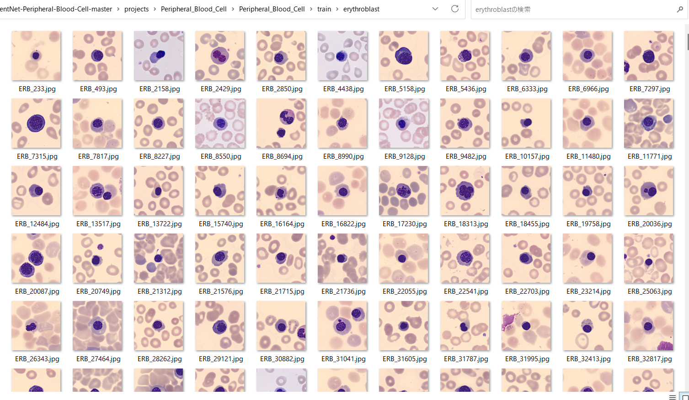
  

Sample images of Peripheral_Blood_Cell/train/ig: 
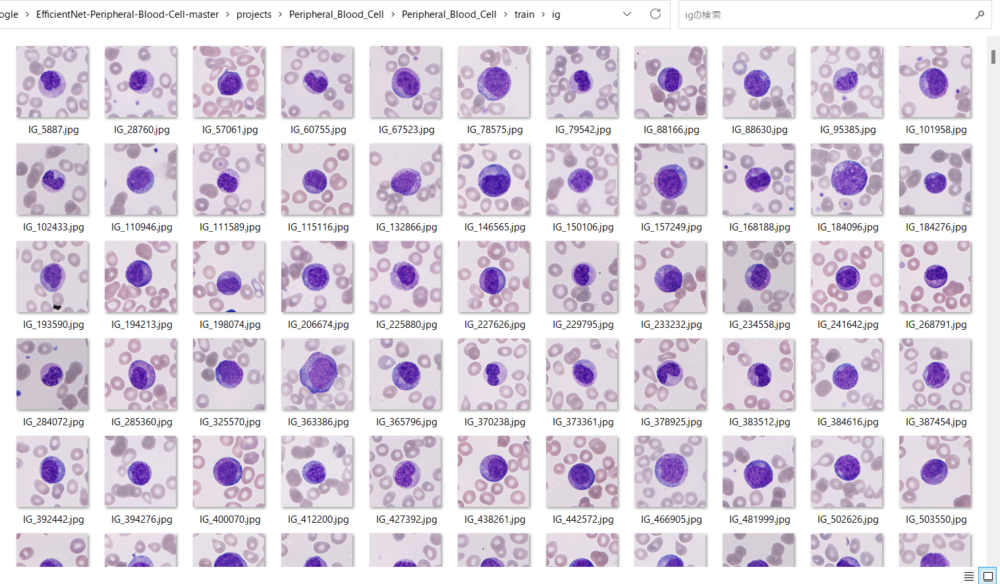
  

Sample images of Peripheral_Blood_Cell/train/lymphocyte: 
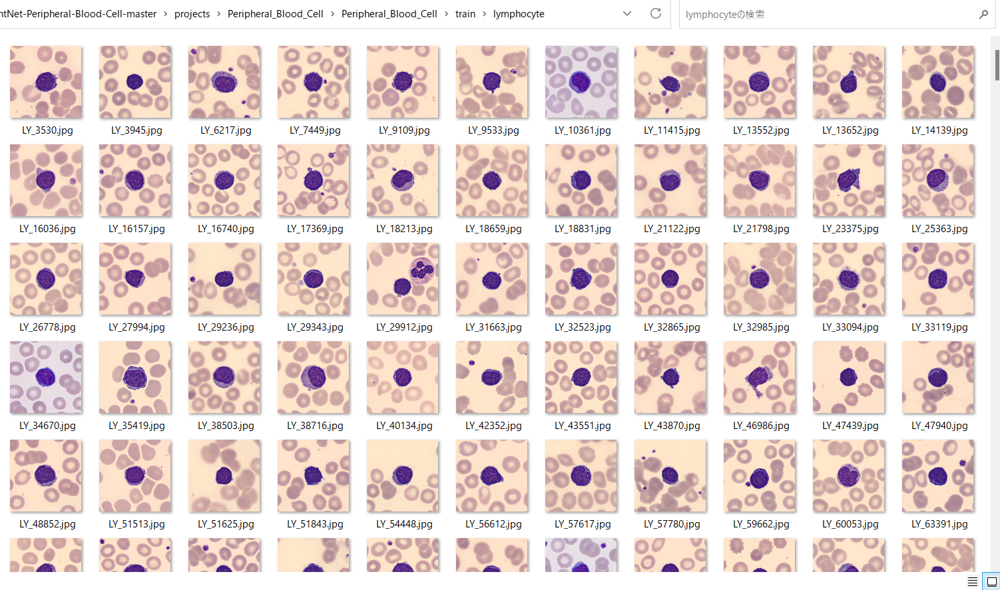
  

Sample images of Peripheral_Blood_Cell/train/monocyte: 
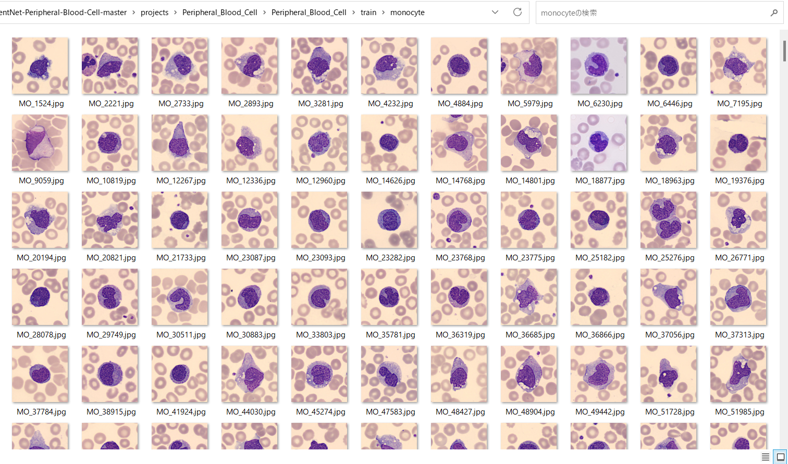
  

Sample images of Peripheral_Blood_Cell/train/neutrophil: 
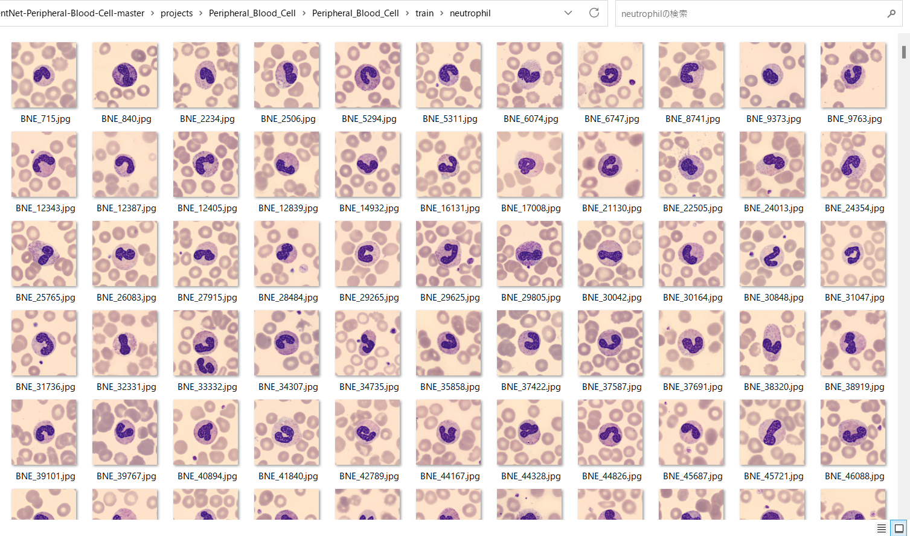
  

Sample images of Peripheral_Blood_Cell/train/platelet: 
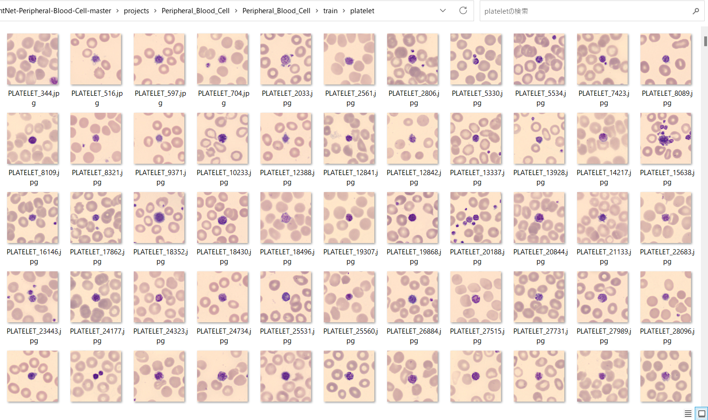
  
 

<h3>
3. Train
</h3>
<h3>
3.1 Training script
</h3>
Please run the following bat file to train our Peripheral-Blood-Cell efficientnetv2 model by using
<b>Peripheral_Blood_Cell/train</b>.
<pre>
./1_train.bat
</pre>
<pre>
rem 1_train.bat
rem 2024/01/18
python ../../../efficientnetv2/EfficientNetV2ModelTrainer.py ^
  --model_dir=./models ^
  --eval_dir=./eval ^
  --model_name=efficientnetv2-m ^
  --data_generator_config=./data_generator.config ^
  --ckpt_dir=../../../efficientnetv2/efficientnetv2-m/model ^
  --optimizer=rmsprop ^
  --image_size=360 ^
  --eval_image_size=360 ^
  --data_dir=./Peripheral_Blood_Cell/train ^
  --data_augmentation=True ^
  --fine_tuning=True ^
  --monitor=val_loss ^
  --learning_rate=0.0001 ^
  --trainable_layers_ratio=0.4 ^
  --dropout_rate=0.4 ^
  --num_epochs=100 ^
  --batch_size=4 ^
  --patience=10 ^
  --debug=True  
</pre>
, where data_generator.config is the following: 
<pre>
; data_generation.config
; 2024/01/18
[training]
validation_split   = 0.2
featurewise_center = False
samplewise_center  = False
featurewise_std_normalization=False
samplewise_std_normalization =False
zca_whitening                =False
rotation_range     = 10
horizontal_flip    = True
vertical_flip      = True
width_shift_range  = 0.2
height_shift_range = 0.2
shear_range        = 0.01
zoom_range         = [0.4, 1.2]
brightness_range   = [0.8, 1.0]
data_format        = "channels_last"
</pre>

<h3>
3.2 Training result
</h3>

This will generate a <b>best_model.h5</b> in the models folder specified by --model_dir parameter. 
Furthermore, it will generate a <a href="./eval/train_accuracies.csv">train_accuracies</a>
and <a href="./eval/train_losses.csv">train_losses</a> files
 
Training console output: 
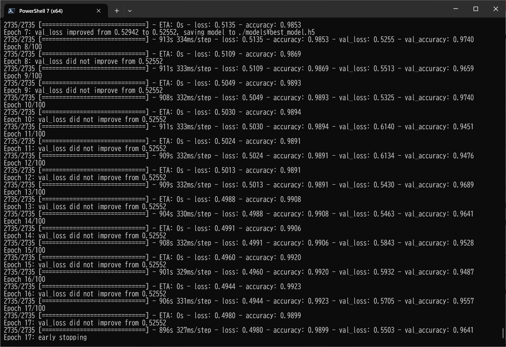 
 
Train_accuracies: 
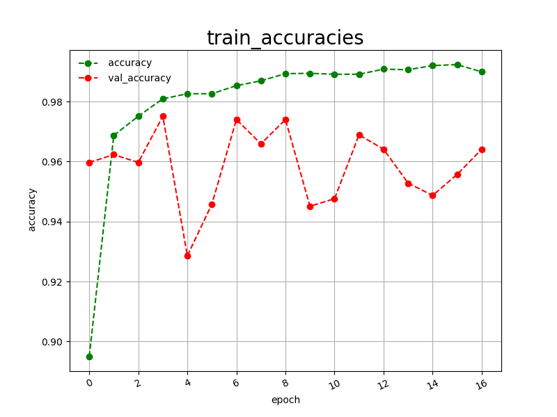 

 
Train_losses: 
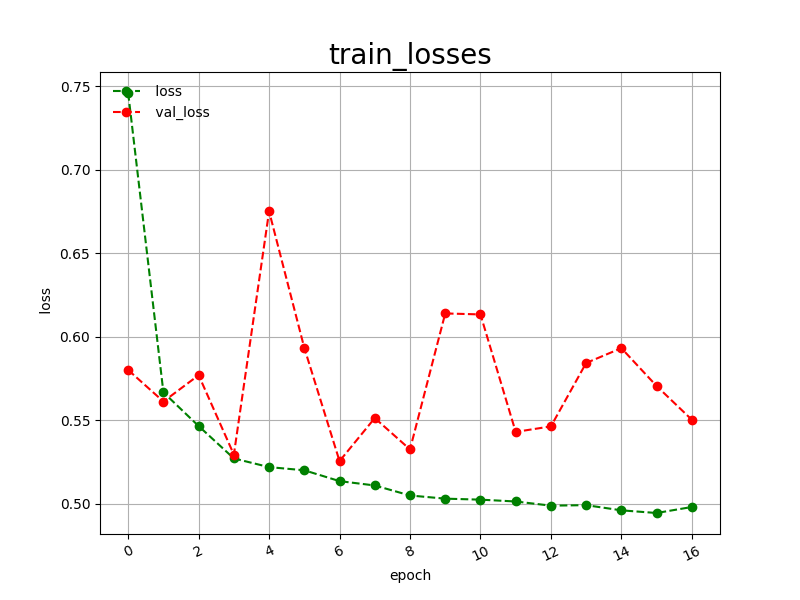 

 
<h3>
4. Inference
</h3>
<h3>
4.1 Inference script
</h3>
Please run the following bat file to infer the skin cancer lesions in test images by the model generated by the above train command. 
<pre>
./2_inference.bat
</pre>
<pre>
rem 2_inference.bat
rem 2024/01/18
python ../../../efficientnetv2/EfficientNetV2Inferencer.py ^
  --model_name=efficientnetv2-m  ^
  --model_dir=./models ^
  --fine_tuning=True ^
  --trainable_layers_ratio=0.4 ^
  --dropout_rate=0.4 ^
  --image_path=./test/*.jpg ^
  --eval_image_size=360 ^
  --label_map=./label_map.txt ^
  --mixed_precision=True ^
  --infer_dir=./inference ^
  --debug=False 
</pre>
 
label_map.txt:
<pre>
basophil
eosinophil
erythroblast
ig
lymphocyte
monocyte
neutrophil
platelet
</pre>
 

<h3>
4.2 Sample test images
</h3>

Sample test images generated by <a href="./create_test_dataset.py">create_test_dataset.py</a> 
from <a href="./Peripheral_Blood_Cell/test">Peripheral_Blood_Cell/test</a>.
 
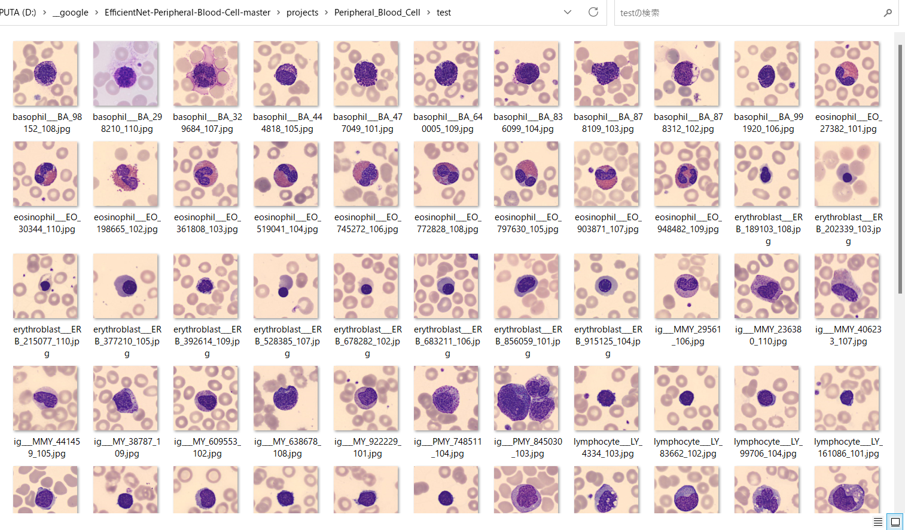 

 
<h3>
4.3 Inference result
</h3>
This inference command will generate <a href="./inference/inference.csv">inference result file</a>.
 At this time, you can see the inference accuracy for the test dataset by our trained model is very low.
More experiments will be needed to improve accuracy. 

 
Inference console output: 
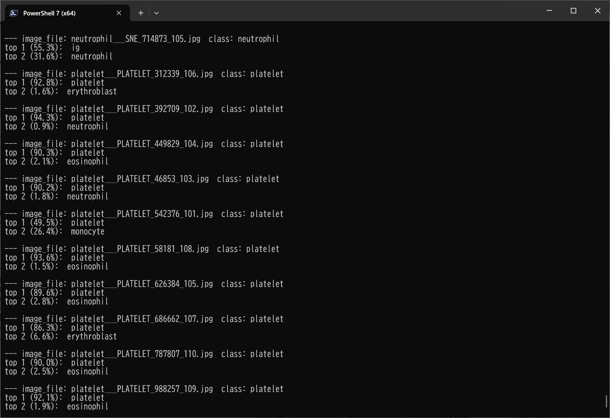 
 

Inference result (<a href="./inference/inference.csv">inference.csv</a>): 
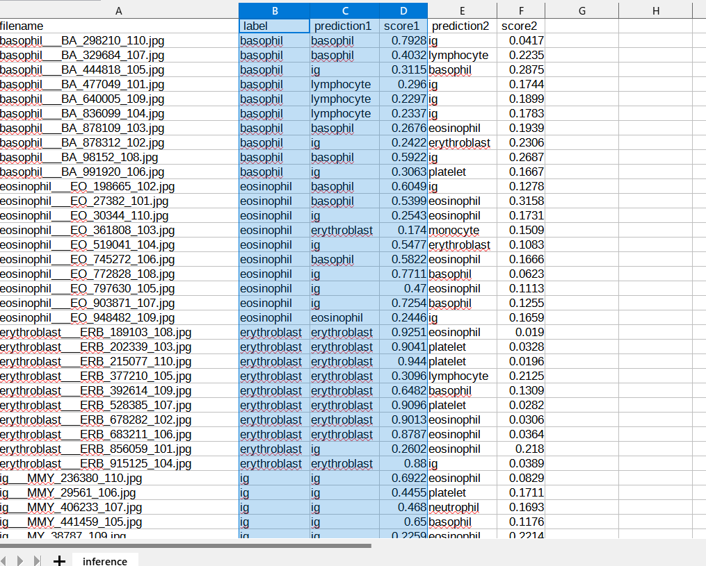 
 
<h3>
5. Evaluation
</h3>
<h3>
5.1 Evaluation script
</h3>
Please run the following bat file to evaluate <a href="./Peripheral_Blood_Cell/test">
Peripheral_Blood_Cell/test</a> by the trained model. 
<pre>
./3_evaluate.bat
</pre>
<pre>
rem 3_evaluate.bat
rem 2024/01/18
python ../../../efficientnetv2/EfficientNetV2Evaluator.py ^
  --model_name=efficientnetv2-m  ^
  --model_dir=./models ^
  --data_dir=./Peripheral_Blood_Cell/test ^
  --evaluation_dir=./evaluation ^
  --fine_tuning=True ^
  --trainable_layers_ratio=0.4 ^
  --dropout_rate=0.4 ^
  --eval_image_size=360 ^
  --mixed_precision=True ^
  --debug=False 
</pre>
 

<h3>
5.2 Evaluation result
</h3>

This evaluation command will generate <a href="./evaluation/classification_report.csv">a classification report</a>
 and <a href="./evaluation/confusion_matrix.png">a confusion_matrix</a>.
 
 
Evaluation console output: 
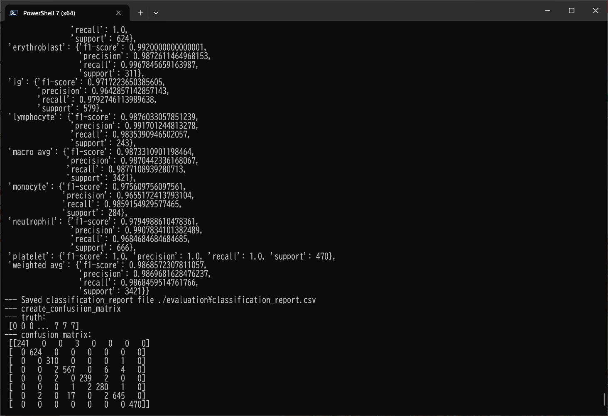 
 

 
Classification report: 
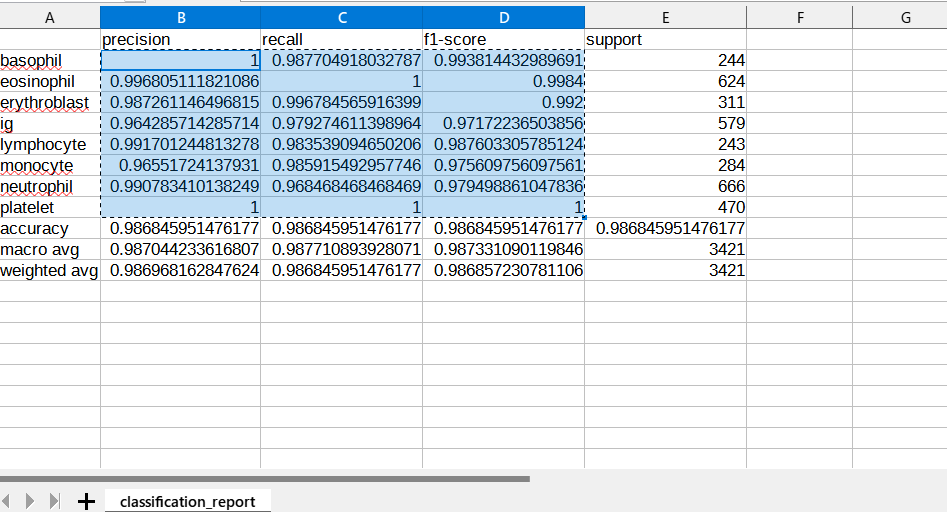 
 
Confusion matrix: 
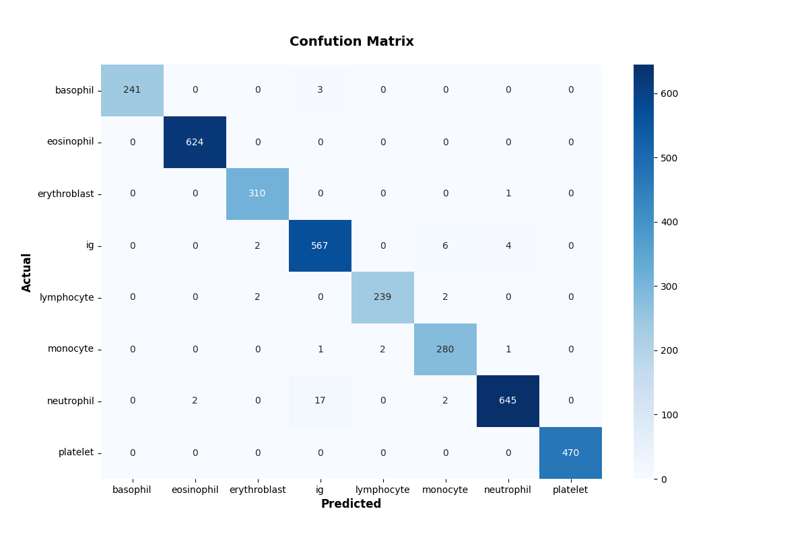 

 
<h3>
References
</h3>
<b>1. Acute Myeloid Leukemia (AML) Detection Using AlexNet Model</b> 
Maneela Shaheen,Rafiullah Khan, R. R. Biswal, Mohib Ullah,1Atif Khan, M.Irfan Uddin,4Mahdi  
Zareei and Abdul Waheed

<pre>
https://www.hindawi.com/journals/complexity/2021/6658192/
</pre>

<b>2. BCNet: A Deep Learning Computer-Aided Diagnosis Framework for Human Peripheral Blood Cell Identification</b> 
Channabasava Chola, Abdullah Y. Muaad, Md Belal Bin Heyat, J. V. Bibal Benifa, Wadeea R. Naji, K. Hemachandran,   
Noha F. Mahmoud, Nagwan Abdel Samee, Mugahed A. Al-Antari, Yasser M. Kadah and Tae-Seong Kim 
<pre>
https://www.mdpi.com/2075-4418/12/11/2815
</pre>

<b>3. Deep CNNs for Peripheral Blood Cell Classification</b> 
Ekta Gavas and Kaustubh Olpadkar  
<pre>
https://arxiv.org/pdf/2110.09508.pdf
</pre>

