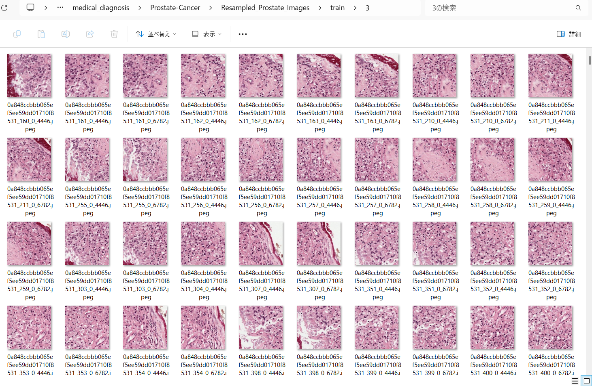

<h2>EfficientNetV2-Prostate-Cancer</h2>

 This is an experimental EfficientNetV2 Prostate Cancer Classification project based on <b>efficientnetv2</b> in <a href="https://github.com/google/automl">Brain AutoML</a>.
 
Please see also our first experiment <a href="https://github.com/atlan-antillia/EfficientNet-Prostate-Cancer"> EfficientNetV-Prostate-Cancer</a>
 

<h3>1. Dataset Citation</h3>
This image dataset used here has been taken from the following website: 
https://github.com/MicheleDamian/prostate-gleason-dataset  

<a href="https://github.com/MicheleDamian/prostate-gleason-dataset/blob/master/LICENSE.md">DATASET LICENCE</a> 
About Prostate Gleason Dataset: Excerpt from the website above: 

Prostate Gleason Dataset is an image database of prostate cancer biopsies derived from the PANDA dataset. The database consists of about 70K patches of size 256x256 pixels extracted from the PANDA's biopsies with overlap. The patches are grouped in 4 classes depending on their Gleason grade:

Class 0: Stroma and Gleason 0 
Class 1: Gleason 3 
Class 2: Gleason 4 
Class 3: Gleason 5 
 

<h3>2. Download dataset</h3>
If you would like to train Prostate Cancer Model by yourself,
please download the dataset from the google drive
<a href="https://drive.google.com/file/d/1n3tzWXT8yyKjx6V_e5ZZ_geDPZvr99wA/view?usp=sharing">Resampled_Prostate_Images.zip</a>
 
It contains the following test and train datasets. 
<pre>
Resampled_Prostate_Images
├─test
│  ├─0
│  ├─1
│  ├─2
│  └─3
└─train
    ├─0
    ├─1
    ├─2
    └─3    
</pre>

</pre>
The number of images in the dataset is the following: 
 
 

Resampled_Prostate_Images/train/0: 

 
 
Resampled_Prostate_Images/train/1: 

 
 
Resampled_Prostate_Images/train/2: 

 
 
Resampled_Prostate_Images/train/3: 

 

<h3>
<3. Train
</h3>
<h3>
3.1 Training script
</h3>
Please run the following bat file to train our Prostate-Cancer Classification efficientnetv2 model by using
<a href="./Prostate_Cancer_Images/train">Resampled_Kidney_Simpler_Disease_Images/train</a>.
<pre>
./1_train.bat
</pre>
<pre>
rem 1_train.bat
rem 2024/01/17
python ../../../efficientnetv2/EfficientNetV2ModelTrainer.py ^
  --model_dir=./models ^
  --eval_dir=./eval ^
  --model_name=efficientnetv2-b0  ^
  --data_generator_config=./data_generator.config ^
  --ckpt_dir=../../../efficientnetv2/efficientnetv2-b0/model ^
  --optimizer=rmsprop ^
  --image_size=224 ^
  --eval_image_size=224 ^
  --data_dir=./Resampled_Prostate_Images/train ^
  --data_augmentation=True ^
  --valid_data_augmentation=False ^
  --fine_tuning=True ^
  --monitor=val_loss ^
  --learning_rate=0.0001 ^
  --trainable_layers_ratio=0.4 ^
  --dropout_rate=0.4 ^
  --num_epochs=50 ^
  --batch_size=16 ^
  --patience=10 ^
  --debug=True  </pre>
, where data_generator.config is the following: 
<pre>
; data_generation.config
; 2024/01/17
[training]
validation_split   = 0.2
featurewise_center = False
samplewise_center  = False
featurewise_std_normalization=False
samplewise_std_normalization =False
zca_whitening                =False
rotation_range     = 4
horizontal_flip    = True
vertical_flip      = True
width_shift_range  = 0.2
height_shift_range = 0.2
shear_range        = 0.01
zoom_range         = [0.8, 1.2]
data_format        = "channels_last"

brightness_range   = [0.8, 1.0]
fill_mode          =  "nearest"

</pre>

<h3>
3.2 Training result
</h3>

This will generate a <b>best_model.h5</b> in the models folder specified by --model_dir parameter. 
Furthermore, it will generate a <a href="./eval/train_accuracies.csv">train_accuracies</a>
and <a href="./eval/train_losses.csv">train_losses</a> files
 
Training console output: 
 
 
Train_accuracies: 
 

 
Train_losses: 
 

 
<h3>
4. Inference
</h3>
<h3>
4.1 Inference script
</h3>
Please run the following bat file to infer the Prostate Cancer in test images by the model generated by the above train command. 
<pre>
./2_inference.bat
</pre>
<pre>
rem 2_inference.bat
rem 2024/01/17
python ../../../efficientnetv2/EfficientNetV2Inferencer.py ^
  --model_name=efficientnetv2-b0  ^
  --model_dir=./models ^
  --fine_tuning=True ^
  --trainable_layers_ratio=0.4 ^
  --dropout_rate=0.4 ^
  --image_path=./test/*.jpeg ^
  --eval_image_size=224 ^
  --label_map=./label_map.txt ^
  --mixed_precision=True ^
  --infer_dir=./inference ^
  --debug=False 
</pre>
 
label_map.txt:
<pre>
0
1
2
3
</pre>
 
<h3>
4.2 Sample test images
</h3>

Sample test images generated by <a href="./create_test_dataset.py">create_test_dataset.py</a> 
from <a href="./Resampled_Prostate_Images/test">Resampled_Prostate_Imagess/test</a>.
 
 

<h3>
4.3 Inference result
</h3>
This inference command will generate <a href="./inference/inference.csv">inference result file</a>.
 
 
Inference console output: 
 
 

Inference result (inference.csv): 
 
 
<h3>
5. Evaluation
</h3>
<h3>
5.1 Evaluation script
</h3>
Please run the following bat file to evaluate <a href="./Resampled_Prostate_Images/test">
Prostate_Images/test</a> by the trained model. 
<pre>
./3_evaluate.bat
</pre>
<pre>
rem 3_evaluate.bat
rem 2024/01/17
python ../../../efficientnetv2/EfficientNetV2Evaluator.py ^
  --model_name=efficientnetv2-b0  ^
  --model_dir=./models ^
  --data_dir=./Resampled_Prostate_Images/test ^
  --evaluation_dir=./evaluation ^
  --fine_tuning=True ^
  --trainable_layers_ratio=0.4 ^
  --dropout_rate=0.4 ^
  --eval_image_size=224 ^
  --mixed_precision=True ^
  --debug=False 
</pre>
 

<h3>
5.2 Evaluation result
</h3>

This evaluation command will generate <a href="./evaluation/classification_report.csv">a classification report</a>
 and <a href="./evaluation/confusion_matrix.png">a confusion_matrix</a>.
 
 
Evaluation console output: 
 
 

 
Classification report: 
 

 
Confusion matrix: 
 

<h3>
References
</h3>
<b>1. Prostate Cancer Detection using Deep Convolutional Neural Networks</b> 
Sunghwan Yoo, Isha Gujrathi, Masoom A. Haider & Farzad Khalvati 
<pre>
https://www.nature.com/articles/s41598-019-55972-4
</pre>

<b>2. Evolution-based Fine-tuning of CNNs for Prostate Cancer Detection</b> 
Khashayar Namdar, Isha Gujrathi, Masoom A. Haider, Farzad Khalvati 
<pre>
https://arxiv.org/pdf/1911.01477.pdf
</pre>

<b>3. A Review on Prostate Cancer Detection using CNN</b> 
Merlyn Koonamparampath1, Raj Shah, Mahipal Sundvesha, Meena Ugale 
<pre>
https://www.academia.edu/74053872/A_Review_on_Prostate_Cancer_Detection_using_CNN?email_work_card=view-paper
</pre>
