<h2>EfficientNetV2-Skin-Cancer</h2>
 This is an experimental Skin Cancer HAM10000 Classification project based on <b>efficientnetv2</b> 
 in <a href="https://github.com/google/automl">Brain AutoML</a> 
Please see also our first experiment <a href="https://github.com/atlan-antillia/EfficientNet-Skin-Cancer">EfficientNet-Skin-Cancer</a>
 

<h3>1. Dataset Citation</h3>
 The original Skin Cancer HAM10000 dataset has been taken from the following web site: 
<b>The HAM10000 dataset, a large collection of multi-source dermatoscopic images of common pigmented skin lesions</b> 

https://dataverse.harvard.edu/dataset.xhtml?persistentId=doi:10.7910/DVN/DBW86T 
 
 

<h3>2. Download dataset</h3>
If you would like to train EfficientNetV2 Skin-Cancer Model by yourself, 
please download the dataset from the following web site:
 
<a href="https://drive.google.com/file/d/1OqRiuFArflpw-8Anm2UV4EdyfS77ANTA/view?usp=sharing">Resampled_HAM10000.zip</a> 
 
It contains the Testing and Training datasets. 
<pre>
Resampled_HAM10000
  ├─Testing
  │  ├─akiec
  │  ├─bcc
  │  ├─bkl
  │  ├─df
  │  ├─mel
  │  ├─nv
  │  └─vasc
  └─Training
     ├─akiec
     ├─bcc
     ├─bkl
     ├─df
     ├─mel
     ├─nv
     └─vasc
</pre>
 
The number of images in Training and Testing of Resampled_HAM10000 dataset: 
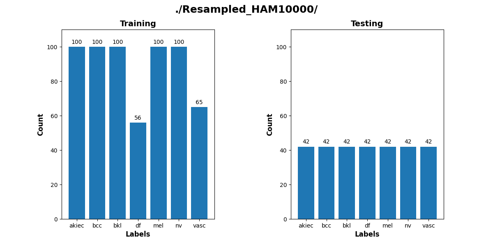
 
<!-- -->
 
Sample images in Resampled_HAM10000/Training/akiec: 
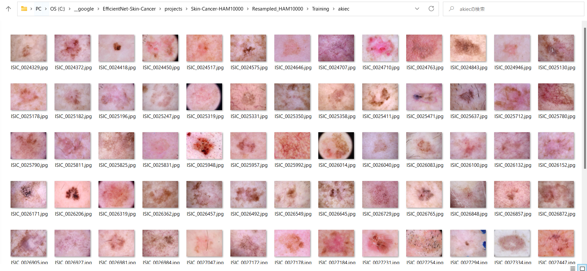
 
 
Sample images in Resampled_HAM10000/Training/bcc: 
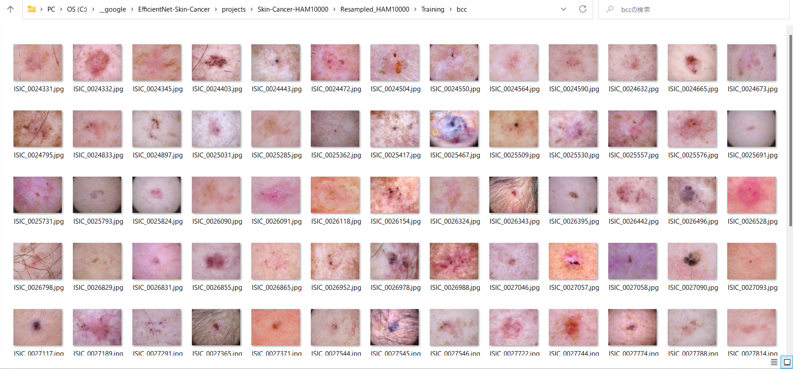
 
 
Sample images in Resampled_HAM10000/Training/bkl: 
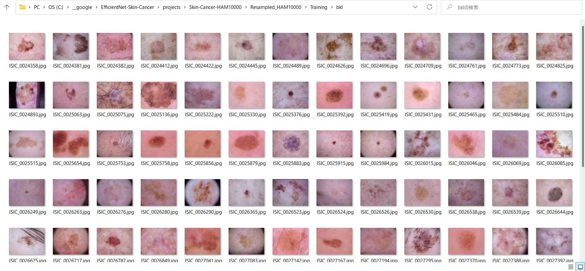
 
 
Sample images in Resampled_HAM10000/Training/df: 
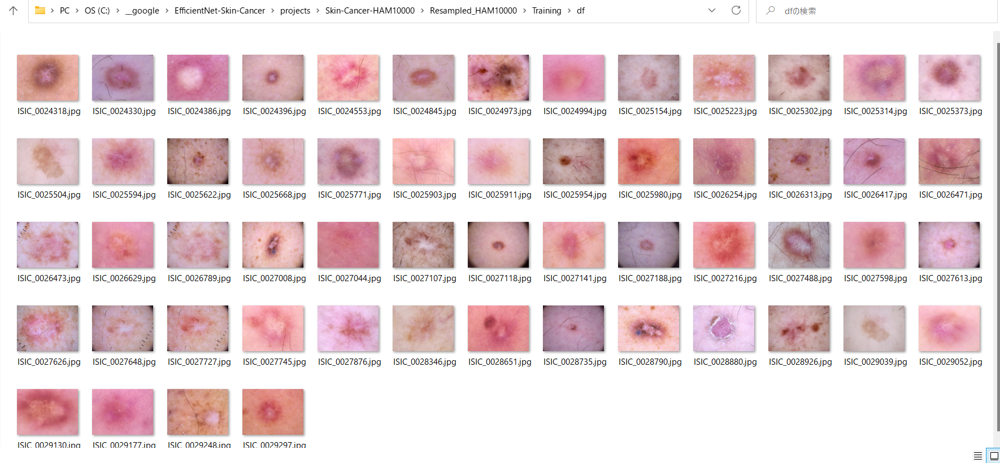
 
 
Sample images Resampled_HAM10000/Training/mel: 
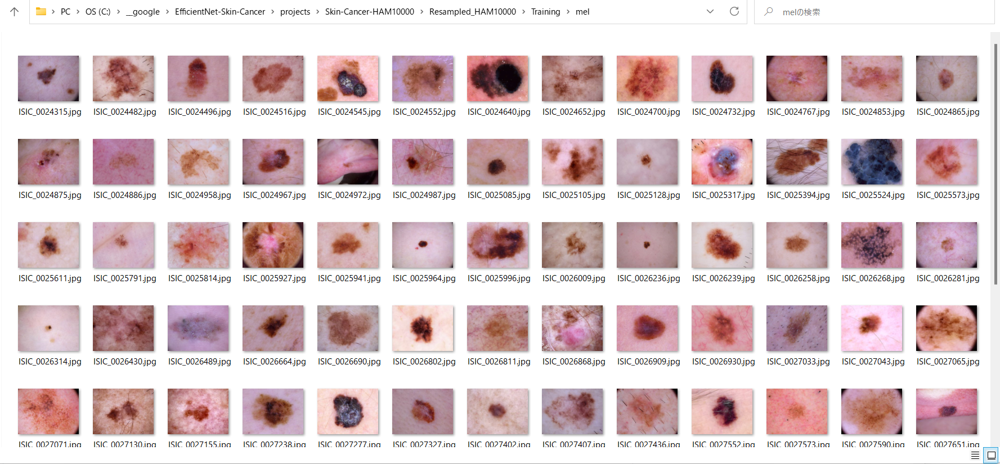
 
 
Sample images in Resampled_HAM10000/Training/nv: 
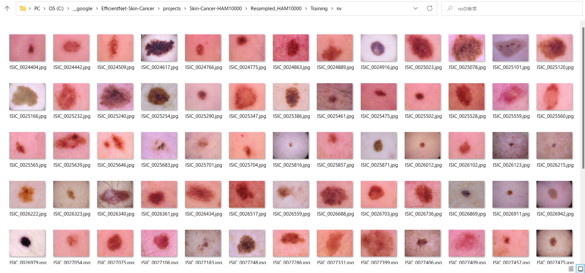
 
 
Sample images in Resampled_HAM10000/Training/vasc: 
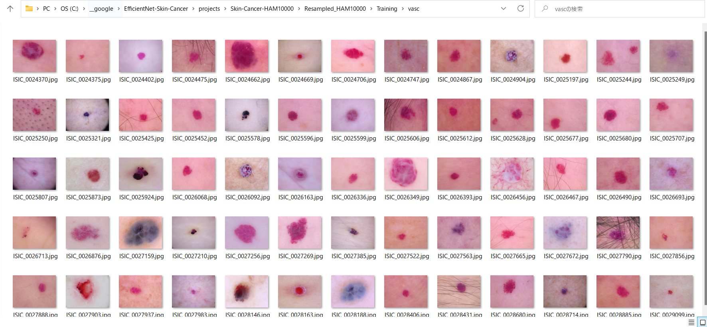
 
 
 

<h3>
3. Train
</h3>
<h3>
3.1 Training script
</h3>
Please run the following bat file to train our Skin Cancer HAM10000 efficientnetv2 model by using
<b>Resampled_HAM10000/Training</b>.
<pre>
./1_train.bat
</pre>
<pre>
rem 1_train.bat
rem 2024/01/01
python ../../../efficientnetv2/EfficientNetV2ModelTrainer.py ^
  --model_dir=./models ^
  --eval_dir=./eval ^
  --model_name=efficientnetv2-m  ^
  --data_generator_config=./data_generator.config ^
  --ckpt_dir=../../../efficientnetv2/efficientnetv2-m/model ^
  --optimizer=rmsprop ^
  --image_size=384 ^
  --eval_image_size=480 ^
  --data_dir=./Resampled_HAM10000/Training ^
  --data_augmentation=True ^
  --valid_data_augmentation=True ^
  --fine_tuning=True ^
  --monitor=val_loss ^
  --learning_rate=0.0001 ^
  --trainable_layers_ratio=0.4 ^
  --dropout_rate=0.5 ^
  --num_epochs=80 ^
  --batch_size=4 ^
  --patience=15 ^
  --debug=True  
</pre>
, where data_generator.config is the following: 
<pre>
; data_generation.config
; 2024/01/01
[training]
validation_split   = 0.2
featurewise_center = False
samplewise_center  = False
featurewise_std_normalization=False
samplewise_std_normalization =False
zca_whitening                =False
rotation_range     = 20
horizontal_flip    = True
vertical_flip      = True
 
width_shift_range  = 0.1
height_shift_range = 0.1
shear_range        = 0.01
zoom_range         = [0.2, 2.0]
;zoom_range         = 0.2
data_format        = "channels_last"

[validation]
validation_split   = 0.2
featurewise_center = False
samplewise_center  = False
featurewise_std_normalization=False
samplewise_std_normalization =False
zca_whitening                =False
rotation_range     = 20
horizontal_flip    = True
vertical_flip      = True
width_shift_range  = 0.1
height_shift_range = 0.1
shear_range        = 0.01
zoom_range         = [0.2, 2.0]
;zoom_range         = 0.1
data_format        = "channels_last"
</pre>

<h3>
3.2 Training result
</h3>

This will generate a <b>best_model.h5</b> in the models folder specified by --model_dir parameter. 
Furthermore, it will generate a <a href="./eval/train_accuracies.csv">train_accuracies</a>
and <a href="./eval/train_losses.csv">train_losses</a> files
 
Training console output: 
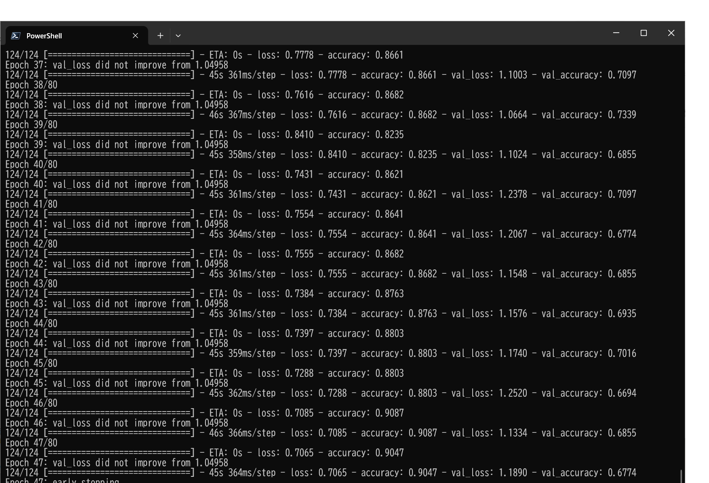 
 
Train_accuracies: 
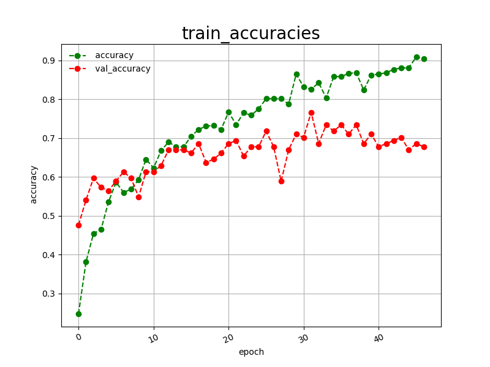 

 
Train_losses: 
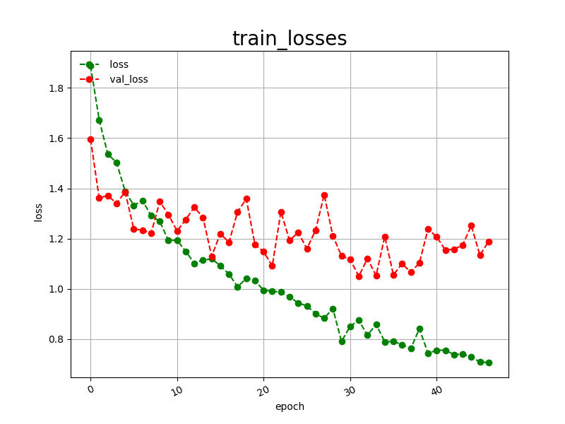 

 
<h3>
4. Inference
</h3>
<h3>
4.1 Inference script
</h3>
Please run the following bat file to infer the skin cancer lesions in test images by the model generated by the above train command. 
<pre>
./2_inference.bat
</pre>
<pre>
rem 2_inference.bat
rem 2024/01/01
python ../../../efficientnetv2/EfficientNetV2Inferencer.py ^
  --model_name=efficientnetv2-m  ^
  --model_dir=./models ^
  --fine_tuning=True ^
  --trainable_layers_ratio=0.4 ^
  --dropout_rate=0.5 ^
  --image_path=./test/*.jpg ^
  --eval_image_size=480 ^
  --label_map=./label_map.txt ^
  --mixed_precision=True ^
  --infer_dir=./inference ^
  --debug=False 
</pre>
 
label_map.txt:
<pre>
akiec
bcc
bkl
df
mel
nv
vasc
</pre>
 
<h3>
4.2 Sample test images
</h3>

Sample test images generated by <a href=".-HAM10000/create_test_dataset.py">create_test_dataset.py</a> 
from <a href=".-HAM10000/Resampled_HAM10000/Testing">Resampled_HAM10000/Testing</a>.
 
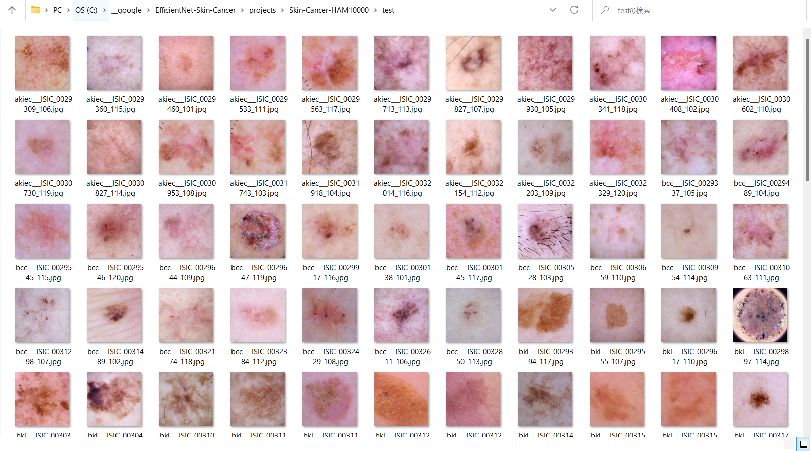 

 
<h3>
4.3 Inference result
</h3>
This inference command will generate <a href="./inference/inference.csv">inference.csv</a>.
 The inference accuracy for the test dataset by our trained model is very low. 
 
Inference console output: 
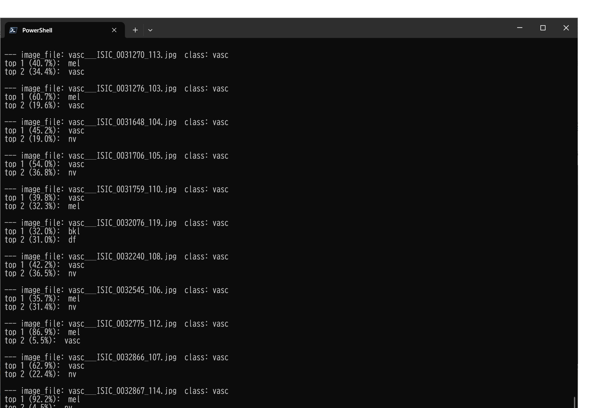 
 
Inference result csv: 
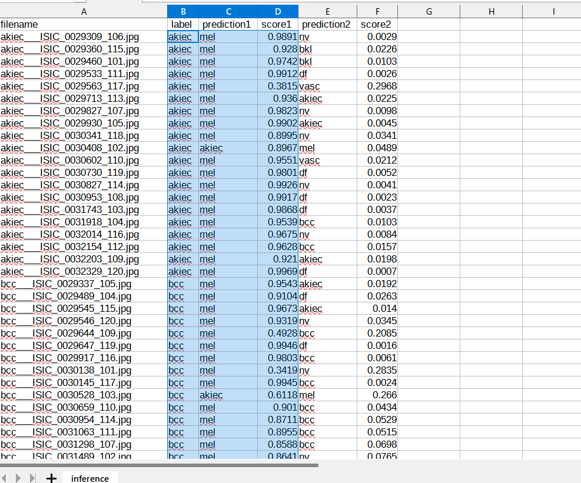 

<h3>
5. Evaluation
</h3>
<h3>
5.1 Evaluation script
</h3>
Please run the following bat file to evaluate <a href="./Resampled_HAM10000/Testing">
Resampled_HAM10000/Testing dataset</a> by the trained model. 
<pre>
./3_evaluate.bat
</pre>
<pre>
rem 3_evaluate.bat
rem 2024/01/01
python ../../../efficientnetv2/EfficientNetV2Evaluator.py ^
  --model_name=efficientnetv2-m  ^
  --model_dir=./models ^
  --data_dir=./Resampled_HAM10000/Testing ^
  --evaluation_dir=./evaluation ^
  --fine_tuning=True ^
  --trainable_layers_ratio=0.4 ^
  --dropout_rate=0.5 ^
  --eval_image_size=480 ^
  --mixed_precision=True ^
  --debug=False 
</pre>
 

<h3>
5.2 Evaluation result
</h3>

This evaluation command will generate <a href="./evaluation/classification_report.csv">a classification_report.csv</a>
 and <a href=".-HAM10000/evaluation/confusion_matrix.png">a confusion_matrix</a>.
 
Evaluation console output: 
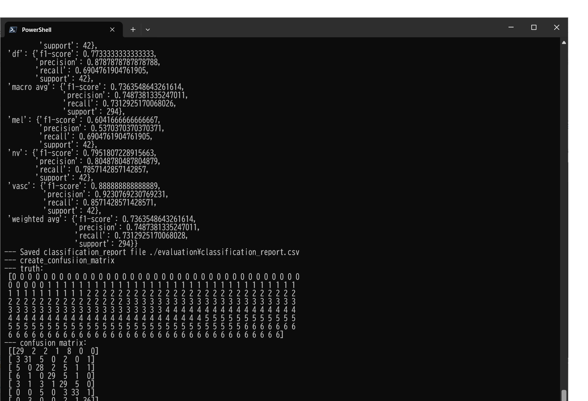 
 

Classification report: 
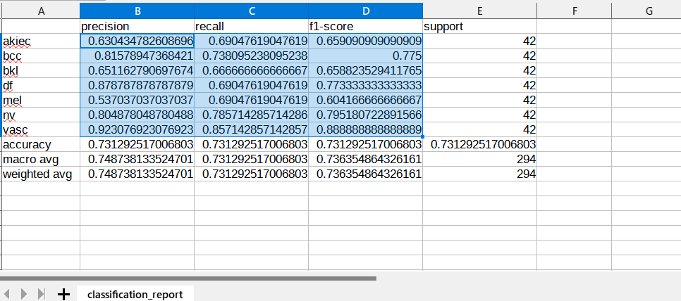 
 
Confusion matrix: 
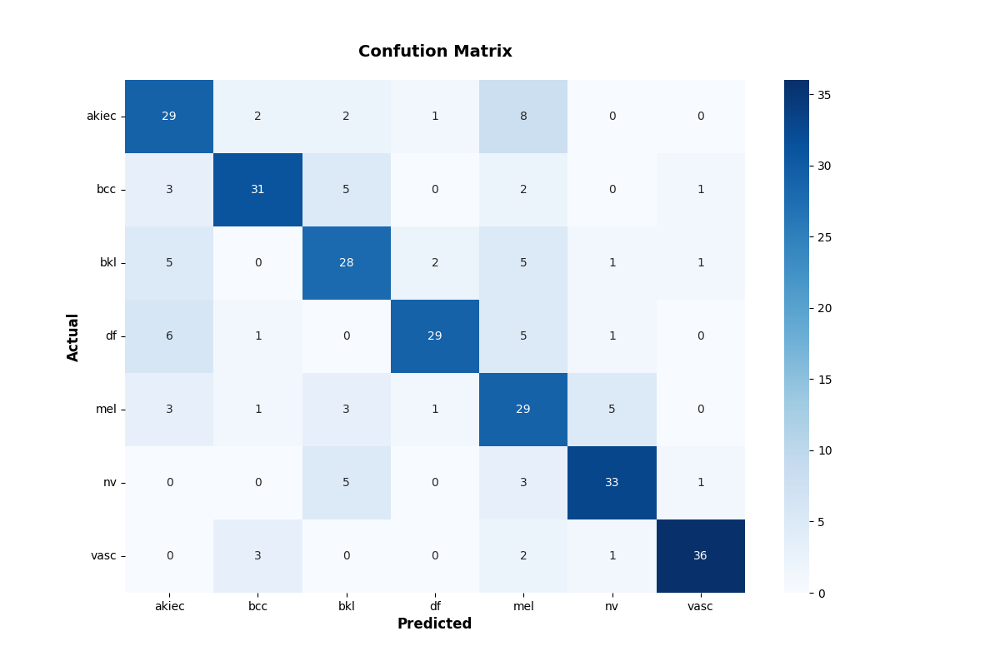 

